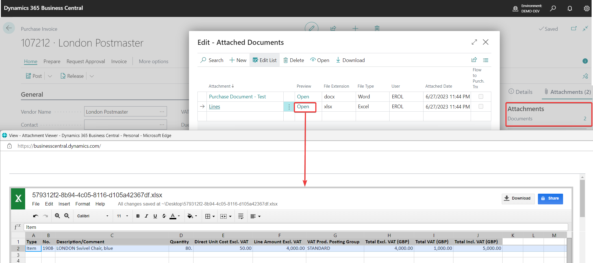
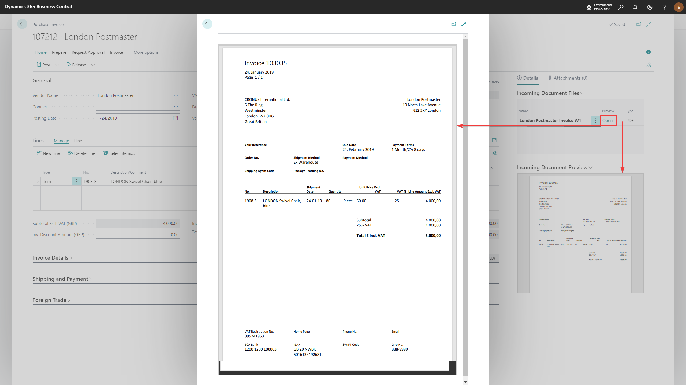

# Attachment Preview
Attachment Preview solution in Business Central enables the following: 
- **Preview files without downloading them**
- Preview is shown on separate page (_as big preview_) or in factbox (_as small preview for incoming document files_)
  

## Setup
To use the solution, **No Setup is needed**  
To view MS Office files a browser plugin <a href="https://chrome.google.com/webstore/detail/office-editing-for-docs-s/gbkeegbaiigmenfmjfclcdgdpimamgkj?hl=en-US" target="_blank">**Office Editing for Docs, Sheets & Slides**</a> 
(_made by Google_) for chromium based browsers (_like Google Chrome and Microsoft Edge_) needs to be installed.

    
## Usage
Just click on **Open** and big preview of the file is opened.  
Select incoming document file line to view small preview in factbox (_only for incoming document files_).  

  
  
  
## Attachment Preview is supported on following pages:
- All pages with Document attachments
- All pages with Incoming document files (except Sales documents) like
  - Purchase Invoice
  - Posted Purchase Invoice
  - Purchase Credit Memo
  - Posted Purchase Credit Memo
  - Gegeral Ledger Entries
  - VAT Entries
  - _etc_
- Report Inbox
  
  
---

For more information please contact BCS Itera AS:  
<a href="https://www.itera.ee/en/about-us/" target="_blank">www.itera.ee/en/about-us/</a>
