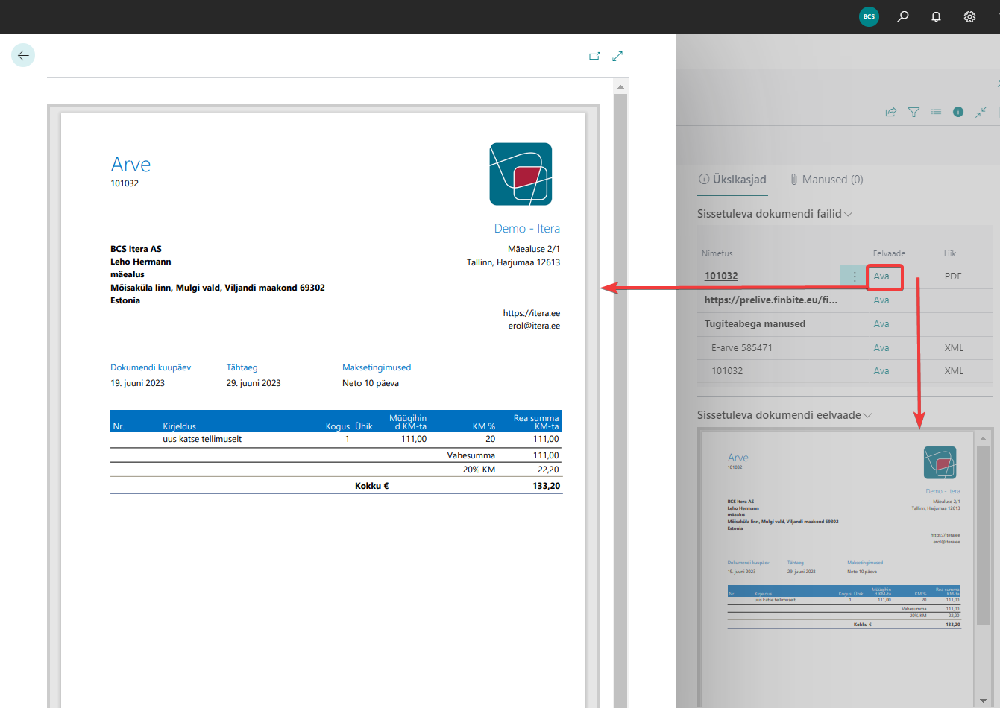

# Manuste eelvaade
Manuste eelvaate lahendus võimaldab Business Centralis teha järgmist: 
- **Vaata manust ilma seda alla laadimata**
- Eelvaadet näidatakse eraldi lehel (_nn suur eelvaade_) või kiirinfos (_nn väike eelvaade sissetuleva dokumendi failide puhul_)  
  

## Seadistus
Lahenduse kasutamiseks, **pole seadistamist vaja teha**  
MS Office failide avamiseks on vajalik installida veebibrauserisse plugin <a href="https://chrome.google.com/webstore/detail/office-editing-for-docs-s/gbkeegbaiigmenfmjfclcdgdpimamgkj?hl=en-US" target="_blank">**Office Editing for Docs, Sheets & Slides**</a> 
(_loojaks Google_) kõikide chromiumil baseeruvate brauserite puhul (_sh Google Chrome ja Microsoft Edge_).  

    
## Kasutamine
**Lihtsalt vajuta "Ava"** ning suur eelvaade avaneb.
Sissetuleva dokumendi failide puhul kuvatakse kiirinfos väike eelvaade vastavalt aktiivsele faili reale.  

  
  
  
## Manuste eelvaade on toetatud järgmistel lehtedel:
- Kõik "Manustatud dokumendid" lehed
- Kõik kiirinfo lehed, kus on "Sissetuleva dokumendi failid" sh:
  - Ostuarve
  - Konteeritud ostuarved
  - Ostu kreeditarve
  - Konteeritud ostu kreeditarved
  - Pearaamatu kanded
  - KM kanded
  - jne
  - _Märkus! Väike eelvaade kiirinfos pole müügidokumentide puhul toetatud_
- Aruannete sisendkaust
- Meilisõnumi manused
  
  
---

Täpsema info saamiseks, palun võtke ühendust BCS Itera AS-ga:
<a href="https://www.itera.ee/" target="_blank">www.itera.ee</a>
