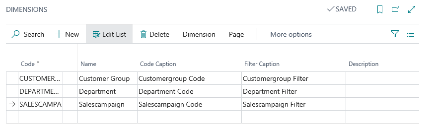
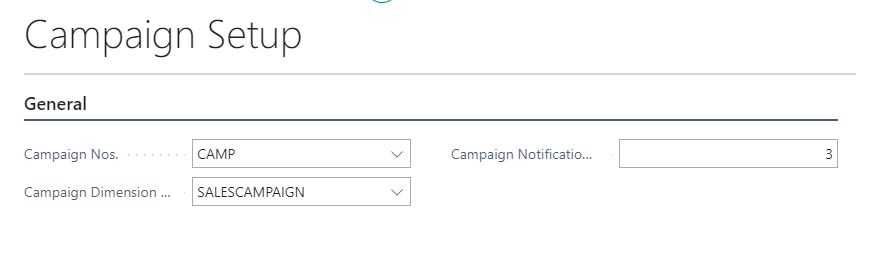
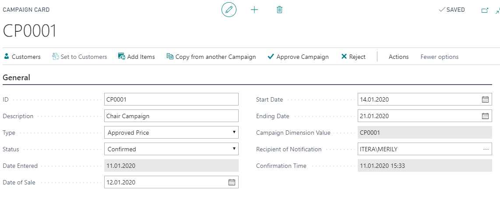
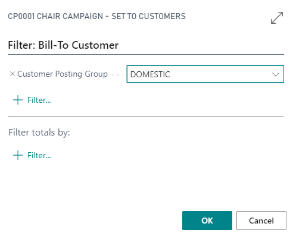
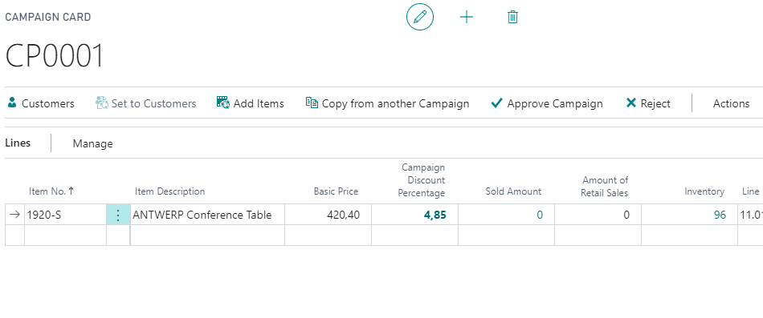
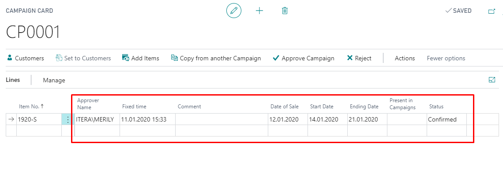
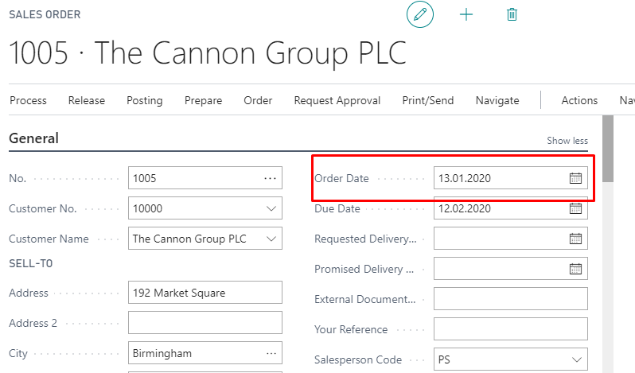
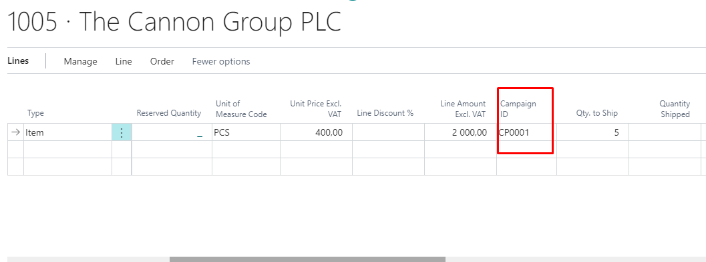
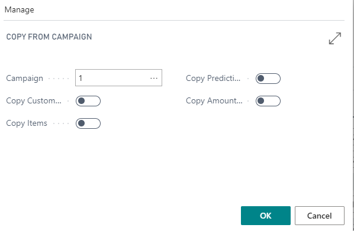

# Campaign Management – User Guide

Campaign functionality enables the following:
* Creating new campaigns by customer or customer posting group and based on campaign creating new sales orders.
* Copy campaigns.
* Copy rows from Excel to create new campaign.
* Possibility to make sales refunds based on campaign sales.

## Verify Campaign Management Installation

Open **Extension Management** and check if extension named ’BCS Itera Campaign Management’ is installed. If not, please find and install it from AppSource or contact BCS Itera AS. 

## Settings

### User Card Settings

On **User Card** you need to set up **Contact Email address**.

### Dimensions Setup

|**Field**|**Value**|
|-|-|
|Code|Fill in manually.|
|Name|Fills automatically.|
|Code Caption|Fills automatically.|
|Filter Caption|Fills automatically.|

### Campaign Setup

|**Field**|**Value**|
|Campaign Nos.|Set up a campaign number series.|
|Campaign Dimension Code|To find campaign sells in General Ledger.|
|Campaign Notification Days|Required for sending an automatic email if your campaign is disapproved.|

## Use

From Search open **Campaign List**.
On the Ribbon click **New**. 

|**Field Name**|**Usage**|
|-|-|
|ID|Campaign number serial.|
|Description|Fill in manually.|
|Type|Approved Price/Open Price.|
|Status|Created/Confirmed/Partly Approved/Refused.|
|Date Entered|Fills automatically with current date.|
|Date of Sale|Based on this date, BC is reviewing Item prices. Always at least +1 day compared to Date Entered.|
|Start Date|Start Date fill in manually.|
|Ending Date|Ending Date fill in manually.|
|Campaign Dimension Value|Fills automatically, same as ID.|
|Recipient of Notification|By default, the user who entered the campaign header.|
|Confirmation Time|Fills automatically, if Campaign is confirmed.|

Customers must be assigned to the campaign before adding items to the campaign.
Click on the Ribbon **Set to Customers**-> Filter **Customer Posting Group**. Then click **OK**.

If you want to make a campaign to only one Customer, delete redundant Customers.

### Adding Items into the Campaign

|**Field Name**|**Usage**|
|-|-|
|Item No.|Fill in manually.|
|Prediction|Fill in manually.|
|Campaign Price|Fill in manually or it will change if you fill in the Campaign Discount Percentage.|
|Item Description|Fills automatically based on Item No.|
|Basic Price|Fills automatically based on Item Card prices and the price depends on the Date of Sale.|
|Campaign Discount Percentage|Fill in manually or it will be calculated if Campaign Price is set up.|
|Sold Amount|Fills automatically.|
|Amount of Retail Sales|Fill in manually (minimum amount for the campaign prices).|
|Inventory|Fills automatically, based on the Inventory.|
|Line Input Time|Fills automatically if Campaign Price or Campaign Discount Percentage is filled.|
|Insertion Name|Fills automatically.|
|Time of Change|Fills automatically.|
|Modified by Name|Fills automatically.|
|Approver name|Fills automatically if campaign is confirmed.|
|Fixed Time|Fills automatically if campaign is confirmed.|
|Comment|Fill in manually.|
|Date of Sale|Fills automatically.|
|Start Date|Fills automatically.|
|Ending Date|Fills automatically.|
|Present in Campaigns|Fills automatically.|
|Status|Fills automatically.|

If user is finished creating campaign click on the Ribbon **Approve Campaign**. With this all the lines in the campaign are automatically confirmed and time and status will be changed from Created to Confirmed.

### Sales Order creating based on the Campaign

Create new **Sales Order**
Confirmed campaign rows will be available after you fill in the **Order date** (must be between Date of Sale and Ending Date) and **Bill-to Customer** is the same as campaign Bill-to Customer No.
Approved prices will be taken from campaign rows. If Customer has line discounts then with approved prices, that will not be applied.
Open prices will be taken in pricelist.
All campaign item rows have campaign dimensions. 
In General Ledger will be new field **Campaign ID** and will be filled with campaign dimensions. 
On the Sales Order rows you find new field **Campaign ID** and it will be Carried on to the Posted Sales Invoices.

### Return Orders with Campaign Sales

If you click on the Ribbon **Process**-> **Get Posted Document Lines to Reverse**, you must see the same lines as you have in Sales Order including **Campaign ID**. It means all the campaign dimensions you had in the Sales Order will be on the Returns order. 

### Copy from Campaign

On the Ribbon click **Copy from another Campaign**. Choose the Campaign you want to copy and what do you what to copy from there: Customers, Items, Predictions and Amounts. If new campaign is ready make sure that the campaign dates are different from the one you just copied (Date of sale, Start Date, Ending Date) otherwise you cannot Approve Campaign.

### Advanced use of Fields

Type:
* Approved Price – then the on the item rows you need to specify campaign prices and predicted quantities. Approved price has the priority and item card line discounts are not counted.
* Open Price- prices are for statistics. You do not need to set up prices for that because they are coming from item price list on the sales order. 
Status:
* Created- new campaign is by default with value Created.
* Confirmed- You can confirm line by line or whole campaign at a time. 
* Partly Approved- Until you haven’t approved whole campaign rows, the status will stay partly approved for example some rows have status refused.
* Refused- Needed for statistics. You can refuse campaign at time or line by line. With approved price campaign then refused lines won’t appear.

### Automatic system controls

Item will not be repeated in the multiple campaigns. If accepting the campaign, the program will control if the Item is already represented in another campaign in this period for the Customer. If Yes, the system alerts user and user must erase the row in the campaign or choose item status refused.
Status change turning the campaign. If the campaign is already started (Date of sale is bigger or the same with today’s date), then user can’t change rows status to approved. Can change only to refused. If the campaign is already started and user need to change the price click on button Edit Campaign Price.  
Date of sale- can’t be later than start and end date. Start date can’t be later than end date. 
NB!
Item rows prices are calculated based on Date of sales date. Campaign prices on rows are calculated 2 decimal places.  
Coping rows from Excel. User needs rows in order: Item No, Prediction, Campaign Price. Copy these 3 rows and all other rows will be filled automatically. 
If you change row information for example the price user sees new Modified by name and date/time. If user add comment into the row, then the Modified by name and date/time will not change. 

For more information and pricing please contact BCS Itera AS:
[https://www.itera.ee](https://www.itera.ee)
