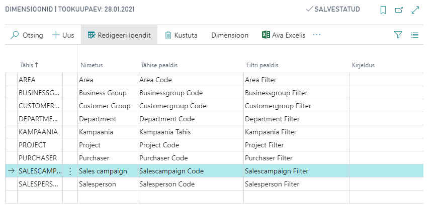
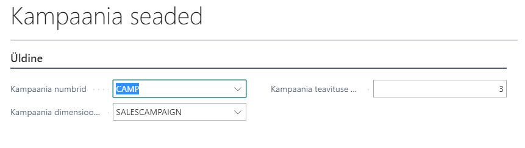
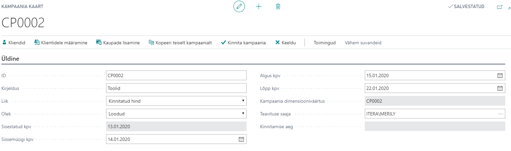
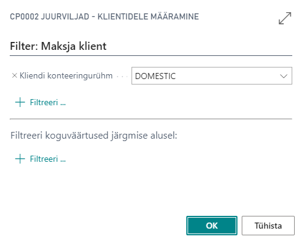
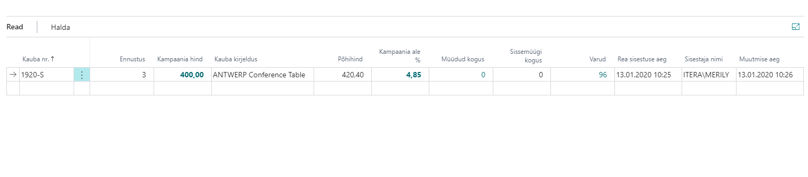
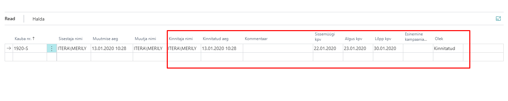
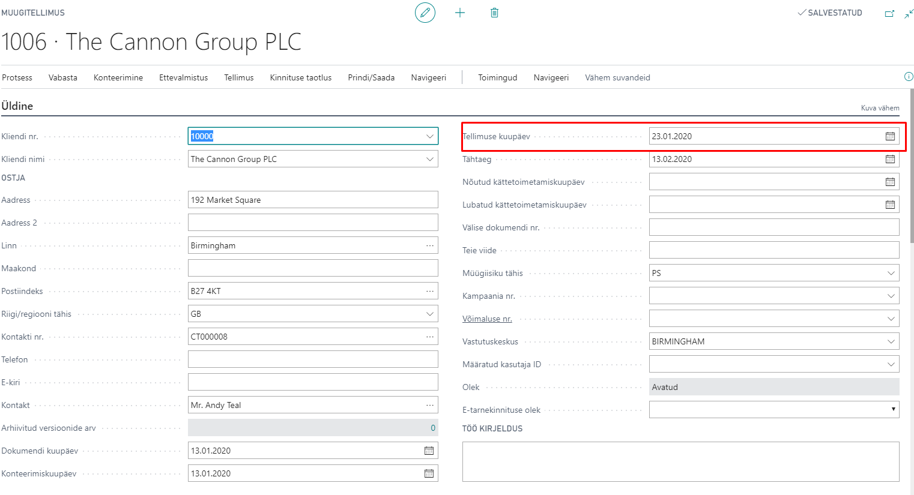
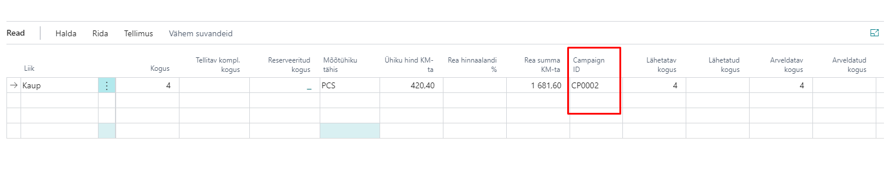
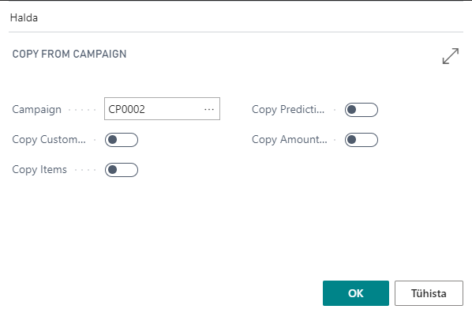

# Kampaaniate haldus– Kasutusjuhend

Kampaania lahendus võimaldab alljärgnevat:
* Kampaaniate loomist kliendi/kliendi konteeringurühma põhiselt, selle põhjal müügitellimuse vormistamist.
* Kampaaniate kopeerimist.
* Ridade kopeerimist Excelist kampaania loomiseks.
* Müügitagastuse tegemist kampaaniamüügi korral.

## Kampaania halduse api tuvastamine

Ava **Laiendused** ja veendu, et app ‘BCS Itera Campaign Management’ on alla laetud. Kui pole, võid selle leida AppSourcest või võta ühendust BCS Iteraga. 

## Seadistused

### Kasutaja kaardi seadistus
Kasutaja kaardile seadista Contact Email aadress.

### Dimensiooni seaded

|**Välja nimi**|**Kasutamine**|
|-|-|
|Tähis|Sisestatakse käsitsi.|
|Nimetus|Täitub automaatselt.|
|Tähise pealdis|Täitub automaatselt.|
|Filtri pealdis|Fills Täitub automaatselt.|

### Kampaania seaded

|**Välja nimi**|**Kasutamine**|
|-|-|
|Kampaania numbrid|Kampaania numbriseeria seadistamine|
|Kampaania dimensiooni tähis|Kampaania müügi eristamiseks kaubaandmiku kannetel.|
|Kampaania teavituse päevade arv|Vajalik automaatse e-maili saatmiseks, kui kampaania pole kinnitatud.|

## Kasutamine

Ava otsingust Kampaaniate loend.
Kliki Uus.

|**Välja nimi**|**Kasutamine**|
|ID|Kampaania numbriseeria väärtus.|
|Kirjeldus|Sisestatakse käsitsi.|
|Liik|Kinnitatud hind/Avatud hind|
|Olek|Loodud/Kinnitatud/Osaliselt kinnitatud/Keeldutud|
|Sisestatud kpv|Automaatselt kampaania loomise kuupäev.|
|Sissemüügi kpv|Selle kuupäeva alusel vaatab BC kaupade hindu. Alati vähemalt +1 päev Sisestatud kpv võrreldes.|
|Algus kpv|Kampaania alguskuupäev käsitsi sisestada.|
|Lõpp kpv|Kampaania lõppkuupäev käsitsi sisestada.|
|Kampaania dimensiooniväärtus|Automaatselt sama, mis ID.|
|Teavituse saaja|Vaikimisi kasutaja, kes sisestas kampaania päise.|
|Kinnitamise aeg|Tuleb automaatselt, kui kampaania on kinnitatud.|

Enne kampaaniale kaupade lisamist tuleb kampaaniale määrata kliendid.
Selleks kliki lindil Klientide määramine-> vali filtrisse Kliendi konteeringurühm.

Avaneb valik sinna konteeringu rühma kuuluvatest klientidest. 
Kui soovid kampaaniat teha ainult ühele kliendile kustuta üleliigsed kliendid. 

### Kaupade lisamine kampaaniasse

|**Välja nimi**|**Kasutamine**|
|-|-|
|Kauba nr|Sisestatakse käsitsi.|
|Ennustus|Sisestatakse käsitsi.|
|Kampaania hind|Sisestatakse käsitsi soovitav või muutub, kui sisestatakse kampaania ale %.|
|Kauba kirjeldus|Täitub automaatselt Kauba nr järgi.|
|Põhihind|Täitub automaatselt Kauba kaardile sisestatud hinna järgi, arvestades sissemüügi kuupäeva.|
|Kampaania ale %|Sisestatakse käsitsi või arvutatakse automaatselt, kui kampaania hind on eelnevalt sisestatud.|
|Müüdud kogus|Täitub automaatselt.|
|Sissemüügi kogus|Sisestatakse käsitsi.(miinimum kogus kampaania hinna kehtimiseks).|
|Varud|Täitub automaatselt arvestades laovarusid.|
|Rea sisestamise aeg|Täitub automaatselt, kui on sisestatud kas Kampaania hind või Kampaania ale %.|
|Sisestaja nimi|Täitub automaatselt.|
|Muutmise aeg|Täitub automaatselt.|
|Muutja nimi|Täitub automaatselt.|
|Kinnitaja nimi|Täitub automaatselt, kui kampaania on kinnitatud.|
|Kinnitatud aeg|Täitub automaatselt, kui kampaania on kinnitatud.|
|Kommentaar|Sisestatakse käsitsi.|
|Sissemüügi kpv|Täitub automaatselt.|
|Algus kpv|Täitub automaatselt.|
|Lõpp kpv|Täitub automaatselt.|
|Esinemine kampaaniates|Täitub automaatselt.|
|Olek|Täitub automaatselt.|

Kui kampaania on valmis kliki lindil Kinnita kampaania, sellega kinnitatakse kõik kampaanias olevad read, nii päis kui read saavad kinnitamise aja ja staatus muudetakse „Loodud“ pealt „Kinnitatud“ peale.

### Müügitellimuse loomine vastavalt loodud kampaaniale
Loo uus müügitellimus.
Kinnitatud kampaania read muutuvad müügitellimustele kättesaadavaks, kui müügitellimusele sisestada „Tellimuse kuupäev“, mis jääb kampaania Sissemüügi kpv ja Lõpp kpv vahemikku ja „Maksja kliendile“ vastab kampaania Maksja- kliendi nr.
Fikseeritud hinnaga kampaania puhul võetakse hind kampaania rea pealt. Kui kliendil on reaallahindlus, siis seda fikseeritud hinnaga kampaania puhul ei rakendata.
Vaba hind kampaania puhul võetakse hind ikka hinnakirjast. 
Samuti võetakse reale külge kampaania dimensioon.
Kaubakandele  lehele on lisatud kampaania kood väli. Täidetakse konteerimisel kampaania dimensiooni väärtusega.
Müügireale kampaania kood väli, mis kandub edasi konteeritud müügireale.

### Müügitagastuse loomine kampaania müügil
Müügitagastus. Müügitagastusele peab saama valida konteeritud müügiridu filtreerides neid kampaania koodi järgi. Müügitagastusel kliki lindil **“Too konteeritud dokumendiread ümberpööramiseks“** peab näitama ridu koos kampaania koodiga (konteeritud müügitellimuse real kampaania kood). Too read võtab ühtlasi kaasa ka kõik dimensioonid, mis selle rea müügil olid.

### Kampaania kopeerimine
Lindil kliki **Kopeeri teiselt kampaanialt** moodustab uue samasuguse kampaania, koos samade kaupade, klientide, ennustuste ja summadega. Kinnitamiseks peab muutma kampaania kuupäevad(Sissemüügi kpv, Algus kpv, Lõpp kpv), sest muidu tekib konflikt, et sama kaup on samale kliendile selles perioodis juba kasutusel ja kampaaniat luua ei saa. 

### Väljade täpsem kasutus
Liik:
* Kinnitatud hind- siis peab ridadele määrama kampaania hinnad ja kampaania kogused (Ennustatav kogus). Fikseeritud hinnaga kampaania hind on prioriteedilt esimene ja sellele ei rakendata enam rea allahindlust.
* Avatud hind- siis võib ridadele määrata kampaania kogused (Ennustatav kogus). Hinnad määratakse statistika jaoks. Hindade lisamine ei ole kohustuslik sest müügil tuleb hind ikka vastavalt hinnakirjale.
Olek:
* Loodud- uus loodud kampaania staatus on vaikimisi väärtusega Loodud.
* Kinnitatud- Kinnitada on võimalik rea põhiselt või kogu kampaaniat. 
* Osaliselt kinnitatud- Seni kuni pole kinnitatud kõiki kampaania ridu, on kampaania staatuseks osaliselt kinnitatud, näiteks mõni rida on staatuses keeldutud. 
* Keeldutud-  vajalik statistika jaoks. Keelduda on võimalik kogu kampaania üleselt või ka rea põhiselt. See tähendab, et klient ei kinnitanud seda pakkumist. Fikseeritud hinnaga kampaania puhul ei kasutata seda rida müügihinna valikul müügitellimusele.

### Automaatsed süsteemi kontrollid
Kaup ei kordu mitmes sama kliendi kampaanias. Kampaania või kampaania rea kinnitamisel kontrollib programm, kas sama kaup ei ole samal perioodil samale kliendile juba kampaaniasse pandud. Kui on siis teatab sellest. Sel juhul tuleb rida kampaaniast eemaldada, sest seda ei ole võimalik kinnitada või panna staatusesse keeldutud.
Staatuse muutmine kampaania ajal. Kui kampaania on alanud (Sissemüügi kuupäev on suurem või võrdne tänase kuupäevaga), siis ei tohi programm lubada enam kampaania ridadel staatust muuta Kinnitatuks. Saab muuta ainult Keeldutud staatuseks. Kampaania hinna muutmiseks juba alanud kampaanial on vaja teha nupp [Muuda kampaania hind]. See on juhuks, kui kogemata oli sisestatud vale kampaania hind ja see tuli kampaania käigus välja.
Sissemüügi kuupäev-  Sissemüügi kuupäev ei tohi olla hilisem kui algus ja lõpp kuupäev. Algus kuupäev ei tohi olla hilisem kui lõpp kuupäev. 
NB!
Kaubaread arvutatakse koos kehtivate hindadega vastavalt päises olevale sissemüügi kuupäevale. Hinnad kampaania ridadel ümardatakse 2 kohta pärast koma.
Kaubaridade lisamine kopeerides need Excelist. Selleks peab järjestama veerud selliselt. Kauba nr; Ennustus; Kampaania hind. Excelis veerud samuti. Kopeeritakse need 3 veergu. Kopeerimisel peab toimuma teiste veergude arvutamine BC järgi.
Rea muutmisel märgitakse reale uus Muutja nimi ja muutmise kuupäev/kellaaeg. Kui sisestada reale kommentaar, siis muutja nime ei muudeta ja muutmis aega samuti mitte.

Lisainformatsiooni saamiseks palun võta ühendust BCS Itera AS:
[https://www.itera.ee](https://www.itera.ee)

