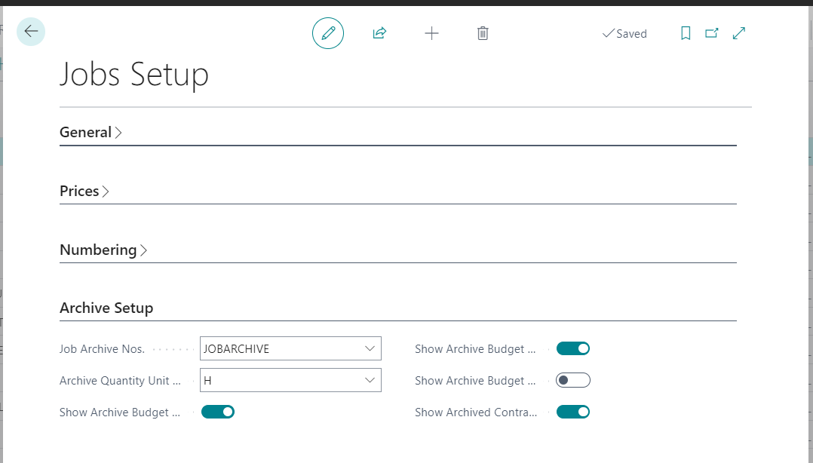
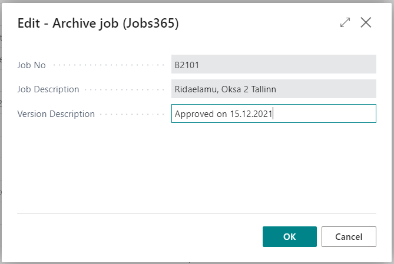
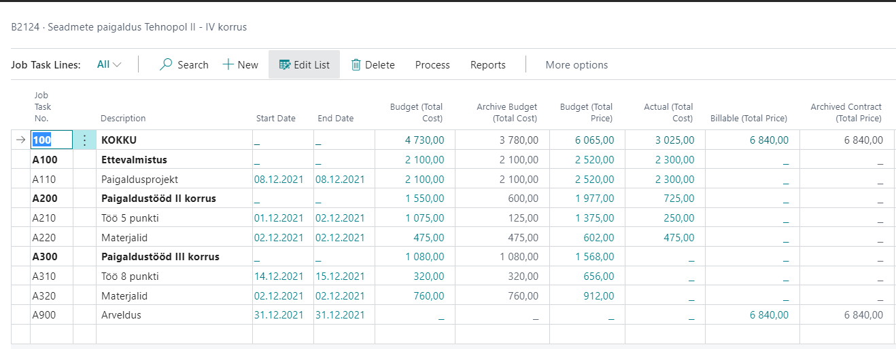
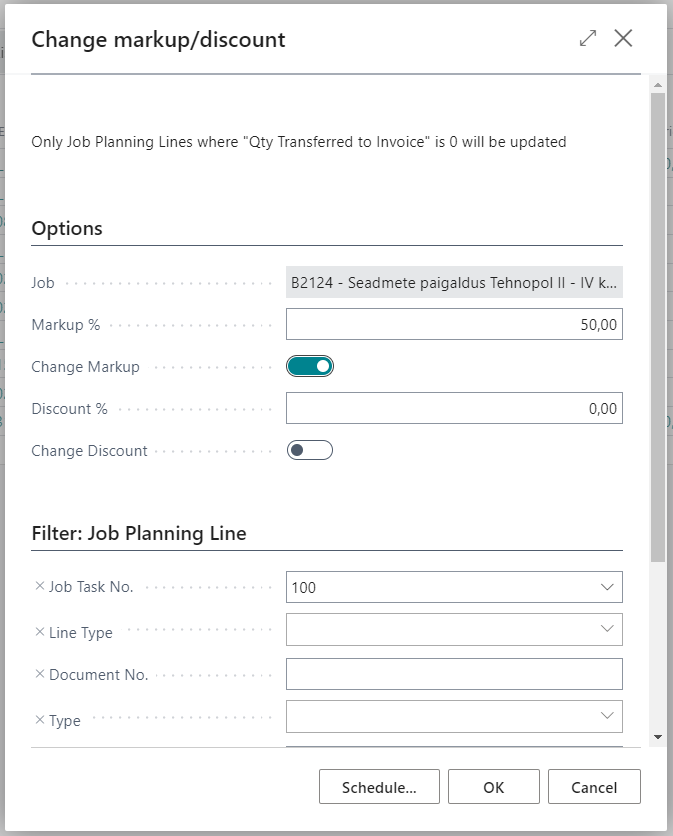
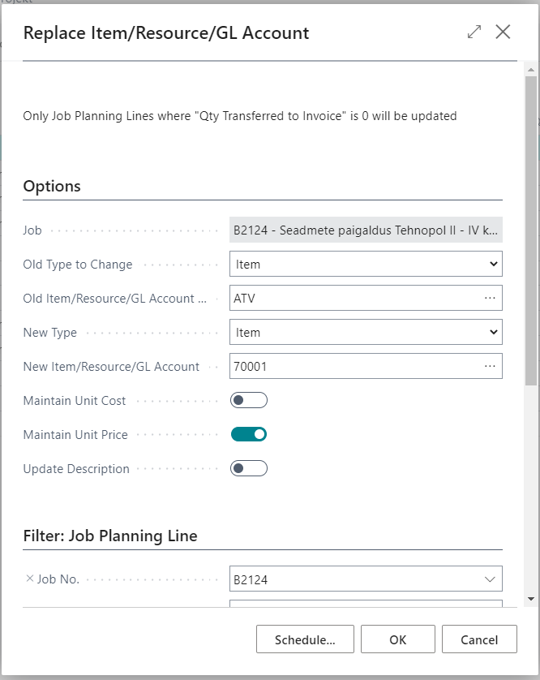
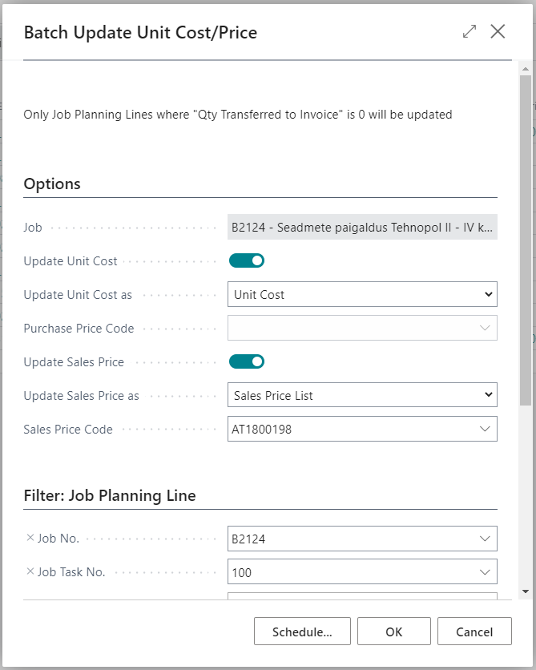

# Jobs365 - General
Additions to Job module include follwoing functionalities:

  - [Archiving Jobs.](#archiving-jobs)
  - [Send Job budget to GL budget](#send-job-budget-to-gl-budget)
  - [Batch changing discount or markup on Job Planning Lines](#batch-changing-discount-or-markup-on-job-planning-lines)
  - [Batch replacing Item or GL account or Resource on Job Planning Lines](#batch-replacing-item-or-gl-account-or-resource-on-job-planning-lines)
  - [Batch updating unit cost and unit price on job planning lines based on relevant cards or pricelists](#batch-updating-unit-cost-and-unit-price-on-job-planning-lines-based-on-relevant-cards-or-pricelists)

## Archiving Jobs
Archiving job budget allows you to archive a jobs budget at certain time and compare it later to current budget.
### Setup
Open **Jobs Setup** and fill in relevant fields on **Archive Setup** tab.

| Field | Explanation|
| --- | --- |
| ***Job Archive Nos.***| Võimaldab määrata projekti arhiivide numbriseeria.|
| ***Archive Quantity Unit of Measure***| Võimaldab määrata enimkasutatava mõõtühiku mille koguseid hakatakse kuvama Projekti ülesande ridadel veerus **Arhiveeritud eelarve kogus**.|
|***Show Archive Budget Quantity***| Võimladab määrata kas antud veergu kuvatakse Projekti ülesande ridadel.|
|***Show Archive Budget (Total Cost)*** | Võimladab määrata kas antud veergu kuvatakse Projekti ülesande ridadel.|
|***Show Archive Budget (Total Price)*** |Võimladab määrata kas antud veergu kuvatakse Projekti ülesande ridadel.|
|***Show Archived Billable (Total Price)***| Võimladab määrata kas antud veergu kuvatakse Projekti ülesande ridadel.|

### Usage
Open **Jobs list**, select relevant job and use button **Archive Budget** under Process tab. Insert **Version description** in the opening window for informational purposes and click **OK**:

Open **Job Card** and assign suitable archive version in **Initial Budget Version** field.
Open **Job Task Lines** (from Jobs List) and check **Archive..** columns. After changing budget/billable amounts the "archive" columns stay unchanged until you assign new archive version on **Job Card**.

## Send Job budget to GL budget
Functionality allows you to send Job budgets (data from Job Planning Lines) to GL budget, so it would be easier to compare date in finance.

Go to **Jobs list** and use button **Send to G/L Budget** under Process tab.

Following view will be displayed:

| Field | Explanation|
| --- | --- |
| ***GL Budget name***| allows you to choose into which **GL Budget** you would like to send job data.|
| ***From Date*** and ***To Date***| allow you to filter which date range should be sent to **GL budget**. Filter will be applied to **Job Planning Lines** to be included.|
|***Line Type***| allows you to chosse which type of **Job Planning Lines** should be included.|
|***Include Cost Amounts*** and ***Include Price Amounts*** | allows you to choose if only costs should be sent to budget or only price amounts or both.
|***Default Gen. Business Posting Group*** | allows you to choose which **Gen. Business Posting Group** will be used for Item and Resource lines to find which Sales, Purchases or COGS account should be used.|
|***Include Budget Dimensions***| allows you to transfer dimension information from jobs to budget if some of the job dimensions match Budget dimensions.|

Additionally it is possible to use filter form **Job**, **Job Task** and **Job Planning Line** tables.

After pressing **OK** information from **Job Planning Lines** will be transferred to **GL Budget**.

# Jobs365 - General

## Batch changing discount or markup on Job Planning Lines
Functionality allows you to batch change markup or discount on **Job Planning Lines**.

Open **Job Task Lines** or **Job Planning Lines** and use button **Change markup/discount**.

Following view will be displayed:

| Field | Explanation|
| --- | --- |
| ***Job***| Information about affected job is being displayed. Field is not editable.|
| ***Markup %***| Allows you to insert markup % in other in other words how much should be added to unit cost to get the unit price. _Example: If you insert number 40 (i.e. 40%) and if line/lines **Unit Cost** is 100 then the result for **Unit Price** would be 140 (100*1,4)_.|
| ***Change Markup***| Allows you to select if markup change is activated with current run.|
| ***Discount %***| Allows you to insert discount % that you would like to assign to line/lines. After running, the field **Line Discount %** will be changed on all lines within the filter and field **Line Amount** will be recalculated accordingly.|
| ***Change Discount***| Allows you to select if discount change is activated with current run.|

Additionally it is possible to use filter form **Job Planning Line** table.

After pressing **OK** functionality will run with specified parameters.

## Batch replacing Item or GL account or Resource on Job Planning Lines
Functionality allows you to batch replace Itema, GL Account or Resource on **Job Planning Lines**.

Open **Job Planning Lines** and use button **Replace Iteam/Resource/GL Account**.

Following view will be displayed:

| Field | Explanation|
| --- | --- |
| ***Job***| Information about affected job is being displayed. Field is not editable.|
| ***Old Type to Change***| Allows you to choose replaceable type.|
| ***Old Item/Resource/GL Account to Change***| Allows you to choose repleaceable Itema, Resource or GL Account. Selection depends on which value was selected in field **Old Type to Change**.|
| ***New Type***| Allows you to choose replacement type.|
| ***New Item/Resource/GL Account***| Allows you to choose replacement Item, Resource or GL Account. Selection depends on which value was selected in field **New Type**.|
| ***Maintain Unit Cost***| Allows you to decide if line's **Unit Cost** will remain unchanged or it will be updated according to new Item or Resource.|
| ***Maintain Unit Price***| Allows you to decide if line's **Unit Price** will remain unchanged or it will be updated according to new Item or Resource.|
| ***Update Description***|  Allows you to decide if line's **Unit Price** will remain unchanged or it will be updated according to new Item, Resource or GL Account.|

Additionally it is possible to use filter form **Job Planning Line** table.

After pressing **OK** functionality will run with specified parameters.

## Batch updating unit cost and unit price on job planning lines based on relevant cards or pricelists
Functionality allows you to batch update **Unit Cost** and **Unit Price** on **Job Planning Lines**. 

Open **Job Task Lines** or **Job Planning Lines** and use button **Batch Update Unit Cost/Price**.

Following view will be displayed:

| Field | Explanation|
| --- | --- |
| ***Job***| Information about affected job is being displayed. Field is not editable.|
| ***Update Unit Cost***| Allows you to decide if unit cost update is activated with current run.|
| ***Update Unit Cost as***| Allows you to choose what will be the base for updating unit cost. **_Unit Cost_** - Unit cost will be updated based on Item or Resource card's relevant field. **_Last Direct Cost_** - Unit cost will be updated based on Item card (**Last Direct Cost**). **_Purchase Price List_** - Unit cost will be updated based on selected **Purchase Price List**.|
| ***Purchase Price List***| Allows you to choose which **Purchase Price List** will be base for updateing unit cost if the selected method is **_Purchase Price List_**.|
| ***Update Sales Price***| Allows you to decide if unit price update is activated with current run.|
| ***Update Sales Price as***| Allows you to choose what will be the base for updating unit price. **_Unit Price_** - Unit cost will be updated based on Item or Resource card's relevant field. **_Sales Price List_** - Unit price will be updated based on selected **Sales Price List**.|
| ***Sales Price List***| Allows you to choose which **Sales Price List** will be base for updateing unit price if the selected method is **_Sales Price List_**.|

Additionally it is possible to use filter form **Job Planning Line** table.

After pressing **OK** functionality will run with specified parameters.

