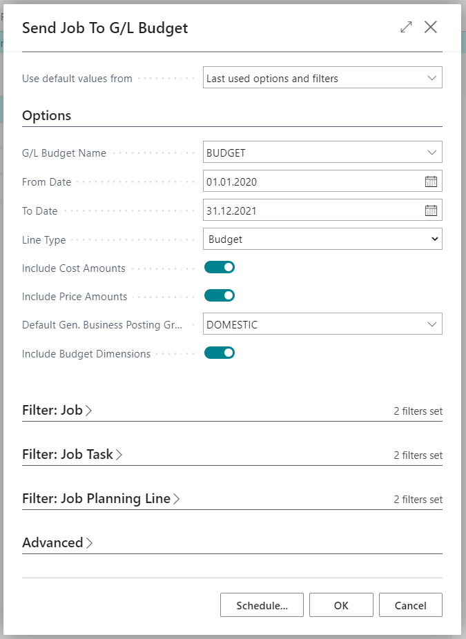

# Jobs365 - General
Additions to Job module include follwoing functionalities:

- Archiving Job budgets.
- Send Job budget to GL budget.
- Batch replacing Item/G/L account/Resource on **Job Planning Lines**.
- Batch changing discount or markup on **Job Planning Lines**.

<!--## Seadistamine
Funktsionaalsus-->

## Usage
### Archiving Job budget
Archiving job budget allows you to archive a jobs budget at certain time and compare it later to current budget.

### Send Job budget to GL budget
Functionality allows you to send Job budgets (data from Job Planning Lines) to GL budget, so it would be easier to compare date in finance.

Go to **Jobs list** and use button **Send to G/L Budget** under Process tab.

Following view will be displayed:

| Field | Explanation|
| --- | --- |
| ***GL Budget name***| allows you to choose into which **GL Budget** you would like to send job data.|
| ***From Date*** and ***To Date***| allow you to filter which date range should be sent to **GL budget**. Filter will be applied to **Job Planning Lines** to be included.|
|***Line Type***| allows you to chosse which type of **Job Planning Lines** should be included.|
|***Include Cost Amounts*** and ***Include Price Amounts*** | allow you to choose if only costs should be sent to budget or only price amounts or both.
|***Default Gen. Business Posting Group*** | allows you to choose which **Gen. Business Posting Group** will be used for Item and Resource lines to find which Sales, Purchases or COGS account should be used.|
|***Include Budget Dimensions***| allows you to transfer dimension information from jobs to budget if some of the job dimensions match Budget dimensions.|

Additionally it is possible to use filter form **Job**, **Job Task** and **Job Planning Line** tables.

After pressing **OK** information from **Job Planning Lines** will be transferred to **GL Budget**.
