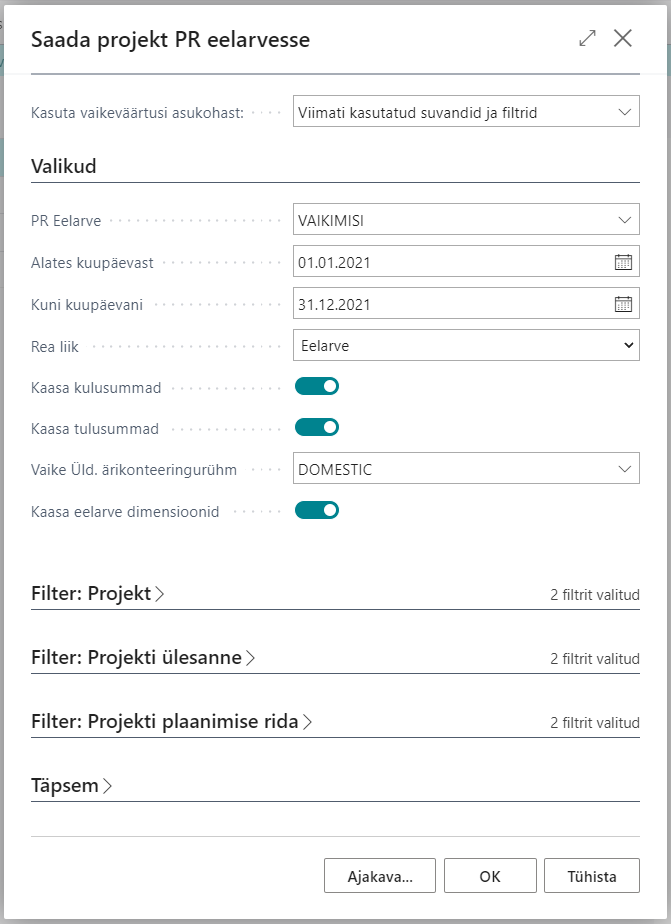

# Jobs365 - General
Projektimooduli täiendused sisaldavad järgenvaid funktsionaalsuseid:

- Projektide arhiveerimine.
- Projekti eelarve PR eelarvesse saatmine.
- Projekti plaanimisridadele Kauba/PR konto/Ressursi massasendmaine.
- Projekti plaanimisridadele allahindluste ja juurdehindluste massmuutmine.

## Table of Contents
  - [Projektide arhiveeirmine](#projektide-arhiveerimine)
  - [Projekti eelarve PR eelarvesse saatmine](#projekti-eelarve-pr-eelarvesse-saatmine)

## Projektide arhiveerimine
### Seadistus

### Kasutamine
Projektide arhiveerimine võimaldab arhiveerida projekti eelarve teatud seisuga ning võrrelda seda hiljem jooksva eelarvega.

## Projekti eelarve PR eelarvesse saatmine
Funktsionaalsus võimaldab saata proejktide eelarved PR eelarvesse, et neid saaks mugavalt kaasta finantseelarve võrdlusesse.

Avage **Projektide loend** ning kasutage nuppu **Saada PR eelarvesse**.

Avaneb järgenv vaade:

| Väli | Selgitus|
| --- | --- |
| ***PR eelarve***| võimaldab valida millisesse **PR eelarvesse** projektide summad saadetakse.|
| ***Alates kuupäevast*** and ***Kuni kuupäevani***| võimaldab filtreerida millist kuupäevavehemikku soovitakse **PR eelarvesse** saata. Filter rakendatatkse kaasatavatele **Projekti plaanimisridadele**.|
|***Rea liik***| võimaldab määrata millise rea liigiga **Projekti plaanimisread** kaasatakse.|
|***Kaasa kulusummad*** and ***Kaasa tulusummad*** | võimaldab määrata kas saadetakse ainutl kulu summad või ainult tulusummad või mõlemad.
|***Vaike üld ärikonteeringurühm*** | võimaldab määrata vaikimisi **Üld ärikonteeringurühm** mida kasutatakse kauba- ja ressursridade müügi, ostu või kaubakulu konto leidmiseks nendel ridadel kus see on määramta.|
|***Kaasa eelarve diemnsioonid***| võimaldab kaasata projektil määratud dimensioonide info kui mõni neist sobib ka eelarve dimensioondiega.|

Täiendavalt on võimalik valida filtreid ka **Projektide**, **Projekti Ülesannete** ja **Projekti plaanimisridade** tabelitest.

Peale **OK** vajutamist saadetakse **Projekti plaanimisridade** andmed **PR eelarvesse**.
