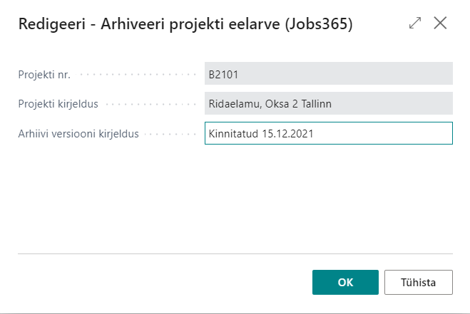
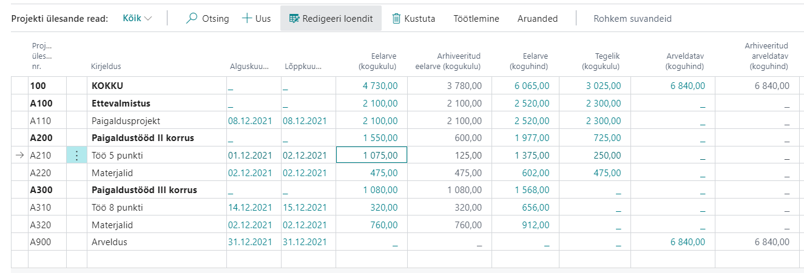

# Jobs365 - General
Projektimooduli täiendused sisaldavad järgenvaid funktsionaalsuseid:

  - [Projektide arhiveeirmine](#projektide-arhiveerimine)
  - [Projekti eelarve PR eelarvesse saatmine](#projekti-eelarve-pr-eelarvesse-saatmine)
  - [Projekti plaanimisridadel allahindluste ja juurdehindluste massmuutmine](#projekti-plaanimisridadel-allahindluste-ja-juurdehindluste-massmuutmine)
  - [Projekti plaanimisridadel Kauba/PR konto/Ressursi massasendamine](#projekti-plaanimisridadel-kauba-pr-konto-ressursi-massasendamine)
  - [Projekti plaanimisridadel ühiku omahindade ja müügihindade massuuendamine](#projekti-plaanimisridadel-ühiku-omahindade-ja-müügihindade-massuuendamine)

## Projektide arhiveerimine
Projektide arhiveerimine võimaldab arhiveerida projekti eelarve teatud seisuga ning võrrelda seda hiljem jooksva eelarvega.
### Seadistus
Avage **Projektide seadistus** ning täitke vahekaardil **Arhiivi seadistamine** vajalikud väljad.

| Väli | Selgitus|
| --- | --- |
| ***Projekti arhiivi numbriseeria***| Võimaldab määrata projekti arhiivide numbriseeria.|
| ***Arhiivi koguse mõõtühik***| Võimaldab määrata enimkasutatava mõõtühiku mille koguseid hakatakse kuvama Projekti ülesande ridadel veerus **Arhiveeritud eelarve kogus**.|
|***Kuva arhiveeritud eelarve kogus***| Võimladab määrata kas antud veergu kuvatakse Projekti ülesande ridadel.|
|***Kuva arhiveeritud eelarve (kogukulu)*** | Võimladab määrata kas antud veergu kuvatakse Projekti ülesande ridadel.|
|***Kuva arhiveeritud eelarve (koguhind)*** |Võimladab määrata kas antud veergu kuvatakse Projekti ülesande ridadel.|
|***Kuva arhiveeritud arveldatav (koguhind***| Võimladab määrata kas antud veergu kuvatakse Projekti ülesande ridadel.|

### Kasutamine
Projekti arhiveerimiseks avage **Projektide loend**, valige välja sobiv projekt ning kasutage nuppu **Arhiveeri eelarve**. Avanevas aknas lisage **Arhiivi versiooni kirjeldus**, et hiljem oleks erienvaid arhiive lihtsam üksteisest eristada, ning klõpsake OK:

Avage **Projekti kaart** ning valige sobiv eelarve versioon väljal **Algse eelarve versioon**.
Seejärel avage **Projekti ülesande read** (Projektide loendist) ning vaadake "arhiivi" veerge. Peale eelarves muudatuste tegemist jäävad "arhiivi" veerud samaks seni kuni valite **Projekti kaardil** uue eealrve arhiivi versiooni.

## Projekti eelarve PR eelarvesse saatmine
Funktsionaalsus võimaldab saata proejktide eelarved PR eelarvesse, et neid saaks mugavalt kaasta finantseelarve võrdlusesse.

Avage **Projektide loend** ning kasutage nuppu **Saada PR eelarvesse**.

Avaneb järgenv vaade:

| Väli | Selgitus|
| --- | --- |
| ***PR eelarve***| võimaldab valida millisesse **PR eelarvesse** projektide summad saadetakse.|
| ***Alates kuupäevast*** and ***Kuni kuupäevani***| võimaldab filtreerida millist kuupäevavehemikku soovitakse **PR eelarvesse** saata. Filter rakendatatkse kaasatavatele **Projekti plaanimisridadele**.|
|***Rea liik***| võimaldab määrata millise rea liigiga **Projekti plaanimisread** kaasatakse.|
|***Kaasa kulusummad*** and ***Kaasa tulusummad*** | võimaldab määrata kas saadetakse ainutl kulu summad või ainult tulusummad või mõlemad.
|***Vaike üld ärikonteeringurühm*** | võimaldab määrata vaikimisi **Üld ärikonteeringurühm** mida kasutatakse kauba- ja ressursridade müügi, ostu või kaubakulu konto leidmiseks nendel ridadel kus see on määramta.|
|***Kaasa eelarve diemnsioonid***| võimaldab kaasata projektil määratud dimensioonide info kui mõni neist sobib ka eelarve dimensioondiega.|

Täiendavalt on võimalik valida filtreid ka **Projektide**, **Projekti Ülesannete** ja **Projekti plaanimisridade** tabelitest.

Peale **OK** vajutamist saadetakse **Projekti plaanimisridade** andmed **PR eelarvesse**.

## Projekti plaanimisridadel allahindluste ja juurdehindluste massmuutmine
Funktsionaalsus võimaldab 

## Projekti plaanimisridadel Kauba/PR konto/Ressursi massasendamine
Funktsionaalsus võimaldab 

## Projekti plaanimisridadel ühiku omahindade ja müügihindade massuuendamine
Funktsionaalsus võimaldab 
