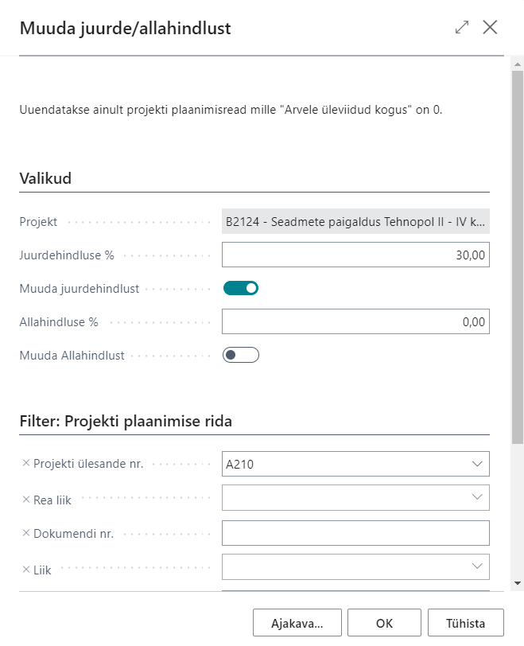
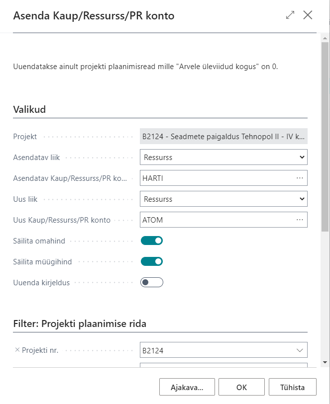
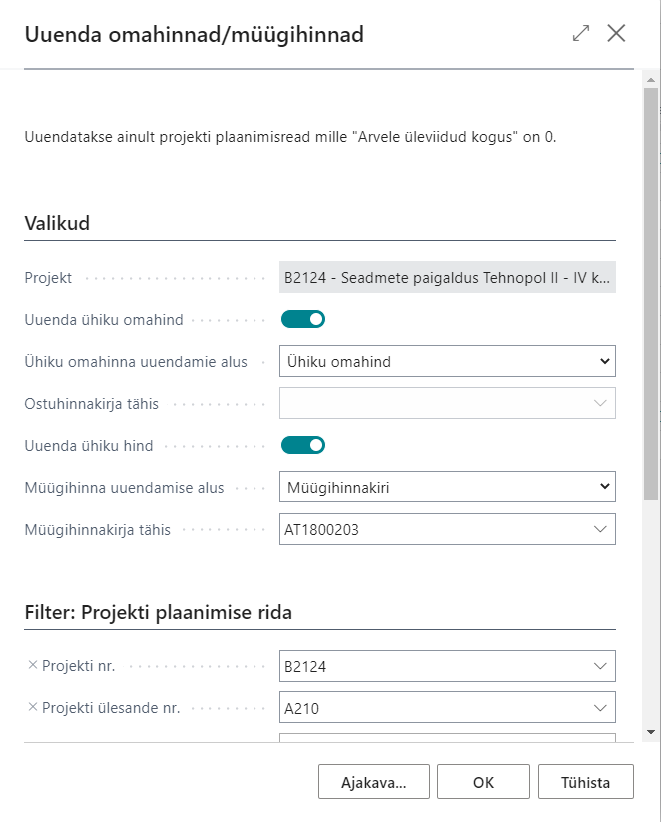

# Jobs365 - General
Projektimooduli täiendused sisaldavad järgenvaid funktsionaalsuseid:

  - [Projektide arhiveeirmine](#projektide-arhiveerimine)
  - [Projekti eelarve PR eelarvesse saatmine](#projekti-eelarve-pr-eelarvesse-saatmine)
  - [Projekti plaanimisridadel allahindluste ja juurdehindluste massmuutmine](#projekti-plaanimisridadel-allahindluste-ja-juurdehindluste-massmuutmine)
  - [Projekti plaanimisridadel Kauba, PR konto või Ressursi massasendamine](#projekti-plaanimisridadel-kauba-või-pr-konto-või-ressursi-massasendamine)
  - [Projekti plaanimisridadel ühiku omahindade ja müügihindade massuuendamine](#projekti-plaanimisridadel-ühiku-omahindade-ja-müügihindade-massuuendamine)

## Projektide arhiveerimine
Projektide arhiveerimine võimaldab arhiveerida projekti eelarve teatud seisuga ning võrrelda seda hiljem jooksva eelarvega.
### Seadistus
Avage **Projektide seadistus** ning täitke vahekaardil **Arhiivi seadistamine** vajalikud väljad.

| Väli | Selgitus|
| --- | --- |
| ***Projekti arhiivi numbriseeria***| Võimaldab määrata projekti arhiivide numbriseeria.|
| ***Arhiivi koguse mõõtühik***| Võimaldab määrata enimkasutatava mõõtühiku mille koguseid hakatakse kuvama Projekti ülesande ridadel veerus **Arhiveeritud eelarve kogus**.|
|***Kuva arhiveeritud eelarve kogus***| Võimladab määrata kas antud veergu kuvatakse Projekti ülesande ridadel.|
|***Kuva arhiveeritud eelarve (kogukulu)*** | Võimladab määrata kas antud veergu kuvatakse Projekti ülesande ridadel.|
|***Kuva arhiveeritud eelarve (koguhind)*** |Võimladab määrata kas antud veergu kuvatakse Projekti ülesande ridadel.|
|***Kuva arhiveeritud arveldatav (koguhind***| Võimladab määrata kas antud veergu kuvatakse Projekti ülesande ridadel.|

### Kasutamine
Projekti arhiveerimiseks avage **Projektide loend**, valige välja sobiv projekt ning kasutage nuppu **Arhiveeri eelarve**. Avanevas aknas lisage **Arhiivi versiooni kirjeldus**, et hiljem oleks erienvaid arhiive lihtsam üksteisest eristada, ning klõpsake OK:

Avage **Projekti kaart** ning valige sobiv eelarve versioon väljal **Algse eelarve versioon**.
Seejärel avage **Projekti ülesande read** (Projektide loendist) ning vaadake "arhiivi" veerge. Peale eelarves muudatuste tegemist jäävad "arhiivi" veerud samaks seni kuni valite **Projekti kaardil** uue eealrve arhiivi versiooni.

## Projekti eelarve PR eelarvesse saatmine
Funktsionaalsus võimaldab saata proejktide eelarved PR eelarvesse, et neid saaks mugavalt kaasta finantseelarve võrdlusesse.

Avage **Projektide loend** ning kasutage nuppu **Saada PR eelarvesse**.

Avaneb järgenv vaade:

| Väli | Selgitus|
| --- | --- |
| ***PR eelarve***| võimaldab valida millisesse **PR eelarvesse** projektide summad saadetakse.|
| ***Alates kuupäevast*** and ***Kuni kuupäevani***| võimaldab filtreerida millist kuupäevavehemikku soovitakse **PR eelarvesse** saata. Filter rakendatatkse kaasatavatele **Projekti plaanimisridadele**.|
|***Rea liik***| võimaldab määrata millise rea liigiga **Projekti plaanimisread** kaasatakse.|
|***Kaasa kulusummad*** and ***Kaasa tulusummad*** | võimaldab määrata kas saadetakse ainutl kulu summad või ainult tulusummad või mõlemad.
|***Vaike üld ärikonteeringurühm*** | võimaldab määrata vaikimisi **Üld ärikonteeringurühm** mida kasutatakse kauba- ja ressursridade müügi, ostu või kaubakulu konto leidmiseks nendel ridadel kus see on määramta.|
|***Kaasa eelarve diemnsioonid***| võimaldab kaasata projektil määratud dimensioonide info kui mõni neist sobib ka eelarve dimensioondiega.|

Täiendavalt on võimalik valida filtreid ka **Projektide**, **Projekti Ülesannete** ja **Projekti plaanimisridade** tabelitest.

Peale **OK** vajutamist saadetakse **Projekti plaanimisridade** andmed **PR eelarvesse**.

## Projekti plaanimisridadel allahindluste ja juurdehindluste massmuutmine
Funktsionaalsus võimaldab muuta alla- või juurdehindlust mitmel projekti plaanimisreal korraga.

Avage **Projekti ülesande read** või **Projekti plaanimisread** ning kasutage nuppu **Muuda juurde/allahindlust**.

Avaneb järgenv vaade:

| Väli | Selgitus|
| --- | --- |
| ***Projekt***| kuvatakse millise projekti ridu hakatakse muutma. Väli ei ole muudetav.|
| ***Juurdehindluse %***| Võimaldab määrata juurdehindluse % ehk kui palju tuleks ühiku omahinnale müügihinna saamiseks juurde lisada. _Näide: Kui sisestada siia number 40 (ehk 40%) ning kui rea/ridade **Ühiku omahind** on 100 siis selle tulemsuena muudetakse rea/ridade **Müügihind** 140-ks (100*1,4)_.|
| ***Muuda juurdehindlust***| Võimaldab määrata kas antud käivitusega rakendatakse juurdehindluse muutmist või mitte.|
| ***Allahinduse %***| Võimaldab määrata allahindluse % mida soovitakse real/ridadele rakendada. Peale käivitamist muudetakse kõikidel filtrisse jäävatel ridadel veergu **Rea hinnaalandi % (Allahindluse %)** ning arvutatakse vastavalt sellele ümber ka veerg **Rea summa**.|
| ***Muuda allahindlust***| Võimaldab määrata kas antud käivitusega rakendatakse allahindluse muutmist või mitte.|

Täiendavalt on võimalik valida filtreid **Projekti plaanimisridade** tabelist.

Peale **OK** vajutamist käivitatakse funtksionaalsus soovitud parameetritega.

## Projekti plaanimisridadel Kauba või PR konto või Ressursi massasendamine
Funktsionaalsus võimaldab kauba, PR konto või Ressursi asendamist mitmel projekti plaanimisreal korraga. 

Avage **Projekti plaanimisread** ning kasutage nuppu **Asenda Kaup/Ressurss/PR konto**.

Avaneb järgenv vaade:

| Väli | Selgitus|
| --- | --- |
| ***Projekt***| kuvatakse millise projekti ridu hakatakse muutma. Väli ei ole muudetav.|
| ***Asendatav liik***| Võimaldab määrata millist liiki hakatakse asendama.|
| ***Asendatav Kaup/Ressurss/PR konto***| Võimaldab määrata millist kaupa, ressurssi või PR kontot soovitakse asendada. Valik sõltub sellest mis väärtus valiti väljale **Asendatav liik**.|
| ***Uus liik***| Võimaldab määrata millise liigiga hakatakse asendama.|
| ***Uus Kaup/Ressurss/PR konto***| Võimaldab määrata millise kauba, ressurssi või PR kontoga soovitakse asendada. Valik sõltub sellest mis väärtus valiti väljale **Uus liik**.|
| ***Säilita omahind***| Võimaldab määrata kas asendamisel säilitatakse rea olemasoelv **Ühiku omahind** või uuendataske see vastavalt uuele kaubale või ressursile.|
| ***Säilita müügihind***| Võimaldab määrata kas asendamisel säilitatakse rea olemasoelv **Müügihind** või uuendataske see vastavalt uuele kaubale või ressursile.|
| ***Uuenda kirjeldus***| Võimaldab määrata kas asendamisel säilitatakse rea olemasoelv **Kirjaldus** või uuendataske see vastavalt uuele kaubale, ressursile või PR kontole.|

Täiendavalt on võimalik valida filtreid **Projekti plaanimisridade** tabelist.

Peale **OK** vajutamist käivitatakse funtksionaalsus soovitud parameetritega.

## Projekti plaanimisridadel ühiku omahindade ja müügihindade massuuendamine
Funktsionaalsus võimaldab kauba, PR konto või Ressursi asendamist mitmel projekti plaanimisreal korraga. 

Avage **Projekti ülesande read** või**Projekti plaanimisread** ning kasutage nuppu **Uuenda omahinnad/müügihinnad**.

Avaneb järgenv vaade:

| Väli | Selgitus|
| --- | --- |
| ***Projekt***| kuvatakse millise projekti ridu hakatakse muutma. Väli ei ole muudetav.|
| ***Uuenda ühiku omahind***| Võimaldab määrata kas antud käivitusega rakendatakse ühiku omahinna uuendus või mitte.|
| ***Ühiku omahinna uuendamise alus***| Võimaldab määrata mille alusel ühiku omahinda uuendatakse. **_Ühiku omahind_** - Ühiku omahind uuendatakse kauba või ressursi kaardilt vastava välja alusel. **_Otsene kulu_** - Ühiku omahind uuendatakse kauba kaardilt (**Viimane otsene kulu**) või ressursi kaardilt () välja alusel. **_Ostuhinnakiri_** -  Ühiku omahind uuendatakse valitud **Ostuhinnakirja** alusel.|
| ***Ostuhinnakirja tähis***| Võimaldab määrata millise **Ostuhinnakirja** alusel Ühiku omahindu uuendatakse kui aluseks oli valitud **_Ostuhinnakiri_**.|
| ***Uuenda müügihind***| Võimaldab määrata kas antud käivitusega rakendatakse müügihinna uuendus või mitte.|
| ***Müügihinna uuendamise alus***| Võimaldab määrata mille alusel müügihinda uuendatakse. **_Ühiku hind_** - Ühiku hind uuendatakse kauba või ressursi kaardilt vastava välja alusel. **_Müügihinnakiri_** -  Ühiku hind uuendatakse valitud **Müügihinnakirja** alusel.|
| ***Müügihinnakirja tähis***| Võimaldab määrata millise **Müüghinnakirja** alusel Müügihindu (Ühiku hindu) uuendatakse kui aluseks oli valitud **_Müügihinnakiri_**.|

Täiendavalt on võimalik valida filtreid **Projekti plaanimisridade** tabelist.

Peale **OK** vajutamist käivitatakse funtksionaalsus soovitud parameetritega.
