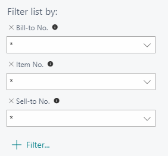
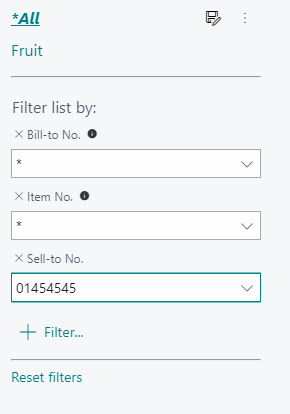
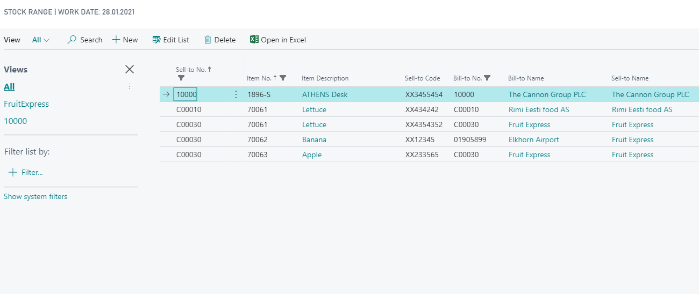

# Stock Range – User Guide

Stock Range functionality enables the following:

* Stock Range import to Excel and from Excel printing and sending Stock Ranges to your customers.
* From Excel back to BusinessCentral copy functionality (Sell-to No, Item No).
* Saving Stock Ranges for your needs. For example, with Sell-to No. 

## Verify Stock Range Installation

Open **Extension Management** and check if extension named ‘BCS Itera Stock Range’ is installed. If not, please contact BCS Itera AS.  

## Settings

### Item Card Settings

Open the **Item Card** you want to add into your new Stock Range. 
In general information choose suitable **Item Category Code**. 
In Fast Tab **Planning** you need to fill in the **Minimum Order Quantity**.
Then you need to set up **Customers Cross-Reference** number, if it is different from BC and EAN code. 
On the Ribbon Click **Navigate**-> **Item**-> **Cross References**.

|**Cross- Reference Type**|**Cross-Reference Type No**|**Cross-Reference No**|
|-|-|-|
|Customer|Customer No|Customer Item No|

No. will be automatically linked to Customers Card Cross-Reference.

|**Cross- Reference Type**|**Cross-Reference No**|
|-|-|
|Bar Code|EAN|

## Use

From Search open **Stock Range**.
3 Filters are automatically built into the solution.

When creating a new Customer-based Stock Range, fill in **Sell-to No** or any other field whose Stock Range you want to create. Then click on **"Save As"**.

### Stock Range list fields

|**Field name**|**Usage**|
|-|-|
|Sell-to No|Customer No whose Stock Range is needed.|
|Item No|Item No user wants in the Stock Range.|
|Item Description|Fills in automatically according to Item No.|
|Sell-to Code|Fills in automatically from Item Card when Cross-Reference for the Customer is setup.|
|Bill-to No|Fills in automatically, if settings in Customer Card with Bill-to No is setup.|
|Bill-to Name|Fills in automatically, if settings in Customer Card Bill-to No is setup.|
|Sell-to Name|Fills in automatically from Sell-to No.|
|Cross-Reference no|Fills in automatically, if Item Card Cross-Reference Bar Code is setup.|
|Minimum Quantity|Fills in automatically, if on Item Card Minimum Quantity is setup.|
|Starting Date|User need to set it.|
|Ending Date|You need to set it.|
|Item Category Code|Fills in automatically, if on Item Card Item Category code is setup.|
|Level |User need to set it.|
|User ID|Fills in automatically.|
|Time Inserted|Fills in automatically.|

Once your needed Stock Range has been created click **Open in Excel** and this one you can modify or send to the Customer.

If you create Stock Range in Excel, then it is possible to import it into BC with only 2 first rows (Sell-to-No, Item No).  It assumes that all needed settings in BusinessCentral are done before. 

For more information and pricing please contact BCS Itera AS:
[https://www.itera.ee](https://www.itera.ee)
