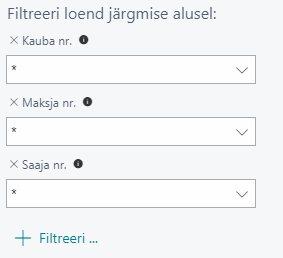
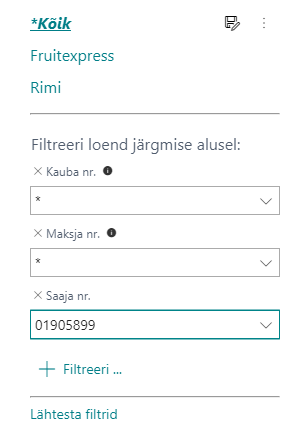

# Sortimendi lahendus – Kasutusjuhend

Sortimendi lahendus võimaldab alljärgnevat:
* Excelisse importimist ning sellelt tellimuslehtede ja sortimendi aruannete printimist.
* Excelist tagasi BusinessCentral-isse kopeerimist(Saaja nr, Kauba nr)
* Sortimentide salvestamist vajaliku filtri põhiselt, näiteks Saaja nr järgi. 

## Sortimendi lahenduse api tuvastamine

Ava **Laiendused** ja veendu, et app ‘BCS Itera Stock Range’ on alla laetud. Kui pole, võid selle leida AppSourcest või Kui see puudub võta ühendust BCS Iteraga.

## Seadistused

### Kauba kaardi seadistamine

Ava **kauba kaart**, mida soovid sortimenti lisada. 
Üldinfo all vali soovitud **Kaubakatekooria tähis**. 
Kiirinfo väljal **Planeerimine** leiad **“Minimaalse tellimuskoguse”**, täida see ära.
Järgmiseks on vaja Kauba kaardil seadistada, kliendi kauba number, kui  erineb BC omast ning EAN kood:
Lindil vajuta **Navigeeri**-> **Kaup**->**Ristviited**.

|**Ristviite liik**|**Ristviite liigi nr**|**Ristviite nr**|
|-|-|-|
|Klient|Kliendi nr|Kliendi tootekood|

Antud ristviide lingib ennast automaatselt ka kliendi enda kaardile. 

|**Ristviite liik**|**Ristviite nr**|
|-|-|
|Vöötkood|EAN|

## Kasutamine

Ava otsingust **Sortiment**.
Lahendusse on automaatselt sisse ehitatud 3 filtreerimist.

Kliendi põhise uue sortimendi loomisel pane filtrisse soovitud ettevõtte **Saaja nr** või mõni muu väli, mille sortimenti soovid luua. Seejärel kliki **“Salvesta Nimega”**.

### Sortimendi lahenduse listi väljad

|**Välja nimi**|**Kasutamine**|
|-|-|
|Saaja nr|Klient, kelle sortimenti hallatakse.|
|Kauba nr|Kauba nr, mida soovid sortimenti lisada.|
|Kauba kirjeldus|Täitub automaatselt Kauba nr järgi.|
|Saaja kood|Tuleb automaatselt kauba kaardilt, kui ristviite all on seadistatud Kliendi Ristviite nr.|
|Maksja nr|Tuleb automaatselt, kui kliendi kaardil on Maksja nr seadistatud.|
|Maksja nimetus|Tuleb automaatselt, kui kliendi kaardil on Maksja nimetus seadistatud.|
|Saaja nimetus|Täitub automaatselt Saaja nr järgi.|
|EAN|Tuleb automaatselt kauba kaardilt, kui ristviite all on seadistatud ristviite nr vöötkoodile.|
|Minimaalne kogus|Tuleb automaatselt, kui kauba kaardil on Minimaalne tellimuskogus seadistatud.|
|Algus kp|Tuleb ise määrata.|
|Lõpp kp|Tuleb ise määrata.|
|Kaubakategooria tähis|Tuleb, kui Kauba kaardil on antud väli täidetud.|
|Tase|Tuleb ise määrata.|
|Sisestaja ID|Tuleb automaatselt.|
|Sisestamise aeg|Tuleb automaatselt.|

Kui soovitud sortiment on loodud, saad klikkides **Ava Excelis** filtris oleva sortimendi avada ning saata kliendile. 
Kui sortiment on loodud Excelis, siis on võimalik sortiment luua BC ka ainult esimese kahe välja abil (Saaja nr, Kauba nr). Eeldab, et kõik eelseadistused BusinessCentrali poole peal on tehtud. 

Lisainformatsiooni saamiseks palun võta ühendust BCS Itera AS:
[https://www.itera.ee](https://www.itera.ee)

