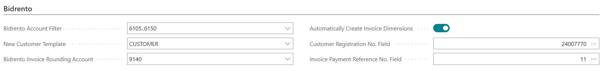

# Bidrento Interface for Business Central User Guide

Bidrento Interface enables the following:
- Get Customers from Bidrento
- Update Customer's info in Business Central
- Get Sales invoices from Bidrento

## Contents
- [Bidrento Installation](#bidrento-installation)
- [Setup](#setup)
- [Customers and customer template](#customers-and-customer-template) 
- [Sales invoices numbers](#sales-invoices-numbers)
- [Dimensions](#dimensions)
- [Payment Terms](#payment-terms)
- [Setup Accounts or Articles for Bidrento](#setup-Accounts-or-Articles-for-Bidrento) 
- [Get Customers and Invoices from Bidrento](#Ge-Customers-and-Sales-Invoices-from-Bidrento) 
- [File log and Error management](#File-log-and-Error-management)
   
  
   
  

## Bidrento Installation
Open **Extension Management** and check if extension named ‘Bidrento’ is installed. If not, please find and install it from AppSource or contact BCS Itera AS.

### Setup

Open the page **Sales & Receivables Setup** and then the fast tab **Bidrento**. Plese fill the fields as following (mandatory fields marked with *):

|Field|Description|
|---|---|
|Bidrento Account Filter *|Specity the G/L account numbers to be sent to Bidrento. There those accounts are reported as articles| 
|New customer Template *|Specify the customer template to be used when creating a new customer imported from Bidrento| 
|Bidrento Invoice Rounding Account *|Set the G/L account number for rounding|
|Automatically Create Invoice Dimensions |Choose Yes, if you want the Dimension Values for the Dimension specified in Bidrento to be generated automatically|
|Customer Registration No. Field  *|Choose which field is used for a Customer Business Registration No. in the Customer table|
|Invoice Payment Reference No.Field |Choose which field is used for a Payment Reference No. in the Invoice Header table|

   
 

  

### Customers and customer template
Customer information is entered in Bidrento and sent to Business Central. Enter account posting groups, language and other important information in the same customer template as specified on the **Sales and Receivables Setup** page. 
A new field **Bidrento No.** has been added to the **Customer's card**, through which the customer's information is updated.

### Sales invoices numbers
The number series of the sales invoices is determined in Bidrento. A posted sales invoice is created with the same number. 

### Dimensions
To use dimensions, add the Dimension code to the Bidrento Interface page.  
You can enter the dimension values manually or the use the button **Automatically Create Invoice Dimensions** to create new dimension values. 

### Payment Terms 
The **Due Date** is set when the invoice is created in Bidrento and is present on the imported invoice.

### Setup Accounts or Articles for Bidrento
Specity the G/L account numbers to be sent to Bidrento on the **Sales and Receivables Setup** page. There those accounts are reported as articles.

  
 

## Get Customers and Sales Invoices from Bidrento

When you send an invoice to a customer from Bidrento, the updated Customer information and invoice are automatically sent to Business Central.

  

## File log and Error management
All files sent from Bidrento are on the page **Bidrento Inbound**.
Once all the settings have been made, the data will be processed immediatley and a **Customer card** or **Sales invoices** will be created.
This page also shows error messages about file exchange or missing setup. Fix the error and then Press the **Process** button to restart processing.

 

