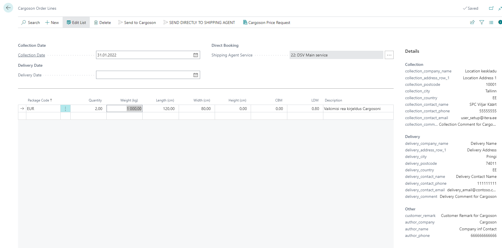
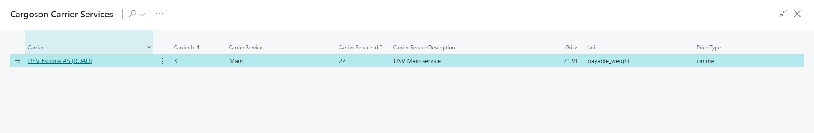
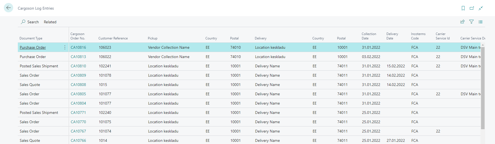

# Cargoson Interface for Business Central User Guide

Cargoson Interface enables the following:
- Sending Transportation Orders (incl. Direct Booking ones) from Business Central to Cargoson. Sending Transportation Orders is supported from Business Central Sales Quotes, Sales Orders, Posted Sales Shipments and Purchase orders.  
- Sending transportation price requests from Business Central to Cargoson and applying the selection directly to the documents. Sending price requests is supported from Business Central Sales Quotes, Sales Orders, Posted Sales Shipments and Purchase orders.
- See data exchange log between Business Central and Cargoson.

## Contents
- [Cargoson App Installation](#Cargoson-app-installation)
- [Menu](#menu) 
- [How to setup](#how-to-setup) 
  - [Setup API ](#setup-api)
  - [Setup Package Types](#setup-package-types) 
  - [Setup User for Cargoson](#setup-user-for-cargoson)
  - [Setup Shipping Agents and Shipping Agent Services for Cargoson](#setup-shipping-agents-and-shipping-agent-services-for-cargoson) 
- [How to make price requests from Cargoson](#how-to-make-price-requests-from-cargoson)
- [How to send transportation orders to Cargoson](#how-to-send-transportation-orders-to-cargoson)  
- [How to check Cargoson Log entries](#how-to-check-cargoson-log-entries)

     

## Cargoson App Installation
Open **Extension Management** and check if extension named ‘Cargoson’ is installed. If not, please find and install it from AppSource or contact BCS Itera AS.

## Menu
Cargoson menu items can be found from all Business Central Role centers via search functionality. Actions can be run from related pages (see instrctions below). 

## How to setup

### Setup API

Search for **Cargoson Setup** to open the Cargoson Setup page and fill the fields as following (mandatory fields marked with *):

|Field|Description|
|---|---|
|Service URL*|Cargoson Service URL given by Cargoson support.|  
|Authentication Phrase*|Cargoson Authentication Phrase given by Cargoson support.| 
|Default Line Description*|Specifies Cargoson transportation order default line description.|
|Default Package Code*|Specifies Cargoson transportation order line default Package Type.|
|Use Collection Location Code|If activated then Cargoson collection information is taken from Location card specified in sales document field Collection Location Code.|

   

### Setup Package Types

Search for **Package Types** to open the Package Types setup page and fill the fields as following (mandatory fields marked with *):

|Field|Description|
|---|---|
|Code*|Cargoson Service URL given by Cargoson support.|  
|Type*|Package Type code used in Cargoson queries. These codes must be mapped with Cargoson.| 
|Description|Package Type description for internal use.|
|Length (cm)|Package Type Length (cm) which is taken to Cargoson transportation lines.|
|Width (cm)|Package Type Length (cm) which is taken to Cargoson transportation lines.|
|Calculate LDM|If marked then LDM is calculated to Cargoson transportation lines automatically.|

   

  

### Setup Authentication Phrase for User

Search for **User Setup** to open the User Setup page and add necessary users and fill the fields as following (mandatory fields marked with *):

|Field|Description|
|---|---|
|Salespers./Purch. Code|User related salesperson code. Data is taken to Cargoson queries|  
|E-Mail|User e-mail address. Data is taken to Cargoson queries| 
|Phone No.|User Phone Number. Data is taken to Cargoson queries|
|Cargoson Authentication Phrase|User based Cargoson Authentication Phrase given by Cargoson support. If defined in user level, it will be used in Cargoson queries instead of the one specified in Cargoson Setup table. It allows to differentiate transportation orders by users in Cargoson webpage.|

  

### Setup Shipping Agents and Shipping Agent Services for Cargoson

Search for **Shipping Agents** to open the Shipping Agents setup page and add necessary Shipping Agents and Shipping Agent Service Codes (these must be agreed with Cargoson): 

  
  

## How to make price requests from Cargoson
Price request from Cargoson can be initiated from the following Business Central documents:
- Sales Quotes, 
- Sales Orders, 
- Posted Sales Shipments, 
- Purchase orders

Process:
- Create Business Central document, e.g. Sales Order 
- Initiate Cargoson price request query from the document header **Process -> Send to Cargoson**  
- Cargoson Order Lines window will be opened:

- Check transportation order data (mandatory fields marked with *):

|Field|Description|
|---|---|
|Header||
|Collection Date*|Transportation Order collection date|  
|Delivery date|Transportation Order delivery date|
|Shipping Agent Service|Transportation Order Shipping Agent Service Code|
|Details||
|Collection Postcode*|Postcode has to be filled in Location card selected to source document|  
|Collection Country*|Country code has to be filled in Location card selected to source document|
|Delivery Postcode*|Ship-to postcode has to be filled in source document|  
|Delivery Country*|Ship-to country has to be filled in source document|
|Lines||
|Package Code*|Transportation Order Line package type| 
|Quantity*|Transportation Order Line package quantity|
|Weight (kg)*|Transportation Order Line package weight. Is filled automatically by items Gross weight sum from source document lines. If Gross weight has not been filled, Net weight is used instead.|
|Length (cm)|Transportation Order Line package length|
|Width (cm)|Transportation Order Line package width|
|Height (cm)|Transportation Order Line package height|
|CBM|Transportation Order Line CBM|
|LDM|Transportation Order line LDM|
|Description|Transportation Order line description|

- Press button **Cargoson Price Request** to send the query to Cargoson.
- Cargoson will reply with price offers from different carriers:

- Mark suitable line and press **OK** to select carrier service to the source document as Shipping Agent and Shipping Agent Service (it is needed for direct booking) or discard the selection by pressing **Cancel**  

  
  

## How to send Transportation Orders to Cargoson

Transportation Order can be sent to Cargoson from the following Business Central documents:
- Sales Quotes, 
- Sales Orders, 
- Posted Sales Shipments, 
- Purchase orders

Process:
- Create Business Central document, e.g. Sales Order 
- On the document header press **Process -> Send to Cargoson** to start Transportaion Order sending process  
- Cargoson Order Lines window will be opened:

- Check transportation order data (mandatory fields marked with *):

|Field|Description|
|---|---|
|Header||
|Collection Date*|Transportation Order collection date. Field must be filled in with today's date or later otherwise Transportation Order cannot not be sent to Cargoson|  
|Delivery date|Transportation Order delivery date. This date is usually given by shipping agent, but it is possible to send it to Cargoson id necessary. Value must be equal on later from **Collection Date**|
|Shipping Agent Service|Transportation Order Shipping Agent Service Code. Field must be filled with Shipping Agent Service Code if Transportation Order is sent to Cargoson with Direct Booking Option (it means that Carogoson will forward the order directly to shipping agent without user intervention in Cargoson's website)|
|Details||
|Collection Postcode*|Postcode has to be filled in Location card selected to source document|  
|Collection Country*|Country code has to be filled in Location card selected to source document|
|Delivery Postcode*|Ship-to postcode has to be filled in source document|  
|Delivery Country*|Ship-to country has to be filled in source document|
|Cargoson Delivery Comment|Additional delivery related information. (e.g., "Code to enter the gate is 1234"). Text can be added on related source document (excl. Posted Sales Shipment)|
|Cargoson Collection Comment|Additional collection related information. (e.g., "Code to enter the gate is 1234"). Text can be added on related source document (excl. Posted Sales Shipment)|
|Cargoson Customer Remark|Remarks to the customer. Text can be added on related source document (excl. Posted Sales Shipment)|
|Lines||
|Package Code*|Transportation Order Line package type| 
|Quantity*|Transportation Order Line package quantity|
|Weight (kg)*|Transportation Order Line package weight. Is filled automatically by items Gross weight sum from source document lines. If Gross weight has not been filled on item card, Net weight is used instead.|
|Length (cm)|Transportation Order Line package length|
|Width (cm)|Transportation Order Line package width|
|Height (cm)|Transportation Order Line package height|
|CBM|Transportation Order Line CBM|
|LDM|Transportation Order line LDM|
|Description|Transportation Order line description|

- Press button **Send to Cargoson** to send the Transportation Order to Cargoson. System checks if all mandatory fielda have been filled with data (if not, the corresponding message is displayed to the user). If Transportaton Order has already been sent to Cargoson from related source document, theb user will be notified with message **Current document is already sent to Cargoson. Do you want to continue?**.
- Press button **SEND DIRECTLY TO SHIPPING AGENT** to send the Transportation Order to Cargoson with Direct Booking option. If Transportaton Order has already been sent to Cargoson from related source document, theb user will be notified with message **Current document is already sent to Cargoson. Do you want to continue?**.
- Cargoson will reply with price offers from different carriers:

- ct carrier service to the source document as Shipping Agent and Shipping Agent Service (it is needed for direct booking) or discard the selection by pressing **Cancel**  

  
  

## How to check Cargoson Log entries
Transportation order related query responses between Business Central and Cargoson are saved to Cargoson Log entries table. Search for **Cargoson Log Entries** to open the Cargoson Log entries page:

|Field|Description|
|---|---|
|Document Type|Document type from which the query was sent|
|Document No.|Document number from which the query was sent|  
|Cargoson Order No.|Related Cargoson Order number. Field acts as link and clicking on it opens Cargoson website with related Transportation Order|
|Customer reference|Customer reference number|
|Pickup|Company name where the goods were collected|
|Postal|Transportation Order collection Postcode|  
|Country|Transportation Order collection Country|
|Delivery|Company name where the goods were delivered|  
|Postal|Transportation Order Delivery Postcode|  
|Country|Transportation Order Delivery Country|
|Collection date|Transportation Order Collection Date| 
|Delivery date|Transportation Order Delivery date|
|Carrier Service ID|Transportation Order Service ID. Indicates that Transportation Order was sent to Cargoson with Direct Booking option|
|Carrier Service Description|Transportation Order Service ID description from BC|
|Incoterms Code|Incoterms code related Transportation Order|
|Label link|Package label link. Field acts as link and clicking on it opens related package label|
|Tracking ID link|Package tracking link. Field acts as link and clicking on it opens related package tracking website|
|Entry No.|Log Entry unique number|
