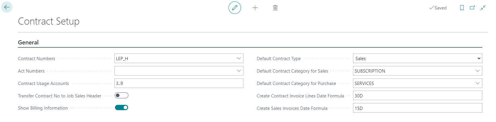
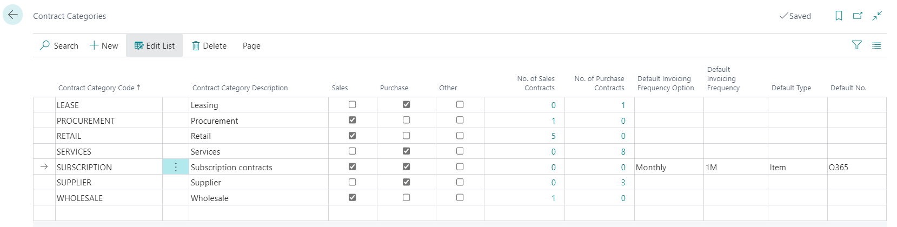
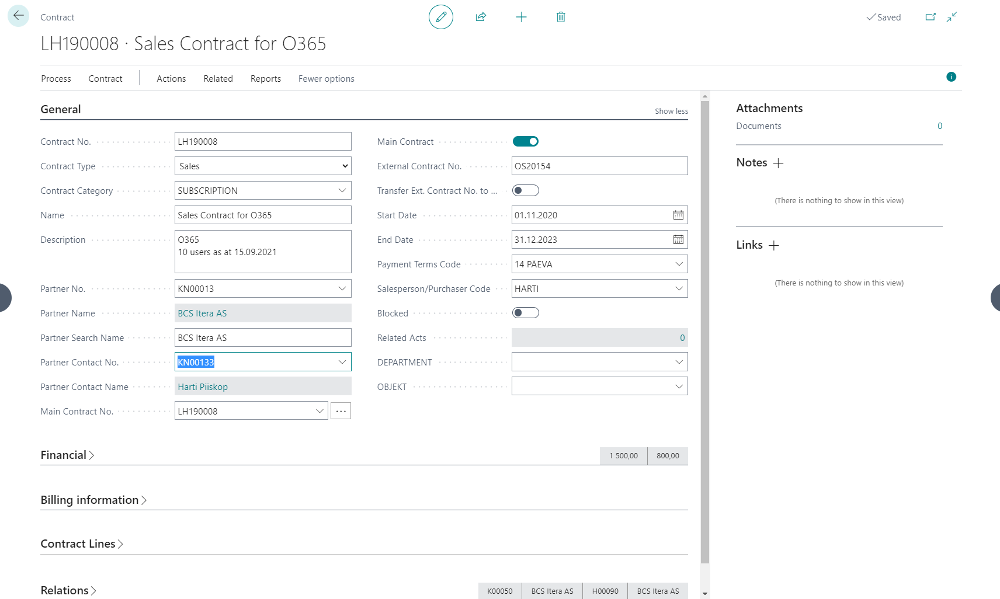
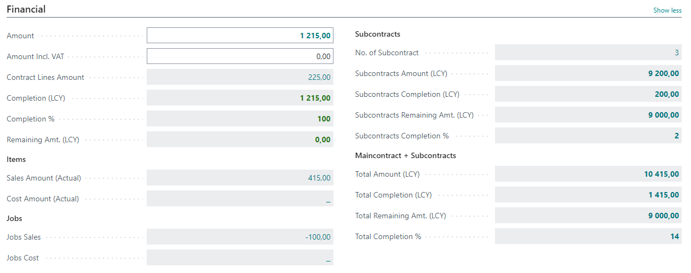
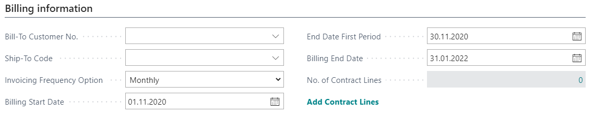
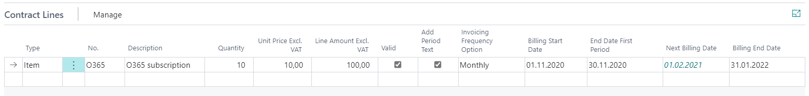
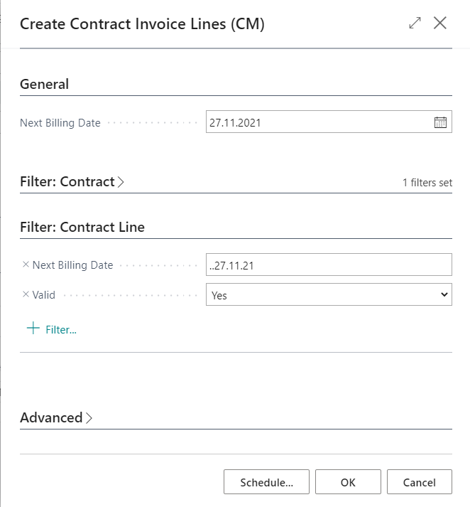
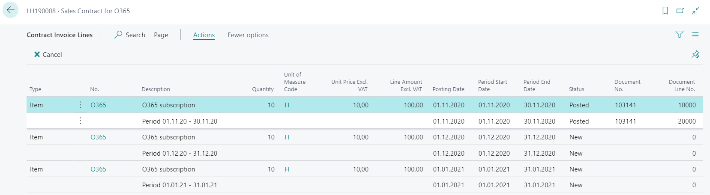

# Contract Management
Contract management functionality in BC enables the following:

- Management of sales and purchase contracts
- Tracking of sales header and sales line amounts by contract number
- Tracking of purchase header and purchase line amounts by contract number
- Contract support on Job card for creating job sales invoices
- Partner and contract support on job planning lines for planning purposes
- Use default dimensions on contracts.
- Create contract lines for billing.
- Create periodic sales orders and invoices based on contract lines.

## Table of Contents
  - [Settings](#settings)
    - [Contract Categories](#contract-categories)
  - [Use](#use)
    - [Create contract](#create-contract)
    - [Using contracts on purchase and sales documents](#using-contracts-on-purchase-and-sales-documents)
    - [Contract completion tracking](#contract-completion-tracking)
    - [Using contracts in Jobs](#usingjcontractsjin-jobs)
  - [Billing](#billing)
    - [Create Contract Invoice Lines](#create-contract-invoice-lines)
    - [Contract Invoice Lines](#contract-invoice-lines)

## Settings
To use the functionality, **Contract Setup** must be opened and following fields filled:

|Field|Explanation|
|---|---| 
| **_Contract numbers_** | For defining contract number series. Value can be chosen from **No. Series List**.|
| **_Contract Usage Accounts_** | Allows to define a GL accounts filter for contract usage calculation. For an example income and expense accounts on which you expect transaction related to contracts. It is advisable to exclude VAT, payables and receivables accounts. You can define specific accounts and/or an accounts range (for an example range 30000..90000).|
|**_Transfer Contract No to Job Sales Header_** |Enables transferring Contract No. from Job Card to new Job Invoice Header.
|**_Default Contract Type_**|Specifies default Contract Type for new contracts.
|**_Def. Contract Category Sales_**|Specifies default Contract Category for sales contracts.
|**_Def. ContractCategory Purchase_**|Specifies default Contract Category for purchase contracts.

_Billing related setup_

|Field|Explanation|
|---|---| 
|**_Show Billing Information_**|Enables Billing Information tab on sales contracts.
|**_Create Contract Invoice Lines Date Formula_**|Specifies default date formula for Next Billing Date in Create Contract Invoice Lines (CM).
|**_Create Sales Invoices Date Formula_**|Specifies default date formula for Posting Date in Create Sales Invoices (CM).

----

### Contract Categories

Contract categories allow you to define different type of categories in order to divide your contracts into different groups.

|Field| Explanation|
|---|---| 
| **_Contract Category Code_** | Specifies a category code for the contract.|
| **_Contract Category Description_** | Decription to define which contracts are categorized to this category|
|**_Sales, Purchase, Other_**| Sales should be marked if category should be availabele on sales contracts (Type **Sales**), Purchase should be marked if category should be availabele on purchase contracts (Type **Purchase**), Other should be marked if category should be availabele other contracts (Type **Other**).
|**_No. of Sales Contracts_** and **_No. of Purchase contracts_**| Shows number of Sales/Purchase contracts in that category.|

_Billing related category setup_

|Field|Explanation|
|---|---| 
| **_Def. InvoicingFrequency Option_** | Specifies default Invoicing Frequency Option for contracts in this category.|
| **_Invoicing Frequency"_** | Specifies default Invoicing Frequency for contracts in this category.|
| **_Default Type_** | Specifies default Type for contract lines for contracts in this category.|
| **_Default No._** | Specifies default No. for contract lines for contracts in this category.|

---
 
## Use
### Create contract

With contract management it is possible to manage purchase, sales and other contracts. For creating a new contract you must open **Contracts** and use button **+New** in order to create a new entry.

An empty **Contract card** opens where you can fill the following fields:

|Field| Explanation|
|---|---| 
| Contract No.* | Is filled automatically according to defined Number Series from **Contract Setup**.
| Name and Description** | For entering contract and short description.
| Partner No.* | Allows to choose contract partner from **Contact list**. If contact is related to a **Customer** or **Vendor** then related information will be displayed on **Relations** tab  on fields _Customer No. and Name_ and _Vendor No. and Name_. 
| Contract Type* | Defines if it is a purchase, sales or other type of contract. Option also defines if that contract can be chosen to Purchase document (**Purchase**) or to Sales document (**Sales**).
|Main Contract No. | Allows to group contracts under a common value (Main Contract), that can be chosen from **Contract List** filtered by field **Main Contract**. Default value is contract's own number.
|Main Contract| Allows that contract to be chosen as main contract.
|External Contract No. | Allows to enter partners contract number.
| Start and End Dates** | Allows to define validity dates of the contract. Field is informative.
| Amount** | Allows to enter contract amount, this amount is base for calculating the reminder of the contract.
| Amount Incl. VAT | Allows to enter contract amount including VAT.
| Payment Terms | Allows to define agreed payment terms. Value will be transferred to Sales/Purchase header after chosing contract in document header.
|Salesperson/Purchaser Code| Specifies a code for the salesperson/purchaser who is responsible for the contract. Value will be transferred to Sales/Purchase header after chosing contract in document header.
| Blocked | Allows to mark contract as Blocked. Contract will no longer be displayed in drop down list on purchase and sales documents, job and job planning lines.

*_Fields that must be filled_
**_Fields that are advisable to fill_

Fields displayed on fast tab **Relations** (Customer No. and Name, Vendor No. and Name) are filled automatically after partner selection. Fields will only be filled if the selected **Contact** is related to **Customer** and/or **Vendor**. If the relation will be created later, then contract must be updated manually by pressing button **Update Customer/Vendor link** on contract card. This updates Contact's relations with Customer and Vendor on contract.

---
 
### Using contracts on purchase and sales documents
On sales and purchase document headers you can select appropriate contract from **Contract List** in the field **_Contract No._**. If contract has been selected in the header then it will be automatically transferred to lines. It is possible to change contract number on lines. 

#### _Important_
---
_Selection of contracts that can be chosen to document is limited with the following:_
- _Contract type - on sales documents you can select contracts with the type of **_Sales_** and on purchase documents with the type of **_Purchase_**._
- _Buyer or Seller number - sales documents **_Sell-To Customer No._** and purchase documents **_Buy-From Vendor No._**._
- _**Blocked** contracts will be left out._

_If there is no contract in the selection that meets the requirement, then it might be due to Customer/Vendor relations that have not been updated on contract card. In order to update the relations button **_Update Customer/Vendor link_** must be pressed on related contract card.This updates Contact's relations with Customer and Vendor on contract_.

---

Contract number will be transferred to posted documents, **General Ledger Entries**, customer and vendor ledgers and **Job Ledger Entries** after posting. 

#### _Important_

--- 
_It must be taken into account that document header contract number will be transferred to customer and vendor ledgers. If different contract have been used on lines then those will be transferred to related income and expenses accounts._

---

### Contract completion tracking

You can track the completion and reminder of the contract from the **Contract List** or **Contract Card** by checking following fields:

- **Completion (LCY)** - displays contract related amounts from **General Ledger Entries**. Account filter from the **Contract Setup** has been applied to entries.
- **Reminder (LCY)** - displays contract remaining amount that is calculated on the basis of fields **_Amount_** and **_Completion (LCY)_**.

Additionally it is possible to open list of related **General Ledger Entries** by using **Completion entries** button in contract list or on contract card.
 
 ---

### Using contracts in Jobs
It is possible to use contract in Job module on **Job Card** and in **Job Planning Lines**.

**Job Card** - it is possible to enter related sales contract to a job by selecting appropriate contract from **Contract List** in the field **_Contract No._**  

Selection of contracts that can be chosen to job is limited with the following:
- Contract Type - contracts with type **Sales** can be used for jobs.
- Customer - contracts that are related to **_Bill-To Customer No._** from job card can be used.
- **Blocked** contracts will be left out.

Contract will be transferred to **Sales Invoice** when creating an invoice for a job by using action **_Create Job Sales Invoice_**.

**Job Planning Lines** - it is possible to enter **_Partner No._** and related **_Contract No._** to job planning lines. That allows track, for an example, if you already have a contract with subcontractor or no for a specific task. Later it will help to track completion..

Selection of contracts that can be chosen to job planning line is limited with the following:
- Partner - contracts that are related to selected **_Partner No._** can be used.
- **Blocked** contracts will be left out.

---

## Billing

You can enter billing information on contract card and then fill in contract lines. After that billing lines can be created, in order to check possible deviations and to have a longer view, and finally sales documents can be created.

#### _Important_

--- 
_**Billing Information** tab becomes visible only if it is allowed in **Contract Setup** and on contracts of type **Sales**! **Contract Lines** tab becomes visible after billing information date related fields are filled in and **Add Contract Lines** has been clicked!_

---

On **Billing Information** tab you can fill following fields:

|Field|Explanation|
|---|---| 
| **_Bill-to Customer No._** | Specifies Bill-To Customer. If not filled in Customer default value will be used on invoice creation.|
| **_Ship-to Code_** | Specifies Ship-To Code. If not filled in Customer default value will be used on invoice creation.|
| **_Invoicing Frequency Option_** | Specifies default Invoicing Frequency Option for lines.|
| **_Invoicing Frequency_** | Specifies default Invoicing Frequency for lines. By default field is not visible.|
| **_Billing Start Date_** | Specifies default Billing Start Date for lines.|
| **_End Date First Period_** | Specifies default End Date of the first billing period for lines. For an example this field allows to play with the length of the first period in order to adjust future periods to fit into full months.|
| **_Billing End Date_** | Specifies default Billing End Date for lines.|
| **_Add Contract Lines_** | Enables **Contract Lines** and inserts first contract line with default values from **Contract Category** and **Billing Information** tab.|

On **Contract Lines** tab you can fill following fields:

|Field|Explanation|
|---|---| 
| **_Type_** | Allows to specify type. Default value will be taken from **Contract Category**.|
| **_No._** | Allows to specify No. to be billed. First line default value will be taken from **Contract Category**|
| **_Description_** | Allows to specify line description.|
| **_Quantity_** | Allows to specify quantity to be billed.|
| **_Unit of Measure Code_** | Allows to specify unit of measure to be billed. Field is not visible by default.|
| **_Unit Price Excl. VAT_** | Allows to specify line unit price to be billed.|
| **_Line Amount Excl. VAT_** | Displays calculated line amount. Field is not editable.|
| **_Valid_** | Allows to specify if line is valid or not. Default value is Valid.|
| **_Add Period Text_** | Allows to specify if new text line with period information will be added after this line when creating invoice information.|
| **_Invoicing Frequency Option_** | Specifies billing period/frequency for current line. Default value will be taken from **Billing Information** tab.|
| **_Billing Start Date_** | Allows to specify Billing Start Date for current line.|
| **_End Date First Period_** | Allows to specify End Date First Period for current line. Default value will be taken from **Billing Information** tab.|
| **_Next Billing Date_** | Displays **Nexte Billing Date** (next period start date) for current line after [Create Contract Invoice Lines](#create-contract-invoice-lines) has been run|
| **_Billing End Date_** | Allows to specify Billing End Date for current line.. Default value will be taken from **Billing Information** tab.|

Contract line based sales orders/invoices creation consists of two steps.

### Create Contract Invoice Lines
First step is to create **Contract Invoice Lines**.

Open **Contracts List** or **Contract Card** and use action **Create Contract Invoice Lines (CM)**.
Following window will be opened:

Fill in **Next Billing Date**, this date will be an end date for a range that will be applied to **Valid** contract lines. It will be applied to **Next Invoicing Date** or to **Billing Start Date** (if the other is empty) and **Contract Invoice Lines** will be created for each **Contract Line** that meets the filtering criteria. 
* By default it is filled with Today + date formula from **_Create Contract Invoice Lines Date Formula_** in **Contract Setup**.
* Additonal filter can be applied from **Contracts** or **Contract Invoice Lines**.
* If clicked from **Contract Card** then **_Contrat No_** filter will be entered automatically. 

Press **OK**.

Use action **Contract Invoice Lines** from **Contract Card** to open list. Check if lines were created and if they look OK for creating invoices/orders. _List is not editable_.

Some of the fields need no explanation. Other will be explained below.

|Field|Explanation|
|---|---| 
| **_Posting Date_** | By default **Period Start Date**.|
| **_Period Start Date_** and **_Period End Date_**  | Are reflecting the actual billing period|
| **_Status_** | Shows status of current line. **New** - First status for alla created lines. Also line gets this status back when it is removed from order/invoice. or removed . **Order** - **Sales Order** has been created from that line. **Invoice** - **Sales Invoice** has been created from that line. **Posted** - involved sales order/invoice has been posted. **Canceled** - line has been canceled by using action **Cancel**, only **New** lines can be canceled.|
| **_Document No._** | Shows document number of the involved document (order, invoice, posted invoice).|

---

For more information please contact BCS Itera AS:  
https://www.itera.ee
