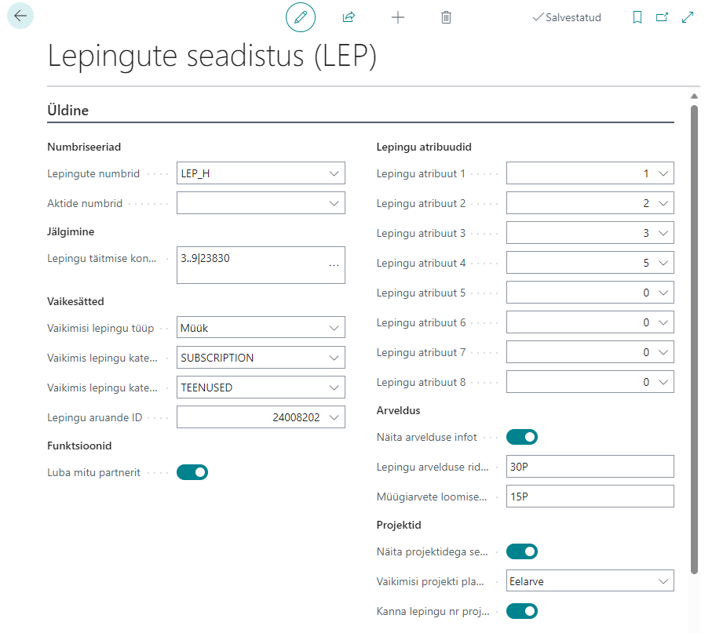
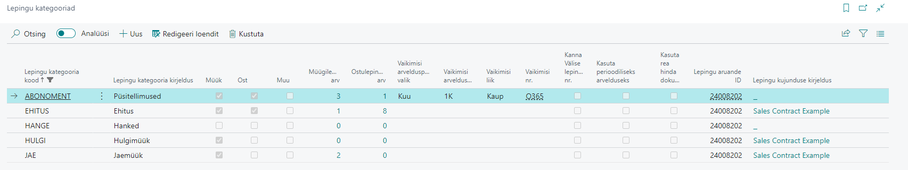
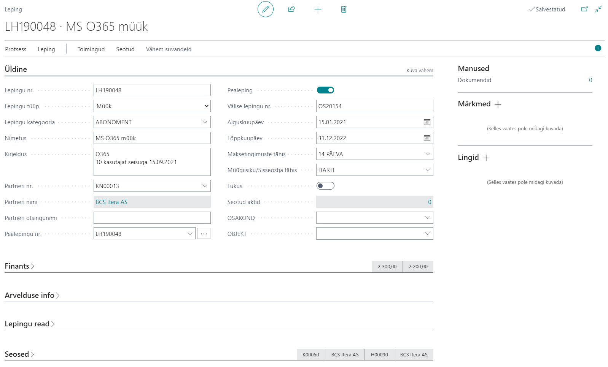
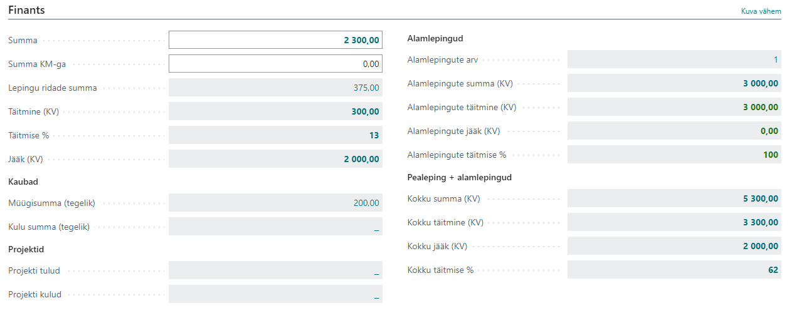
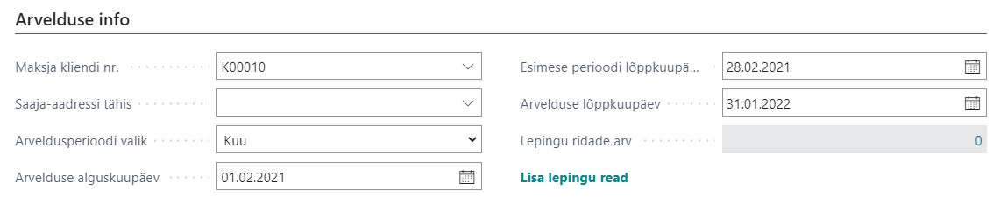
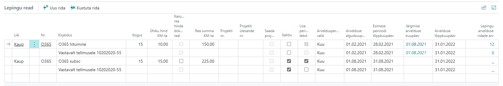
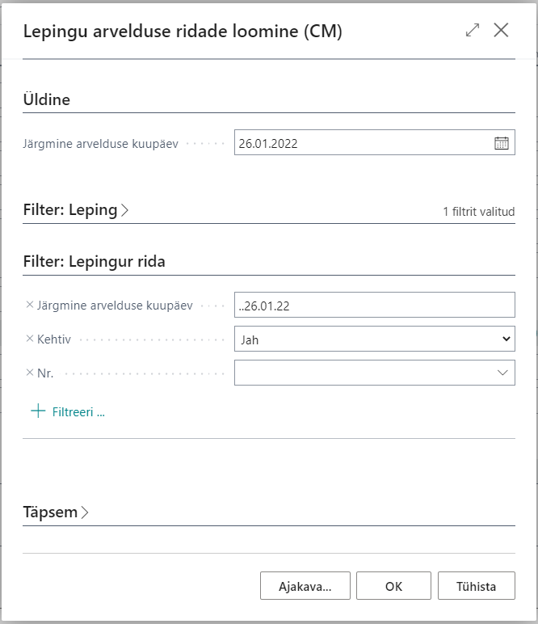
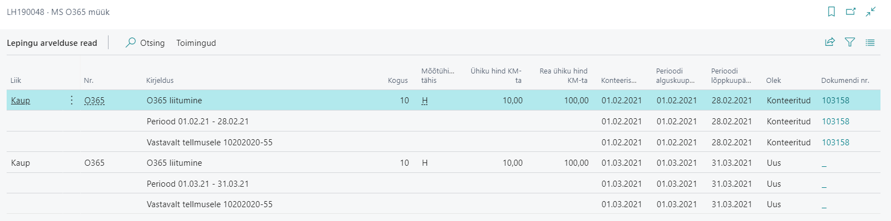
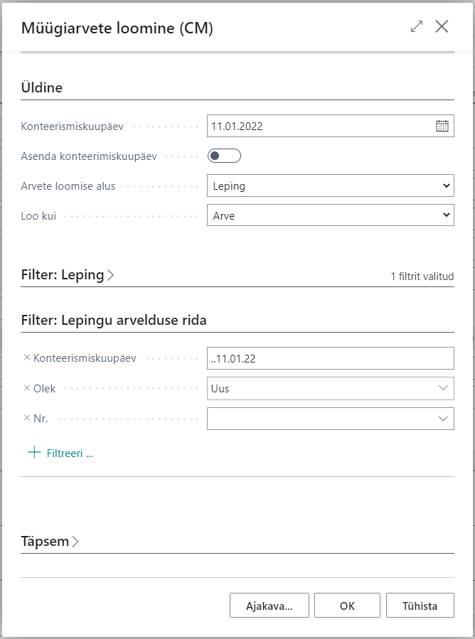

# Lepingute haldus
Lepingute funktsionaalsus võimaldab BC-s järgmist:

- Müügi- ja ostulepingute haldus
- Müügipäise ja müügiridade summade jälgimist lepingu numbri alusel
- Ostupäise ja osturidade summade jälgimist lepingu numbri alusel
- Lepingute tugi projekti kaardil projekti müügiarvet loomiseks
- Partneri ja lepingute tugi projekti plaanimisridadel planeerimise eesmärgil 
- Vaikedimensioonide kasutamine lepingtel
- Lepingu arvelduse ridade loomine
- Perioodiliste müügiarvete loomine lepingu arvelduse ridade alusel

## Sisukord
  - [Seadistamine](#seadistamine)
    - [Lepingu kategooriad](#lepingu-kategooriad)
  - [Kasutamine](#kasutamine)
    - [Lepingu loomine](#lepingu-loomine)
    - [Lepingu kasutamine ostu- ja müügidokumentidel](#lepingu-kasutamine-ostu--ja-müügidokumentidel)
    - [Lepingu täituvuse jälgimine](#lepingu-täituvuse-jälgimine)
    - [Lepingute kasutamine projektides](#lepingute-kasutamine-projektides)
  - [Arveldamine](#arveldamine)
    - [Lepingu arvelduse ridade loomine](#lepingu-arvelduse-ridade-loomine)
    - [Müügiarvete loomine](#müügiarvete-loomine)

## Seadistamine
Funktsionaalsuse kasutamiseks tuleb **Lepingute seadistuses** seadistada järgmised väljad:

| Väli | Selgitus |
| --- | --- | 
| **_Lepingute numbrid_** | Antud väljal määratakse ära lepingute numbriseeria. Väärtus on valitav **Numbriseeriate** loendist.|
| **_Lepingu täitmise kontod_** | Tuleb ära määrata PR kontode filter mille pealt hakatakse lugema lepingu täitmist. Näiteks tulu ja kulukontod, kuhu tekib lepingu kandeid. Kindlast võiks välja jätta käibemaksu ja reskontroga seotud kontod. Võib sisestada konkreetsed kontod ja/või kontode vahemiku (näiteks vahemik 30000..90000).|
|**_Kanna lepingu nr. projekti arve päisesse_** |Võimaldab projekti kaardile valitud lepingu numbri kaasa võtta projekti arve loomisel ning lisada selle loodud projekti arve päissesse.
|**_Vaikimis lepingu tüüp_**|Määrab ära uute lpingute vaikimisi lepingu tüübi.
|**_Vaikimisi lepingu kategooria müügi jaoks_**|Määrab uute müügilepingute vaikimisi kategooria.
|**_Vaikimisi lepingu kategooria ostu jaoks_**|Määrab uute ostulepingute vaikimisi kategooria.

_Arveldamisega seotud seadistused_

|Väli|Selgitus|
|---|---| 
|**_Näita arvelduse infot_**|Määrab kas **_Arveldamise info_** vahekaart on müügilepingutel nähtav või mitte.
|**_Lepingu arvelduse ridade loomise kuupäevavalem_**|Määrab vaikimisi kuupäevavalemi **_Järgmise arvelduse kuupäeva_** jaoks kui kasutatakse funtksiooni **Lepingu arvelduse ridade loomine (CM)**.
|**_Müügiarvete loomise kuupäevavalem_**|Määrab vaikimisi kuupäevavalemi **_Konteerimiskuupäeva_** jaoks kui kasutatakse funtksiooni **Müügiarvete loomine (CM)**.

----

### Lepingu kategooriad

Lepingu kategooriad võimaldavad teil kirjeldada erienvat tüüpi kategooriaid, et lepinguid oleks lihtsam grupeerida.

|Väli|Selgitus|
|---|---| 
| **_Lepingu kategooria tähis_** | Võimaldab määrata lepingu kategooria tähise.|
| **_Lepingu kategooria kirjeldus_** | Võimaldab määrata lepingu kategooria kirjelduse.|
|**_Müük, Ost, Muu_**| Müük tuleks märkida juhul kui kategooriat peaks saama valida müügilepingutele (Tüüp **Müük**), Ost tuleks märkdia juhul kui kategooriat peaks saama valida ostulepingutele (Tüüp **Ost**), Muu tuleks märkida juhul kui kategooriat peaks saama valida ka muudele lepingutele (Tüüp **Muu**).
|**_Müügilepingute arv_** ja **_Ostulepingute arv_**| Kuvab müügi/ostulepingute arvu antud kategoorias.|

_Arveldamisega seotud seadistused_

|Väli|Selgitus|
|---|---| 
| **_Vaikimisi arveldusperioodi valik_** | Võimaldab antud kategooriasse kuuluvate lepingute jaoks määrata vaikimis arveldusperioodi valiku.|
| **_Vaikimisi arveldusperiood_** | Võimaldab antud kategooriasse kuuluvate lepingute jaoks määrata vaikimis arveldusperioodi.|
| **_Vaikimisi liik_** | Võimaldab antud kategooriasse kuuluvate lepingute lepingu ridade jaoks määrata vaikimisi liigi.|
| **_Vaikimisi nr._** | Võimaldab antud kategooriasse kuuluvate lepingute lepingu ridade jaoks määrata vaikimisi nr.|

---
 
## Kasutamine
### Lepingu loomine

Lepingute lahenduse puhul on võimalik hallata nii ostu-, müügi- kui ka muid lepinguid. Uue lepingu sisestamiseks tuleb avada **Lepingud** ning luua uus kirje kasutades nuppu **+Uus**.

Avaneval lepingu kaardil on võimalik täita järgenvad väljad:

| Väli | Selgitus |
| --- | --- | 
| Lepingu nr.* | Täitub automaatselt vastavalt **Lepingute seadistuses** määratud numbriseeriale.|
| Nimetus ja Kirjeldus** | Lepingu nimetuse ja lühikirjelduse sisestamiseks.|
| Partneri nr.* | Võimaldab määrata lepingu osapoole, valik toimub **Kontaktide loendist**. Kui kontakt on seotud ka mõne **Kliendi** või **Hankijaga** siis kuvatakse vastavad andmed väljadel _Kliendi nr ja nimi_ ning _Hankija nr ja nimi_. |
| Lepingu tüüp* | Määratakse ära kas tegemist on ostu, müügi või mõne muu lepinguga. Valik määrab ühtlasi ära ka selle kas leping on valitav ostuarvele (**Ost**) või müügiarvele (**Müük**).|
|Pealepingu nr. | Võimaldab lepingute grupeerimist ühise tunnuse (pealepingu) alla, väljalt avaneb valik **Lepingute loendisse**. Vaikimisi täidetakse lepingu enda numbriga.|
|Välise lepingu nr. | Võimaldab sisestada partneripoolse lepingu numbri.|
| Algus- ja Lõpukuupäev** | Määratakse ära mis on lepingu kehtivusaeg. Väli on informatiivse tähendusega|
| Summa** | Võimaldab määrata lepingu summa, mille alusel hakatakse kuvama ka lepingu jääki.|
| Summa KM-ga | Võimaldab sisestada lepingu summa koos käibemaksuga.|
| Maksetingimused | Võimaldab määrata lepingus kokkulepitud maksetingimused. Väärtus kantakse üle müügi/ostu päisesse peale lepingu nr valimist dokumendi päises.|
|Müügiisiku/Sisseostja tähis| Võimaldab määrata müügiisiku/sisseostja kes on vastava lepingu eest vastutav. Väärtus kantakse üle müügi/ostu päisesse peale lepingu nr valimist dokumendi päises.
| Lukus | Võimaldab lepingu märkida lukus olevaks. Lepingut ei kuvata enam lepingu valiku juures ost- ja müügidokumentidel ega projektide valikutes.|

*_Väljad mis tuleb kndlasti täita_
**_Väljad mis on soovituslikud täita_

Vahekaardil **Seosed** kuvatavad väljad (Kliendi nr. ja nimi ning Hankija nr. ja nimi) täituvad automaatselt peale partneri valimist. Väljad täituvad ainult juhul kui partneriks valitud **Kontakt** on seotud kliendi ja/või hankijaga. Kui seos luuakse hiljem, siis tuleb lepingu päises kasutada tegevust **Uuenda kliendi/hankija seos**, mis uuendab Kontaktiga (Partneri nr.) seotud Kliendi ja Hankija seosed ka lepingul.
 
### Lepingu kasutamine ostu- ja müügidokumentidel
Müügi- ja ostudokumentidel on võimalus valida päisesse väljale **_Lepingu number_** sobiv leping **Lepingute loendist**. Kui dokumendi päisesse on lepingu number valitud siis lisatakse see automaatselt ka igale dokumendi reale. Dokumendi ridadel on võimalik lepingu numbrit muuta. 

#### _Tähtis_
---
_Dokumentidele valitavate lepingute valik on piiratud järgnevate tunnuste alusel:_
- _Lepingu liigiga ehk müügidokumentidele saab valida lepinguid liigiga **_Müük_** ja ostudokumentidele liigiga **_Ost_**._
- _Ostja või müüja numbriga ehk müügidokumentidel **_Ostja-kliendi number_** ning ostudokumentidel **_Müüja-Hankija number_**._
- _Valikust jäävad välja ka **_Lukus_** lepingud._

_Kui tingimustele vastavat lepingut siiski valikus ei kuvata võib asi olla selles, et lepingul on uuendamata Kliendi/Hankija seos. Uuendamiseks tuleb **Lepingu kaardil** vajutada nuppu **Uuenda kliendi/hankija seos**, mis uuendab **Kontaktiga** (Partneri nr.) seotud **Kliendi** ja **Hankija** väärtused lepingul._

---

Dokumendi konteerimisel kantakse lepingu number edasi konteeritud dokumentidele, pearaamatusse, kliendi- ja hankijareskontrosse ning projektiandmiku kannetesse. 

#### _Tähtis_

--- 
_Arvestama peab sellega, et kliendi- ja hankijareskontrosse liigub lepingu number mis on valitud dokumendi päisesse. Kui ridadel on kasutatud ka teisi lepingu numbreid siis need liiguvad edasi vastavatele tulu ja kulukannetele._

---

### Lepingu täituvuse jälgimine

Lepingu täituvust ning jääki on võimalik jälgida **Lepingute loendist** või **Lepingu kaardilt** järgnevatelt väljadelt:

- Täitmine (KV) - kuvab lepinguga seotud summasid **Pearaamatu kannete alusel**. Kannetele on summa arvutamiseks rakendatud **Lepingute seadistuses** määratud filtrit.
- Jääk (KV) - kuvab lepingu jääki mis leitakse väljade **_Summa_** ja **_Täitmine (KV)_** alusel

Lisaks on nii loendist kui kaardilt võimalik avada ka seotud **Pearaamatu kanded** kasutades selleks nuppu **Täitmise kanded**.
 

### Lepingute kasutamine projektides
Lepinguid on võimalik kasutada ka projektimoodulis nii **Projekti kaardil** kui ka **Projekti plaanimisridadel**.

**Projekti kaardile** on võimalik sisestada projektiga seotud müügileping. 

Lepingu valimisel rakenduvad järgnevad filtrid:
- Lepingu liik ehk projektile saab valida lepinguid liigiga **_Müük_**.
- Klient ehk projektile saab valida lepinguid mis on seotud projektil märgitud **_Maksja-kliendi nr._**-ga.
- Valikust jäävad välja ka **_Lukus_** lepingud.

Projekti müügiarve loomisel kantakse leping üle ka loodavale **Müügiarvele**.

**Projekti plaanimisridadele** on võimalik sisestada **_Partneri nr._** ning temaga seotud ostu- või müügileping. See võimaldab jälgida seda kas näiteks allhanke puhul on partneriga juba leping sõlmitud või mitte ning hiljem jälgida ka lepingu täituvust.

Lepingu valimisel rakenduvad järgnevad filtrid:
- Partner ehk projekti plaanimisreale saab valida lepinguid mis on seotud projekti plaanimisreale märgitud **_Partneri nr._**-ga.
- Valikust jäävad välja ka **_Lukus_** lepingud.

---

## Arveldamine

Funktsionaalsus võimaldab sisestada arvldamise infot lepingu kaardile ning seejärel lepingu ridadele. Peale seda saate luua lepingu arvelduse ridu, et kontrollida õigsust ning kõrvalekaldeid, ning seejärel saate nende ridade alusel luua müügidokumente.

#### _Tähtis_

--- 
_**Arvelduse info** vahekaart on nähtav ainult juhul kui **Lepingute seadistuses** on see lubatud ja lepingu tüüp on **Müük**! **Lepingu read** vahekaart muutub nähtavaks peale seda kui arveldus info kuupäevaväljad on täidetud ning on klikatud **Lisa lepingu read**!_

---

**Arvelduse info** vahekaardil on võimalik täita järgenvad väljad:

|Väli|Selgitus|
|---|---| 
| **_Maksja kliendi nr._** | Võimaldab määrata maksja kliendi numbri. Kui väli pole täidetud siis kasutatakse müügidokumendi loomsiel kliendi vaikeväärtust.|
| **_Saaja-aadressi tähis_** | Võimaldab määrata saaja-aadressi. Kui väli pole täidetud siis kasutatakse müügidokumendi loomsiel kliendi vaikeväärtust.|
| **_Arveldusperioodi valik_** | Võimaldab määrata vaikimisi arvldusperioodi valiku lepingu ridade jaoks.|
| **_Arveldusperiood_** | Võimaldab määrata vaikimisi arvldusperioodi lepingu ridade jaoks. Vaikimisi on väli peidetud.|
| **_Arvelduse alguskuupäev_** | Võimaldab määrata vaikimisi arvelduse alguskuupeäva lepingu ridade jaoks.|
| **_Esimese perioodi lõppkuupäev_** | Võimaldab määrata vaikimisi esimese perioodi lõppkuupäeva lepingu ridade jaoks. See väli võmaldab mängida esimese perioodi pikkusega, et sättida tuelvikuperioodid täiskuude peale.|
| **_Arvelduse lõppkuupäev_** | Võimaldab määrata vaikimisi arvelduse lõppkuupäeva lepingu ridade jaoks|
| **_Lisa lepingu read_** | Aktiveerib vahekaardi **Lepingu read** ja sisestab esimese lepingu rea vaikeväärtustega **Lepingu kategoorialt** ja **Arvelduse info** vahekaardilt.|

**Lepingu read** vahekaardil on võimalik täita järgenvad väljad:

|Väli|Selgitus|
|---|---| 
| **_Liik_** | Võimldab määrata liiki. Vaikeväärtus võetakse **Lepingu kategooria** alusel.|
| **_Nr._** | Võimaldab määrata nr. mida hakatakse arveldama. Esimese rea vaikeväärtus võetakse **Lepingu kategooria** alusel|
| **_Kirjeldus_** | Võimaldab määrata rea kirjelduse.|
| **_Kogus_** | Võimaldab määrata arveldatavat kogust.|
| **_Mõõtühik_** | Võimaldab määrata arveldatavat mõõtühikut. Vaikimsi on väli peidetud.|
| **_Ühiku hind KM-ta_** | Võimaldab määrata arveldatavat ühiku hinda.|
| **_Rea summa KM-ta_** | Kuvab arvutatud rea summat. Väli ei ole muudetav.|
| **_Kehtiv_** | Võimaldab määrata kas rida on kehtiv või mitte. Vaikeväärtus on Kehtiv.|
| **_Lisa perioodi tekst_** | Võimaldab määrata kas uus perioodi infoga tekstirida lisatakse peale antud rida kui luuakse lepingu arvelduse ridu.|
| **_Arveldusperioodi valik_** | Võimaldab määrata arveldusperioodi valiku antud reale. Vaikeväärtus võetakse **Arvelduse info** vahekaardilt.|
| **_Arvelduse alguskuupäev_** | Võimaldab määrata arvelduse alguskuupäeva antud reale. Vaikeväärtus võetakse **Arvelduse info** vahekaardilt.|
| **_Esimese perioodi lõppkuupäev_** | Võimaldab määrata arveldusperioodi valiku antud reale. Vaikeväärtus võetakse **Arvelduse info** vahekaardilt.|
| **_Järgmsie arvelduse kuupäev_** | Kuvab antud rea **Järgmsie arvelduse kuupäeva** (järgmsie perioodi alguskuupäev), väli täidetakse automaatselt peale tegevuse [Lepingu arvelduse ridade loomine](#lepingu-arvelduse-ridade-loomine) käivitamist. Väli ei ole muudetav.|
| **_Arvelduse lõppkuupäev_** | Võimaldab määrata arvelduse lõppkuupäeva antud reale. Vaikeväärtus võetakse **Arvelduse info** vahekaardilt.|

Lepingu ridade põhine müügidokumentide loomine koosneb kahest sammust: Lepingu arvelduse ridade loomine ja Müügiarvete loomine.

### Lepingu arvelduse ridade loomine
Esimene samma on luua **Lepingu arvelduse read**.

Ava **Lepingute loend** või **Lepingu kaart** ja kasutage nuppu **Lepingu arvelduse ridade loomine (CM)**.
Avaneb järgnev vaade:

Täitke ära **Järgmise arvelduse kuupäev**, seda kuupeäva rakendatakse lõpu filtrina vaheimikule mida rakendatakse **Kehtivatele** lepingu ridadele. Seda rakendatakse väljale **Järgmine arvelduse kuupäev** või **Arvelduse alguskuupeäv** (kui eelnev väli on veel tühi) ning seejärel luuakse **Lepingu arvelduse read** iga **Lepingu rea** kohta mis vastav filtri kriteeriumitele. 
* Vaikimisi täidetakse see Täna + kuupäevavalem  **Lepingute seadistuse** väljalt **_Lepingu arvelduse ridade loomise kuupäevavalem_**.
* Täiendavalt on võimalik valida filtreid ka **Lepingu** ja **Lepingu ridade** tabelitest.
* Kui nuppu klõpsatakse **Lepingu kaardilt** siis vaikimisi rakendatakse **_Lepingu nr._** filtrit. 

Vajutage **OK**.

Kasutage **Lepingu kaardilt** nuppu  **Lepingu arvelduse read**, et avada loend. Kontrollige kas arvleudse read loodi ning kas need paistavad korrektsed, et nende alusel müügidokumendid luua. _Loend ei ole redigeeritav_.

Mõned väljad selgitust ei vaja, kuid mõnele on selgitused lisatud allpool.

|Väli|Selgitus|
|---|---| 
| **_Konteerimiskuupäev_** | Vaikimisi **Perioodi alguskuupäev**.|
| **_Perioodi alguskuupäev_** ja **_Perioodi lõppkuupäev_**  | Kuvavad tegelikku arvelduse perioodi.|
| **_Olek_** | Kuvab antud rea olekut. **Uus** - Esimene olek kõikidel loodud ridadel. Samuti taastatakse selline oleks ridadel mis müügidokumendilt eemaldatakse või kui kogu müügodokument eemaldatakse. **Tellimus** - Kui ridade alusel on loodud **Müügitellimus**. **Arve** - Kui ridade alsuel on loodud **Müügiarve**. **Konteeritud** - seotud müügidokument on konteeritud. **Tühistatud** - rida on tühistatud kasutades nuppu **Tühista**. Tühistada saab ainult ridu mille olek on **Uus**.|
| **_Dokumendi nr._** | Kuvab seotud dokeumdni numbrit (tellimus, arve, konteeritud arve).|

---

### Müügiarvete loomine
Teien samm on **Müügitellimuste** või **Müügiarvete** loomine.

Avage **Lepingute loend** või **Lepingu kaart** ja kasutage nuppu **Müügiarvete loomine (CM)**.
Avaneb järgnev vaade:

Täitke ära **Konteerimiskuupäev**, seda kuupeäva rakendatakse lõpu filtrina vaheimikule mida rakendatakse **Lepingu arvelduse ridadele** mille olek on **Uus**. Seda rakendatakse väljale **Konteerimiskuupäev** ning seejärel luuakse **Müügairved/Tellimsued** kõikide lepingu arvelduse ridadega mis vastavad filtrite kriteeriumitele ning need grupeeritakse vastavalt **Arvete loomise alusele**.
* By default it is filled with Today + date formula from **_Create Sales Invoices Date Formula_** in **Contract Setup**.
* Additonal filters can be applied from **Contracts** or **Contract Invoice Lines**.
* If clicked from **Contract Card** then **_Contrat No_** filter will be entered automatically. 

|Väli|Selgitus|
|---|---| 
| **_Asenda konteerimiskuupäev_** | Võimaldab loodavatel müügidokumentidel asendada **Konteerimiskuupäeva**. Vaikimisi võetakse müügidokumendi konteerimiskuupäev esimeselt sellele dokumendile lisati lepingu arvelduse realt. |
| **_Arvete loomise alus_** | Võimaldab määrata mille alusel ridadest dokumendid luuakse. **Leping** - üks arve/tellimus iga lepingu kohta. Ainult ühe lepinguga seotud read lisatakse ühele arvele/tellimsuele. **Klient** - üks arve/tellimuse kliendi kohta. Read erinevatest sama kliendi lepingutest koondatakse kokku ühele arvele/tellimusele. **Pealeping** - üks arve/tellimus pealepingu kohta. Read erienvatest lepingutest millel on sama pealepingu number koondatakse kokku ühele arvele/tellimusele.|
| **_Loo kui_** | Võimaldab määrata millist tüüpi müügidokumendid luuakse: **Arved** (vaikimisi) või **Tellimsued**.|

Vajutage **OK**.

---

Täpsema info saamiseks, palun võtke ühendust BCS Itera AS-ga:  
https://www.itera.ee
