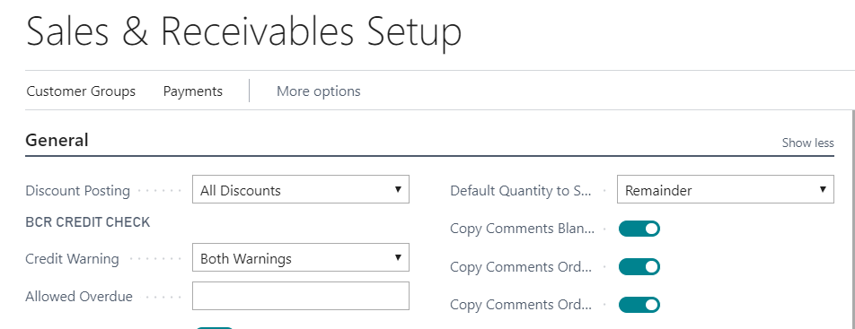
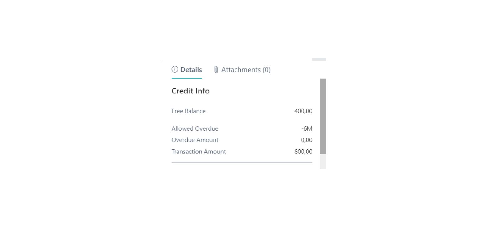
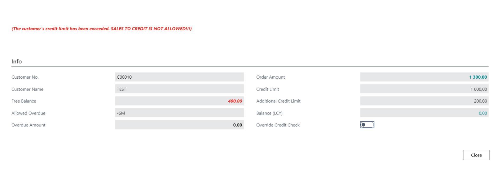

# Customer Credit Control  - User Guide

Customer Credit Control enables the following:

•	Add Customer credit contract with a time limit.  
•	Block sales to the Customer after the Credit limit is exceeded.  
•	Block sales to the Customer if there are overdue invoices.    
•	Add additional Credit limit with a time limit.  
•	Exclude overdue invoices.  

## Settings
Open Extension Management and check if extension named ’BCS Itera Credit Check’ is installed. If not, please contact BCS Itera AS.  

### Sales & Receivables settings.
On Sales & Receivables Setup page on ’Credit Warning’ field the option has to be „Both Warnings“  

  
### Contact settings  
Using BCS Itera Credit Control app it is mandatory that Customer has at least one **contact**.   
On **contact card** fill fields:  
a)	„Mandate Start Date“  
b)	„Mandate End Date“  

Date range has to be valid, not expired.

 
### Customer Card settings
On Customer Card fill fields:

|**Field**|**Mandatory**|**Value**|
|-|-|-|
|Contract Start Date|Yes|Contract start date|
|Contract End Date|Yes|Contract end date|
|Contract No|Yes|Contract number|
|Credit Limit (LCY)|Yes|	Agreed Credit limit with customer|
|Additional Credit Limit|No|Possible to give extra Credit to customer|
|Additional Credit Limit Valid To|No|	The expiry date of the credit limit|
|Allowed Overdue|No|Have to mark „-„. For exmaple -6M. Business Central exludes six months overdue invocies.| 
|Allowed Overdue Valid To|No|The expiry date of allowed Overdue|  

 
## Use  
### Sales Orders
Sales Order Factbox is showing information about free balance, allowed overdue time, overdue amount and transaction amount.  

 
### Add lines to Sales Order
Credit Control functionality controls credit limit per lines and takes into account the total order amount. 
When Credit limit is exceeded, then Pop-Up appears:  

 
**NB:** After You close the Pop-Up, the „Quantity“ field is automatically cleared on the last line entered.
**NB:** When you choose on Pop-Up field „Override Credit Check“, then „Quantity“ field amount is saved.   

 
### Payment Terms
Credit Control functionality controls payment terms through „Due Date Calculation“ field. It does not apply, if on Sales Order there is payment term where „Due Date Calculation“ is 0. 
For example: customer has overdue invoices, but wants to pay by card or in cash. In that case, the Credit Control will not be applied.   

 
For more information and pricing please contact BCS Itera AS:
www.itera.ee

