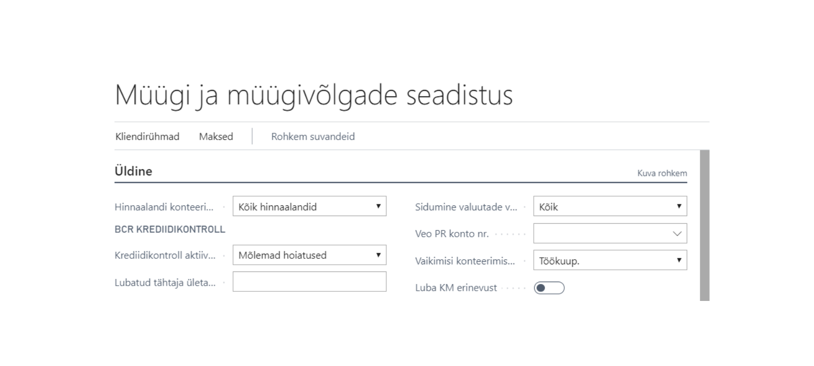
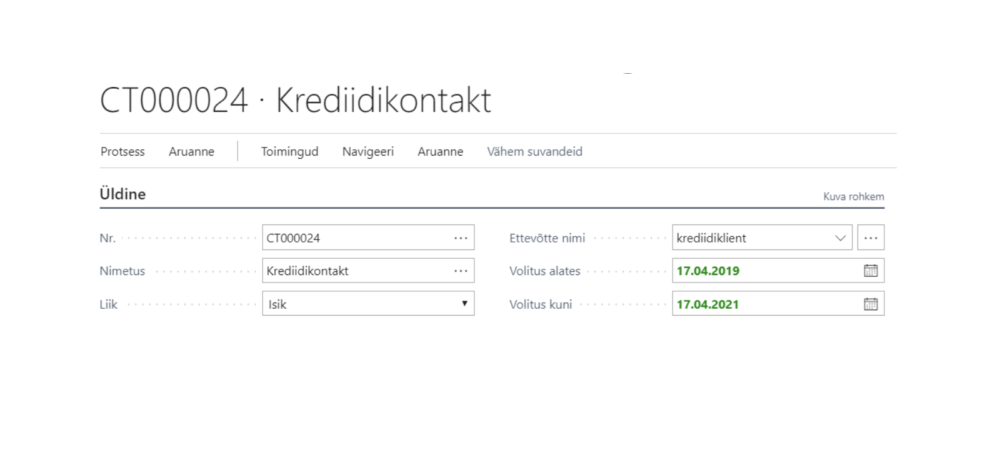
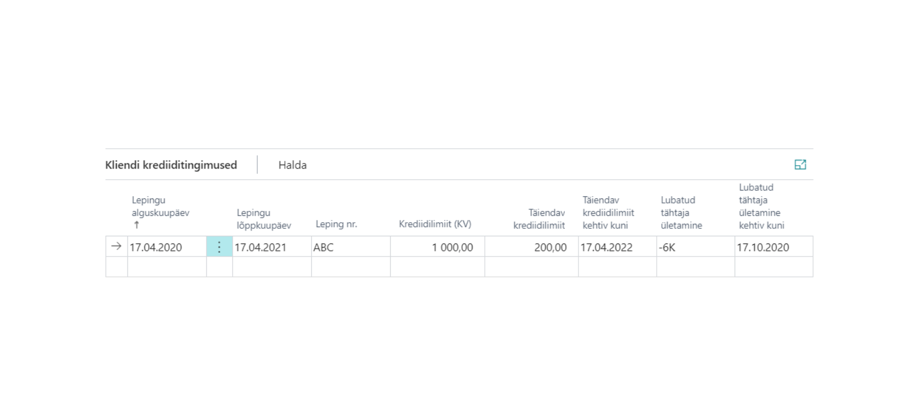
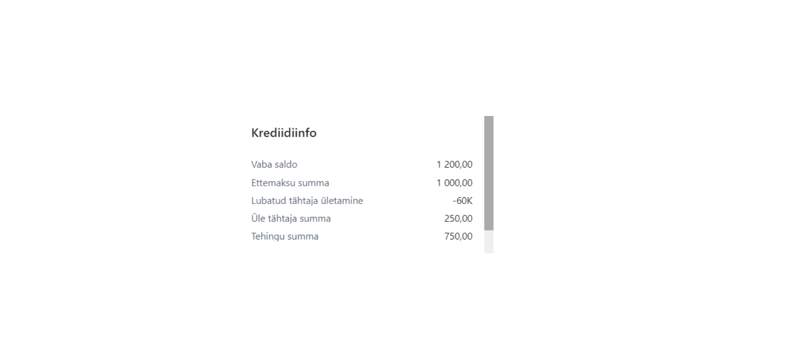
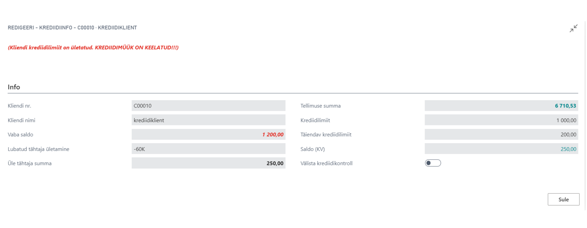
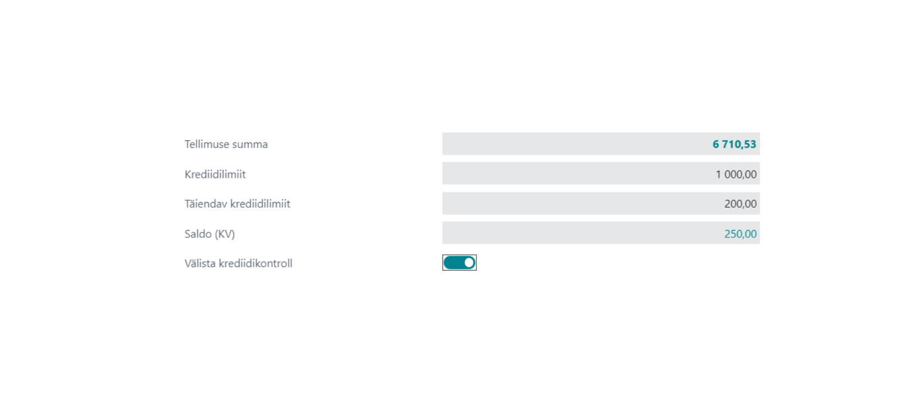
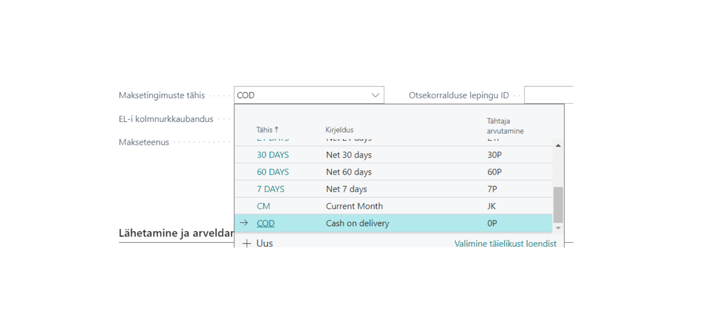

# Laiendatud krediidikontroll - Kasutusjuhend

Laiendatud krediidikontrolli lahendus võimaldab alljärgnevat:

•	Lisada kliendile krediidilepingut koos kehtivusajaga.  
•	Keelata müük kliendile, kui krediidilimiit on ületatud.  
•	Keelata müük kliendile, kui on üle tähtaja võlgnevusi.   
•	Lisada täiendavat krediidilimiiti koos kehtivusajaga.  
•	Välistada üle tähtaja võlgnevused teatud ajaperioodiks.  

## Paigaldamine
Ava **Laiendused** ja veendu, et app ‘Extended Credit Check’ on alla laetud. Kui pole, võid selle leida AppSourcest või võta ühendust BCS Iteraga.

## Seadistused
### Müügi ja müügivõlgade seadistus
Müügi ja müügivõlgade seadistuse lehel peab olema täidetud  väli „Mõlemad hoiatused“

  
### Kontakti seadistused
Kasutades BCS Itera Customer Credit Control app’i, on vajalik, et kliendiga oleks seotud vähemalt üks **kontakt**.  
Kontakti kaardil peavad olema täidetud järgmised väljad:  
a)	„Volitus alates“  
b)	„Volitus kuni“  

Kuupäeva vahemik peab olema kehtiv. Ei tohi olla aegunud.

 
### Kliendi kaardi seadistused  
Kliendi kaardil täida järgmised väljad:  

|**Väli**|**Kohustuslik**|**Kasutamine**|
|-|-|-|
|Lepingu alguskuupäev|Jah|Lepingu alustamise kuupäev|
|Lepingu lõpukuupäev|Jah|Lepingu lõppemise kuupäev|
|Lepingu nr|Jah|Lepingu number|
|Krediidilimiit (KV)|Jah|Kokkulepitud krediidilimiit|
|Täiendav krediidilimiit|Ei|Võimalus lisada täiendavat krediiti|
|Täiendav krediidilimiit kehtiv kuni|Ei|Täiendava krediidi lõppemiskuupäev|
|Lubatud tähtaja ületamine|Ei|Vaja kasutada „-„ märki. Näiteks “-6K”. Business Central välistab sellisel juhul viimase kuue kuu üle tähtaja arved krediidikontrollist.| 
|Lubatud tähtaja ületamine kehtiv kuni|Ei|Lubatud tähtaja ületamise kehtivuse viimane kuupäev.|  

 
## Kasutamine  
### Müügitellimus  
Müügitellimuse ‘FactBoxis’ näidata infot, kui palju on kliendil hetkel vaba krediiti, mis on lubatud tähtaja ületamine, mis on tähtaja ületanud arvete summa ning käesoleva tellimuse summa.  Ettemaksu korral ka ettemaksu summa.

 
### Ridade lisamine müügitellimusele  
Krediidikontrolli app võtab arvesse *per* rida ning vaatab võrdleb seda tellimuse lõppsummaga. Kui järgmise reaga ületatakse limiit, siis tuleb kasutajale teada.  
Kui krediidilimiit ületatakse, siis tuleb kasutajale ette hüpikaken:
 

 
**NB:** Peale hüpikanka sulgemist eemaldatakse viimasena sisestatud rea “Kogus” väljalt märgitud kogus.    
**NB:** Kui valida linnuke “Välista krediidikontroll”, siis “Kogus” väljale jäetakse sisestatud kogus alles.   

 
### Maksetingimus  
Krediidikontrolli app kontrollib müügitellimusel maksetingimust. Kui müügitellimusel on valitud maksetingimus, mille “Tähtaja arvutamine” välja väärtus on 0, siis krediidikontrolli ei rakendata.  
Näiteks: Kui kliendil on üle tähtaja maksmata arveid, kuid soovib tehingu sooritada sularahas või kaardiga makstes, siis välistatakse krediidikontroll.  
  

 
Lisainformatsiooni saamiseks palun võta ühendust BCS Itera AS:  
www.itera.ee
