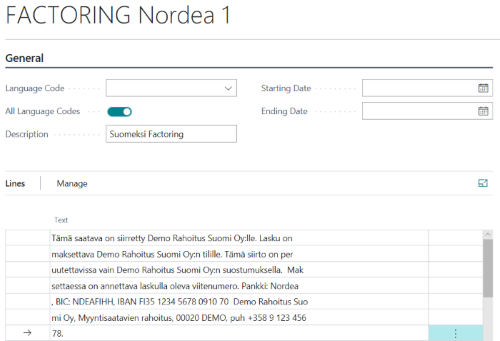
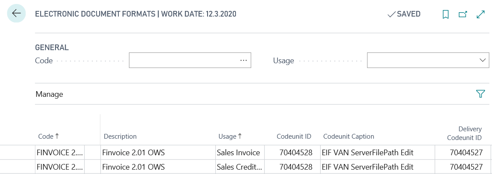
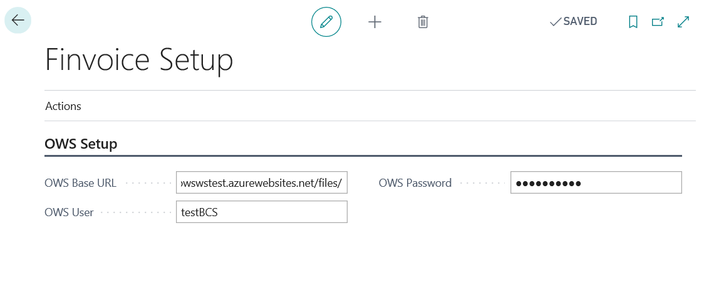
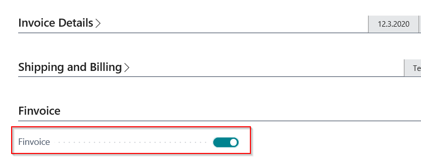

# Finvoice e-Invoicing for Finland – User Guide

Finvoice Sales e-Invoicing functionality in BC enables the following:
* Create electronical sales invoices in Finvoice format (B2B).
* Manage Factoring customers.
* Create Sales e-Invoices for Factoring company.
* Send e-Invoices to e-invoice operators*.

e-Invoicing functionality could be also used without Factoring functionality.

In addition, to **being able to send an e-invoice to customer**, Finnish operator service is required. This solution is ready to use with Finnish operator OWS (www.ows.fi). For message traffic with other Finnish operators, contact your Microsoft Business Central partner or BCS Itera Oy (bcsitera@bcsitera.fi).

## Settings

To use the functionality Finvoice Sales e-Invoicing, following setups must be made:

### Company Information 
Open **Company Information** and add setup data to Finvoice tab:

|**Field**|**Value**|
|-|-|
|EDI Code|Code provided by operator|
|Intermediator Code|Code provided by operator|
|Party Identifier|Company registration code|

### No. Series for Transmission No.
Necessary only, if Factoring will be used.
Open **No. Series** and create new series for Factoring transmission numbers. 

### Standard Text Code
Necessary only, if Factoring will be used.
Open **Standard Text Codes** and create new standard text for Factoring text, to be printed to invoice.

Open **Extended Texts** for created Standard text and add lines (text is given by Factoring company).
Split text to multiple lines. Text length on single line may not exceed more than 70 characters (according to Finvoice standard format). You can add Extended Texts in Finnish and in English.

### Setup Electronical Document Formats
Open **Electronic Document Formats** and insert two new Electronical Document Formats (1st for Sales Invoice and 2nd for Sales Credit Memo).
Enter the following data:

|**Field**|**Value**|
|-|-|
|Code|Fill in manually|
|Description|Fill in manually|
|Usage|Select Sales Invoice or Sales Credit Memo|
|Codeunit ID|70404528|
|Delivery Codeuint ID|70404527|

### Setup Document Sending Profile
Open **Document Sending Profile** and create new. Enter the following data:

|**Field**|**Value**|
|-|-|
|Code|Fill in manually|
|Description|Fill in manually|
|Electronic Document|Select Through Document Exchange Service|
|Format|Select created format|

### Factoring Agreement
Necessary only, if Factoring will be used.
Open **Factoring Agreements** and select New.
Enter the following data:

|**Field**|**Value**|
|-|-|
|No.|Factoring agreement No.|
|Description|Fill in manually|
|Factoring Text on Invoice|Select created Standard text Code|
|Refrence No. Base|Reference No. format is provided by Factoring company. Enter base No. and zeros to fill in the given length. For final reference No, invoice No. will be added after the base no.|
|Factroing Customer No.|Create Customer Card for Factoring company|
|Transmission Nos.|Select created No. Series|

### Setup Customer
For sending e-Invoices to customer setup Customer Card for customer.

|**Field**|**Value**|
|-|-|
|Document sending profile|Select created document sending profile|
|Factoring agreement No.|Select created Factoring agreement. Necessary only, if Factoring will be used.|
|EDI Code|Customer EDI Code|
|Business Identity Code|Customer business registration code|
|Party Identifier|Customers party identifier|
|Intermediator Code|Customers intermediator code (customers operator code)|

### Setup connection whit OWS operator*

Open **Finvoice Setup**.

Tab **OWS Setup**

|**Field**|**Value**|
|-|-|
|OWS Base URL|Insert path provided by OWS Oy|
|OWS User|Insert user name provided by OWS Oy|
|OWS Password|Insert password provided by OWS Oy|

* To being able to send an e-invoice to customer, Finnish operator service is required. This solution is ready to use with Finish operator OWS (www.ows.fi). For message traffic with other Finnish operators, contact your Microsoft Business Central partner or BCS Itera Oy (bcsitera@bcsitera.fi).

## Use

### Create Sales document
Create new sales document for customer (quote, order or invoice).

Sales Quote, Sales Order and Sales Invoice have Finvoice tab. Electronical invoice cuold be sent, if Finvoice field is activated.
User can deactivate the field and e-Invoice will not be created.

After posting sales invoice the Finvoice XML-file could be created.

### Send Finvoice e-Invoices
To be able to send an e-invoice to customer, Finnish operator service is required. See section **Finvoice Setup**.

Finvoice e-Invoice files could be send to operator manually or automatically.

  #### Manually
  Open Posted Sales Invoice and select **Print/Send** and **Send**.

|**Field**|**Value**|
|-|-|
|Email|No|
|Disc|No|
|Electronic Document|Trough Document Exchange Service|
|Format|Select Finvoice format. See chapter Setup Electronical Document Formats.|

  #### Automatically
  You can set up Job Que for sending e-Invoices automatically.

### View/save e-Invoice XML-file

Open Posted Sales Invoice and select **Print/Send** and **Send**.
On Edit Send Document select:

|**Field**|**Value**|
|-|-|
|Email|No|
|Disc|Electronic Document|
|Electronic Document|No|
|Format|Select Finvoice format. See chapter Setup Electronical Document Formats.|

Open or save xml-file to disc.

### Create Factoring XML-file
1.	Open **Factoring Agreements** and select agreement.
2.	Select **Create transmission**.
3.	Select **OK**.
4.	Select transmission line and select **Send**.

For more information and pricing please contact BCS Itera Oy: https://www.bcsitera.fi
