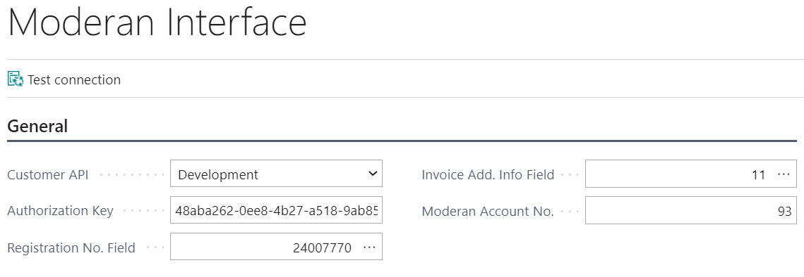

# Moderan for Business Central User Guide

Moderan Interface enables the following:
- Get Customers from Moderan
- Get Invoices from Moderan
- Send Customer Balances to Moderan

## Contents
- [Moderan Installation](#moderan-installation)
- [Menu](#menu)
- [How to setup](#how-to-setup)
  - [Setup API ](#setup-api)
  - [Setup customers](#setup-customers) 
  - [Setup accounting codes in Moderan](#setup-accounting-codes-in-moderan)
- [How to Get Customers from Moderan](#how-to-get-customers-from-moderan)
- [How to Get Invoices from Moderan](#how-to-get-invoices-from-moderan)
  - [Periodization of Invoices](#periodization-of-invoices)
- [How to Send Customer Balances to Moderan](#how-to-send-customer-balances-to-moderan)
  
   
  

## Moderan Installation
Open **Extension Management** and check if extension named ‘Moderan’ is installed. If not, please find and install it from AppSource or contact BCS Itera AS.

## Menu

Moderan menu items can be found in the Role centers: Accountant and Business Manager.

## How to setup

### Setup API

Open **Interface** in Moderan menu or page Moderan Interface and fill the fields as following (mandatory fields marked with *):

|Field|Description|
|---|---|
| Customer API* |Production or Development|  
|Authorization Key*|Moderan authorization key from Moderan Admin -> Integrations| 
|Registration No. Field*|Please choose which field is a Registration No. in the Customer table| 
|Invoice Add. Into Field *|Please choose which field is for a Reference No in the Sales Invoice Header table|  
|Moderan Account No. *|Customer account number in Moderan (ask from Moderan)|

  

To test, if the connection is correct, press the button – Test connection.

  

### Setup customers

**NB!** Before performing any data exchange between Business Central and Moderan, existing customers in Business Central and Moderan must be mapped. To do so, open **Customers** and fill in **Moderan ID** (located in **Invoicing** fasttab) for every customer which should be mapped.

### Setup accounting codes in Moderan

In addition to mapping customers, services should be mapped. To do so, setup accounting codes in Moderan.

Accounting code should be in format: “Type:No.:GeneralProductPostingGroup”

For example – G/L Account:6115:RENT

## How to Get Customers from Moderan

To get customers from Moderan, run action **Moderan – Get Customers**. Existing (mapped) customers will be updated, and new customers (who have a Registration No in Moderan) created.

The customers who do not have a Registration No. will be skipped.

If the customer has English as the invoicing language, the Language code is also displayed on the BC customer card.

If new customers were created, review customer cards and fill in missing data like **Posting Groups**.

**Moderan – Get Customers** can be setup to run automatically by using **Job Queue** functionality.

To do so, open **Job Queue Entries** and create new entry as:

|Field/Tab|Value/Description|
|-|-|
|Object Type to Run|Report|
|Object ID to Run|24007900|
|Recurrence|Indicate desired recurrence|

## How to Get Invoices from Moderan

To get invoices from Moderan, run action **Moderan – Get Invoices** and fill in the parameters as following:

|Field|Description|
|-|-|
|Period Start*|Choose period for which invoices will be retrieved|  
|Posting Date*|Enter Posting Date for the invoices|  
|Document Date*|Enter Document Date for the invoices|  
|Customer Filter|If set, invoices of other customers will be skipped|  
|Invoice Type*|Choose **Rent**|  

After successful import, open **Sales Invoices.** Review, post and issue invoices.

If the Payment Terms code is the same in BC and in the Moderan contract, the Invoice Due Date will be calculated based on this code.

If you run action **Moderan – Get Invoices** more than once for the same period and invoice type, then the following logic will apply:

|Invoice in Business Central|Explanation|
|-|-|
|Invoice does not exist|Import will create invoice|
|Invoice has not been posted|Import will update the invoice (delete old and create new)|
|Invoice has been posted|Import will skip invoice|

If the invoice amount in Moderan is 0, then an invoice will not be created in Business Central.

**Moderan – Get Invoices** can be setup to run automatically by using **Job Queue** functionality.

To do so, open **Job Queue Entries** and create new entry as:

|Field/Tab|Value/Description|
|-|-|
|Object Type to Run|Report|
|Object ID to Run|24007901|
|Recurrence|Indicate desired recurrence|

### Periodization of Invoices

If there are services on the invoice which are not for the current period, the **Periodization** checkmark will be set on the invoice header and according message will be shown in the end of import.

User can filter out these invoices and perform periodization tasks if required.

## How to Send Customer Balances to Moderan

To send customer overdue balances from Business Central to Moderan, run action **Moderan – Send Balances**.

Action will send current balance information for all the customers with **Moderan ID**.

Sending balances can be setup to run automatically by using **Job Queue** functionality.

To do so, open **Job Queue Entries** and create new entry as:

|Field/Tab|Value/Description|
|-|-|
|Object Type to Run|Report|
|Object ID to Run|24007902|
|Recurrence|Indicate desired recurrence|
