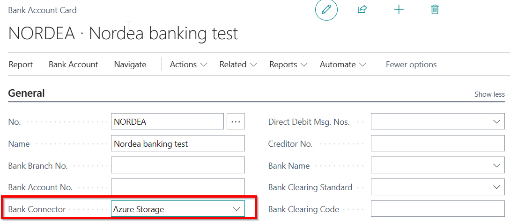

---
---
# Realtime Bank for Finland - User Guide
## Table of Contents

- [Setup](#setup)
- [Incoming Bank Messages](#incoming-bank-messages)
- [Processing Bank Account Transactions](#processing-bank-account-transactions)

## Setup

### Setup Azure Storage Connector

First setup Azure Stotage account and setup containers.

Open Setup Azure Storage Connector page in Business Cental and enter following information: 

Field |  Description | 
-- | --
Account Name | Enter account name.
Shared Key | Inser account key.
Input Container Name | Name of the Azure Stotage container for receiving bank statemenst.
Output Container Name | Name of the Azure Stotage container for outgoing bank payment files.

Test connection

### Setup Bank Account
Open Bank Account card and choose the connector in the Bank Connector field.

### Setup Realtime Bank
Open Realtime Bank Setup and assign the number series for the Posted Transaction Nos. field.

## Incoming Bank Messages

### Get bank messages automatically

To get bank messages press the button Get New Bank Messages or setup Job Queue Entries on the bank connector setup page.

The process imports new bank statements to the page Incoming Bank Messages. This page is opened with filters: Source and Status.

Use the “Show all Messages” to see all entries.

### Import bank statement manually

You can manually import the bank statement file on the _Incoming Bank Messages_ page by clicking the _Import From File_ button. The entry is in the _Received_ status.

To process the file click _Process_ button.  
Then click "Show All Messages" and choose the line.  
You see the status – Processed and No. of Saved Transactions.  
By pressing this number it is possible to go to the Bank Account Transactions.

## Processing Bank Account Transactions

### Bank Account Transactions

In Bank Account card there is a new field Balance in Bank. Drilldown in this field to open Bank Account Transactions. By default you can see unposted transactions which need to be applied before they can be posted.

### Applying Service Fees

You can use Text-To-Account functionality or describe the G/L account corresponding to the Transaction Code.

Click on the _Transaction Code_ field in the fast box _Bank Account Transaction Details._
Enter the new line with bank transaction code and G/L Account.

Then go back to transaction and press the Apply Automatically button.
The Application status is changed to _High Confidence_.

You can apply one or more transactions at once.

### Applying Invoices
Appying can be done either manually or automatically.

For manual application, assign Applied Account No. and click Apply Manually. This will open the list of open ledger entries. Apply entries by clicking Process->Set Applies-to ID.

For automatic application run the action Apply Automatically.

### Posting

Applied transaction can be posted to ledger entries by clicking Post action.

In addition Job Queue Entry can be configured, which posts transactions automatically when transaction has been applied and Application Status (quality) is 'High Confidence'.

---

### Contact Information
For more information and pricing please contact:  
[https://apps.itera.ee/docs/en-us/support](https://apps.itera.ee/docs/en-us/support)
