# Smart Warehouse – User Guide

Smart Warehouse functionality enables the following:
- Paper free warehouse management
- Decrease the probability of errors
- Acceleration of warehouse processes
- Automatic exchange of information between Business Central and Smart Warehouse
- Functionality for determining traffic routes
- Accounting of pallets and boxes upon receipt of goods for packaging excise duty
- Possibility to assign an expiry date to the goods
- Possibility to set the order of assembly
- Possibility to print bin labels for the product
- Possibility to set the life of the goods
- From the Smart Warehouse program, the warehouse employee can see the stock of goods with expiration dates

## Table of Contents
  - [Smart Warehouse Installation](#smart-warehouse-installation)
  - [Settings](#settings)
  - [Use](#use)
  - [Purchase order process in Business Central](#purchase-order-process-in-business-central)
  - [Purchase order process in Smart Warehouse program](#purchase-order-process-in-smart-warehouse-program)
  - [Purchase order check in Business Central and order posting](#purchase-order-check-in-business-central-and-order-posting)
  - [Sales Order process in Business Central](#sales-order-process-in-business-central)
  - [Sales Order process in Smart Warehouse](#sales-order-process-in-smart-warehouse)
  - [Sales order check in Business Central and order posting](#sales-order-check-in-business-central-and-order-posting)
  - [Bin content check](#bin-content-check)
  - [New features](#new-features)

 

## Smart Warehouse Installation
Open **Extension Management** and check if extension named ‘Smart Warehouse’ is installed. If not, please find and install it from AppSource or contact BCS Itera AS.

## Settings

Open **Install Wizard**.
Click on *Enable Web Service** and go **Next**.

User is instructed to find Smart Warehouse Web Service. Here go **Yes**.

You find the Web Service on the top of the list of services.

Close Web Services.
Copy Whiteboard Application URL for later use and go **Next**.

You can choose all functionalities for your needs and go **Next** again.
|Field|Usage|
|-|-|
|Use Work Ordeds|Allows user to view Work Orders.|
|Use Warehouse Shipments|Allows user to create and view Warehouse Shipments.|
|Use Warehouse Receipts|Allows user to create Warehouse Receipts.|
|Use Warehouse Activities|Allows user to view and create Warehouse Activities.|

Allows automatically **Setting Up Item Categories** which automatically sends the work order to the **Smart Warehouse** program. If needed activate and go **Next**.

If you activated previous page, then now opens **Item Categories** page.

Select the category you want from there and put checkmark in the **Automatic workflow Order**. **Close** the page.

For next choose **Package Gen. Prod. Posting Group**:

This setting allows the inclusion of tare lines at the end of the Work Order. If necessary, adjust suitable.
Go **Next**.

|Field|Usage|
|-|-|
|Probability % of checking employee|You can determine the probability of user possible errors when assembling orders. By typing the number into the box, the user is assigned the inspector, who randomly inspects his / her completed items according to the set percentage.|
|Select customers to be checked|Activation allows you to change the following option (Select customers to be checked manually or using filters)|
|Select customers to be checked manually or using filters|The previous setting must be activated, then the user can decide which option to select for the customers to be checked. |

Here user can assign the inspector for the employee.

Go **Next**.
In the following user can activate automated job’s what is needed for user. 

Go **Next**.

User can see specific information about all the selected automatic works. For example:

Go **Next**.
In the last settings window, you can activate user rights updating, open the settings window and queue entries. When needed lines are activated Finish the installation. 

User can download the Smart Warehouse application from the following page:

Extract the document and open file **SmartWarehouse Setup.exe**:

|Field|Usage|
|-|-|
|URL|Here copy the previously copied link. |
|Authentication|Windows/Nav User Password|
|User name|Depending on the pre-selection, either Window or Business Central User|
|Password|Depending on the pre-selection, either Window or Business Central User|

Then test the connection:

If user succeeded, the answer is:

Go back to **Business Central**.
Open **Unit of Measure** settings and set up needed unit of measures. These what user needs to use in **Smart Warehouse** program put the checkmark into **Unit of Weight** box.

Go to **Warehouse Employees** page.
Add there all employees who start using Smart Warehouse program. Select **Location Code**. Put the checkmark for these locations in box **Default** what are going to be the users default locations. 

## Use

### Purchase order process in Business Central

Open **Purchase Orders** and make **New** order.
Mandatory fields are: **Vendor Name**, **Vendor Invoice No**, **Vehicle No**. On the lines add items with **Location code** and **Quantity**.

Previous information is needed, because then the warehouse worker can see this in the Smart Warehouse program. 
Then Press **Actions** -> **Release** -> **Fill Quantity Originally Ordered**.
Field **Quantity Originally Ordered** must now be filled with same value in the field **Quantity**.

Press button **Release**.
Press **Actions** -> **Warehouse** -> **Create Whse. Receipt**

### Purchase order process in Smart Warehouse program 

Open **SmartWarehouse.exe.**

If needed log in with the same **User name** and **Access key** you used in the settings:

After successful login user can see activity list: 

Open **Warehouse Receipt**.
In the following user can choose how to find right Warehouse Receipt: **by Date**, **by Vendor**, **by Vehicle**, **by Item**. 

If for example user chooses Vehicle, all the purchase orders that have vehicle are shown:

Click on **the Vehicle** and then user can see purchase lines. 

|Field|Usage|
|-|-|
|Code|From Business Central item code, not editable.|
|LTAR000019 FDR345|Items from Warehouse Receipt, not editable.|
|Original Quantity|In the Business Central purchase order quantity, not editable.|
|Unit|Unit from Business Central, not editable.|
|Quantity|Click on the field and fill in the actual quantity.|
|Scrap %|Click on the field and fill scrap % if needed.|
|Lot|If item has lot, edit it.|
|Bin|From Business Central, not editable field.|
|Complete|If the row checked user can mark it Complete.|

Click on item row **Quantity** and enter actual quantity.
For some products user also needs to fill in rows:

|Field|Usage|
|-|-|
|Pallet KG|If setup in Business Central comes automatically. Editable field if needed.|
|Box KG|If setup in Business Central comes automatically. Editable field if needed.|
|Boxes|If setup in Business Central comes automatically. Editable field if needed.|
|Gross KG|If setup in Business Central comes automatically. Editable field if needed.|
|Net KG|If setup in Business Central comes automatically. Editable field if needed.|
|Scrap %|If click on the field can setup scrap %.|
|Lot|Here user can’t set it. User can set it on the previous page.|
|Complete|If all is set, click **Complete**.|

From button Print label, user can print pallet label. 

If item is checked put a checkmark into box **Complete**.

If all items are checked in warehouse go **Back**.

Then user can choose if to approve lines or not. If approves, click **Yes and Open**.

Then for user opens warehouse put-away, where user can choose the place for items.

If place is set and items are in the right place put the checkmark into the box **Complete**.
All the purchase processes are done and user can go back home.  

### Purchase order check in Business Central and order posting

Open the purchase order that has put-away registered in Smart Warehouse.
On the **Lines** -> **Line** -> **Item Tracking Lines** user can see expiration date entered on **Warehouse Receipt** in Smart Warehouse program.

In addition, user can set Serial No., Lot No. and SN code for item.

On the ***Lines** -> **Line** -> **Weighing lines** you see archive of weighing.

Now if all is correct **Post** the Document.

### Sales Order process in Business Central

Create **new** Sales Order.
In the General part in field **Work Description** user can enter information to the warehouse worker:

In the part **Smart Warehouse** user can enter following information:

|Field|Usage|
|-|-|
|Picking Status|Picking/Completed|
|Route|Preset routes|
|Route Delivery Start|Route delivery starting time|
|Route Delivery End|Route delivery ending time|
|Position on Route|What is the position in chosen route|
|Shipment Date|Shipment Date|
|Work Group|It is possible to connect warehouse workers with customers|

On the row’s user can enter information for assembler:

If all needed rows are filled **Release** the document.
Open **Job Queue Entries**.
Restart Job Queue Entry: 
- Object ID to Run - 70466728
- Parameter String: CREATESALESSHIPMENTS

This automation job creates a **Warehouse Shipment** and **Inventory Picking**. The lines will now available in the Smart Warehouse program.

### Sales Order process in Smart Warehouse

Open Smart Warehouse program.
Open page **Warehouse Activities**.

Then page **Pick**.

Then the **Warehouse Pick** user made in Business Central will be visible.

Warehouse worker can see **Work Description**, **Route and Warehouse Shipment** information with item information. 
Also here is possible to print Label for Bin. 
If items are picked put the checkmark into box **Complete**.

Pick is registered and user can go back **Home**.
Now go to **Warehouse Shipment**.

Opens picked warehouse shipment list.

User can specify car information by clicking on the button **Specify Car**. 

Then click on the row user wants to send out and confirm the **quantities** and put the checkmarks into **Complete**. 

Go Back and Complete.

From Smart Warehouse part process is done and user can go back **Home**.

### Sales order check in Business Central and order posting

Open **Business Central** and check the **Sales order** what was previously made.
**Quantities** should be updated from **Smart Warehouse** program.

**Post** the invoice.

### Bin content check

Open in Smart Warehouse program page **Goods Inspection**.
Click on the field Code and enter item number user wants to check ant then click **Enter**. User can see Bin content for the item.

If item has for example lot, user can check it by clicking on the item line. 

If needed information is checked click button **Clear** and go **Back**. 

## New features
New improved version has been made to Smart Warehouse solution. Now it is possible to use it with partial warehousing. 
For partial warehousing the documents you can use for that is Picks and Put away. In addition, you can use Bins. 
The solution has also been upgraded for use with Android devices in Opera web browser or can be used with Business Central app with the special User permission set: **BCS.BPF SMARTWAREHOU**. When user have this permission set then automatically user will be redirected to Smart Warehouse solution. 

### New setup features
In setup you can find five new menus. 

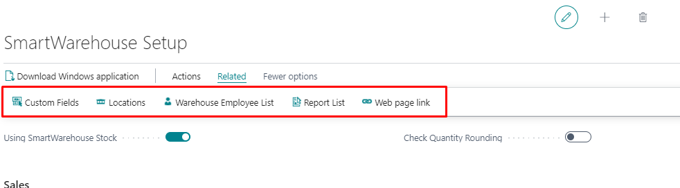

### Custom fields
Custom fields allow the user to add the necessary additional fields to the documents in the Smart Warehouse solution.
Configurable according to the user's own needs and all the fields on the item card can be added to the solution.

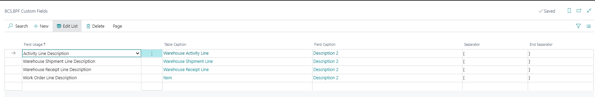

|Field|Value|
|-|-|
|**Field usage**|where you want to add the additional info|
|**Table Caption**|on what document you want this additional info|
|**Field Caption**|which additional field info must be displayed|
|**Separator**|if you need to separate previous two fields info you can use them. It can also be blank|
|**End separator**|if you need to separate previous two fields info you can use them. It can also be blank|

Example from Smart Warehouse:

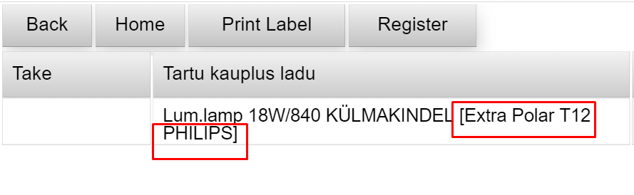

For example, in this case for Picking document user added Description 2 fields information from item card to the document with the separators. 

### Locations
Allows user to set the necessary parameters to warehousing for Locations without leaving the Smart Warehouse settings. In addition, if most Locations do not use Smart Warehouse solution and needs to be used only in a few Locations then it is possible to set solution up on Locations. The general settings in Smart Warehouse setup always have priority. 

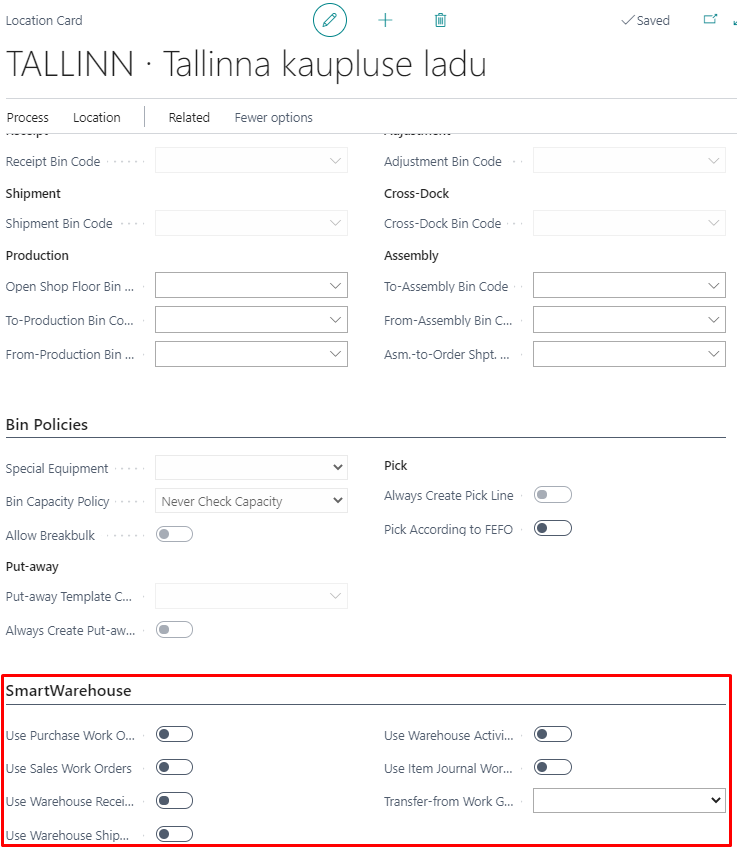

### Warehouse Employee List
Allows user to navigate directly to the warehouse employees from the Smart Warehouse settings for example if user needs to add new users as warehouse employees without having to search for the right page. 

### Report List
Allows to set pallet/bin/box stickers. 
Example of different sticker options:

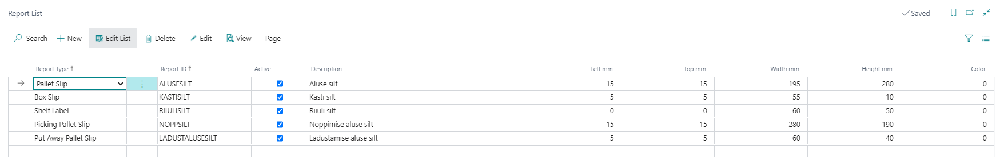

You can define different stickers and their size in the list. By opening the desired sticker card, it is possible to set which rows are displayed on the sticker.
For example:

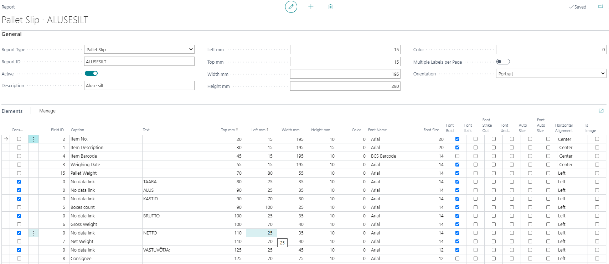

Example of sticker printed for picking:

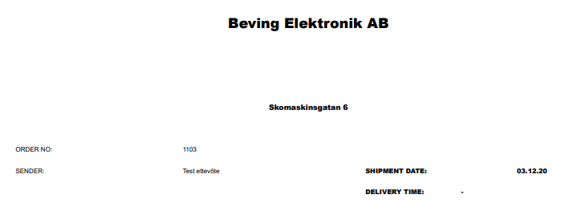

### Web page link
The link can be used to open Smart Warehouse solution for example in Opera web browser. 

### Setup fields
Setup fields that should be enable for partial warehouse management (picking, put away, bin mandatory):

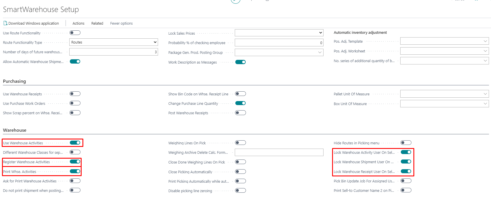

**Use Warehouse Activities**- activation defines that partial warehouse management is used.
**Register Warehouse Activities**- sends pick/put away row’s information to Business Central.
**Print Whse. Activities**- allows user to print posted sales shipments/ posted purchase receipts after register the document. For that we have Jog Queue Entry:

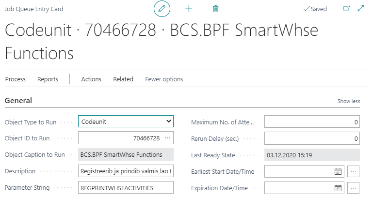

**Lock Warehouse Activity User on Select**- allows user to attach a user ID to a Document. Once a user has opened a document for themselves, their ID is attached to the document and the document is no longer visible to other users. Same functionality with **Lock Warehouse Shipment User on Select and Lock Warehouse Receipt User on Select**.
In Smart Warehouse solution then will be checkmark on Pick/Put away field **My**. 

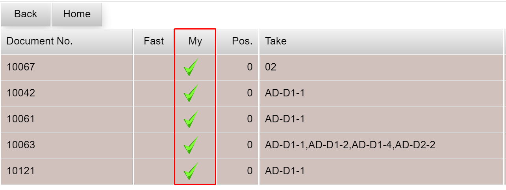

## Smart Warehouse menu for partial warehouse management
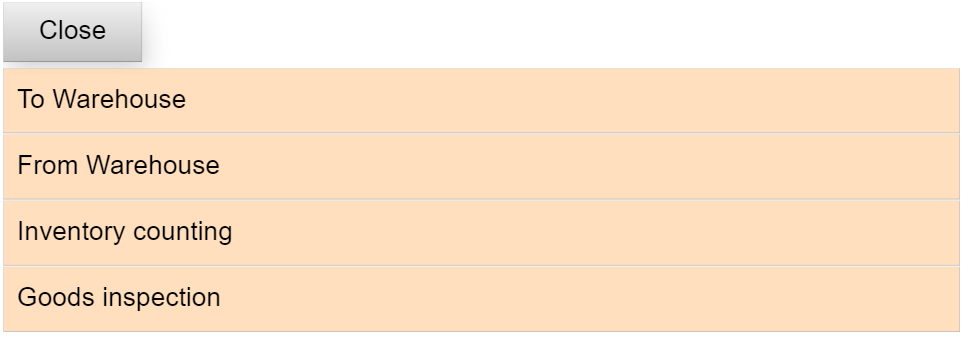

### Put away menu
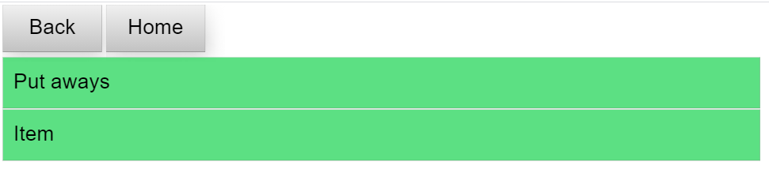
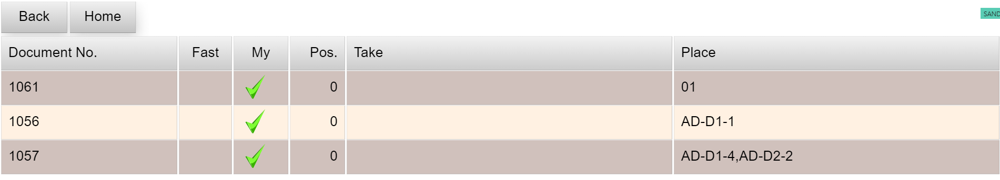
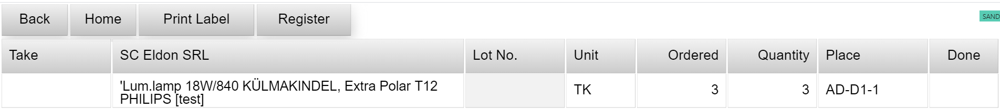

### Picks menu

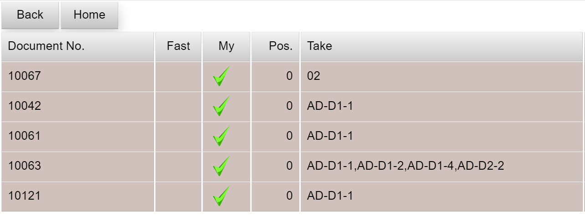
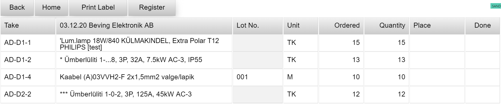

## Purchase order activities with partial warehouse management 
Create a new purchase order in Business Central, add items to the order and release the document.
To send Inventory Put-away into Smart Warehouse solution click in the **Process**-> **Create Inventory Put-away/Pick**.

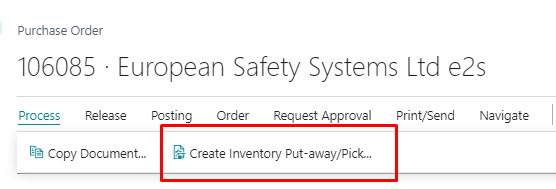

Then activate activity **Create Invt.Put-Away**

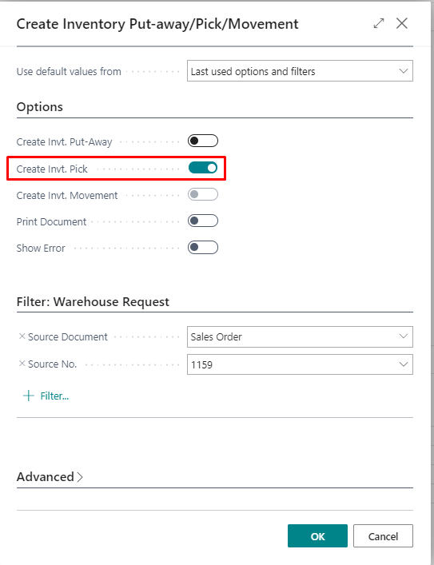

Click **OK**.
Now move into Smart Warehouse solution.
In menu click **To Warehouse**.

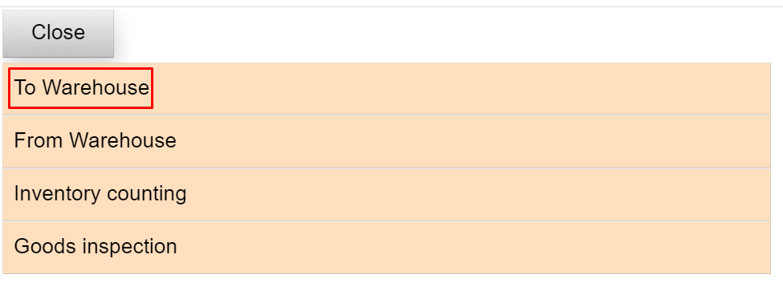

Next choose **Put away**.

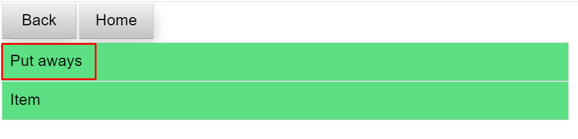

Then the put away document list will open.

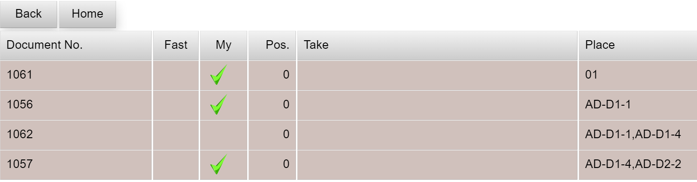

Select the Document you want to process. NB! After you have opened the Document your user ID will be saved on the document and you see the checkmark in the box **My**. 
If we look the same document in Business Central **Inventory Put-away list** you can see that, when user opened the document the **Assigned User ID** will be automatically filled. 

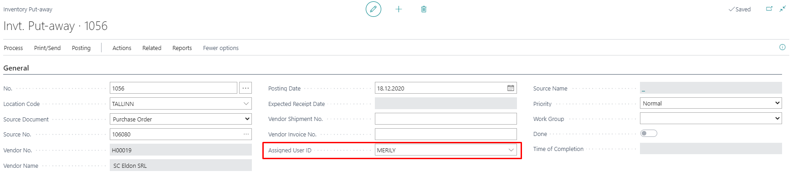

Now let’s move back to the Smart Warehouse solution.
For Lot item it is possible to add lot no in Business Central or manually in the solution. It depends on how lot assignment is set. 

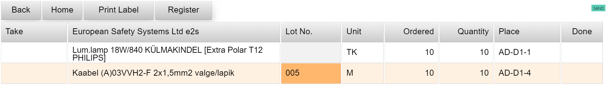

In this case lot no is added manually in solution. Also, the value can be added with the scanner. If the received quantities are different from the actual quantity, the change must be recorded in the **Quantity field**.

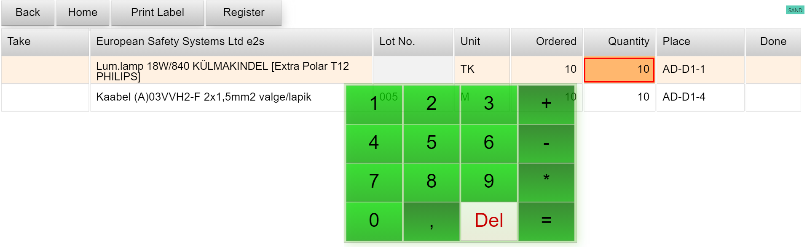

When the quantities have been checked, mark the lines **Done**.

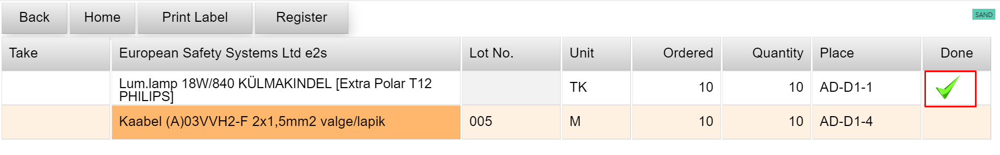

After all lines has the checkmark **Done**, user must **Register** the Put away and all the lines information will be transferred in Business Central.  

In addition, with the Job queue entry the **Posted Purchase Receipt** will be automatically open, and user can print the Document.

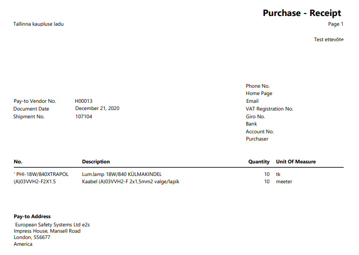

Moving back to the Business Central view on Purchase order, you can see the quantity that was received in the warehouse.

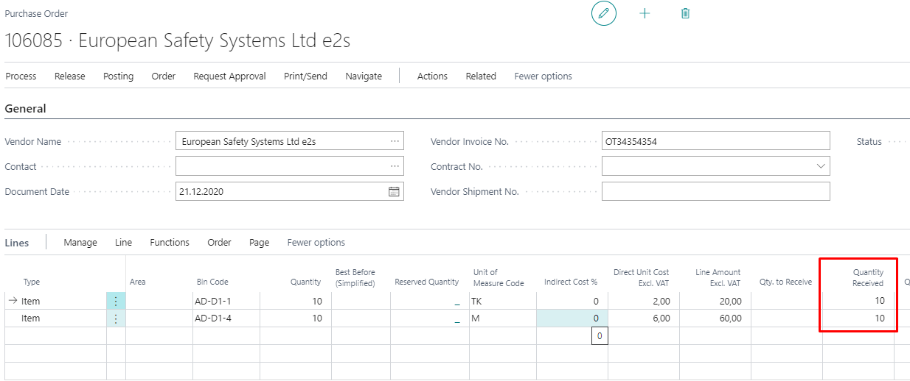

In addition, with lot items, lot will be attached to the items.

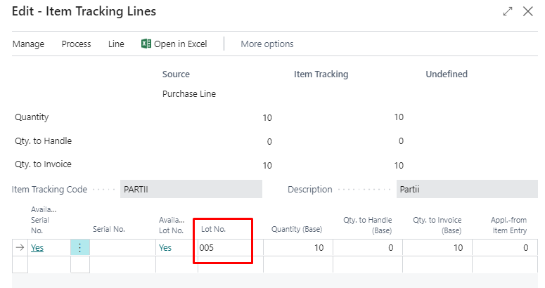

## Sales order activities with partial warehouse management
Create a new sales order in Business Central and add the items to the order and release the document.
To send a pick to the Smart Warehouse solution click **Process**-> **Create Inventory Put-away/Pick**.

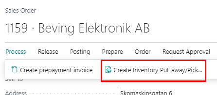

Activate option **Create Inv.Pick** and click **OK**. 

It is possible to add picking priority to each pick-up page for warehouse worker from the Business Central side.
For that go to **Related**-> **Warehouse**-> **Inv. Put-away-/Pick Lines**.

Opens the **Inventory Pick List** for your Sales order.
For opening the **Pick**, click **Related**-> **Line**-> **Card**.

On the Inv. Pick you can find field **Priority**. By selecting **High** as the priority, the user will see these documents above in Smart Warehouse solution and the document will be marked **Fast**.

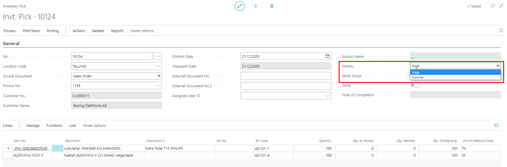

Now move back to Smart Warehouse solution and choose **From Warehouse** in the menu. 

A list of all free picks and picks with your user ID opens. If the user from Business Central side marked Pick to **high priority**, then Smart Warehouse worker sees them above and have a **Fast** checkmark on that pick. 

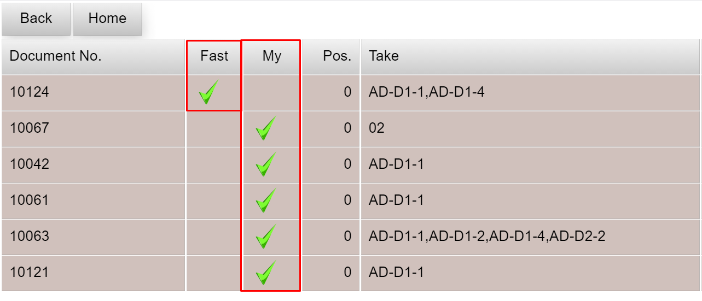

Open the Pick you want to send out. In this case it should be the first Document with the checkmark **Fast**. 
If the item is with Lot no, then you must click on the right item row on Lot no box. Then you see free lot no-s in warehouse and can choose what lot you took for the order. 

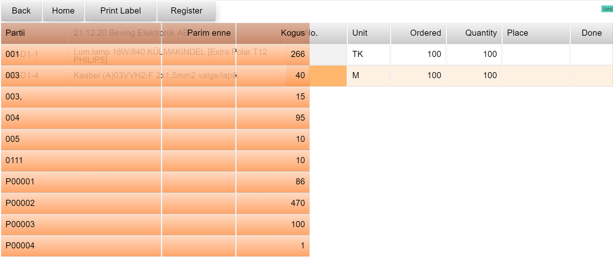

Like the purchase side, it is possible to change the quantities in the quantity field.
When all the items have been assembled, checkmark the **Done** fields and **Register** the Document. Now Business Central will reach all the information about that Document.

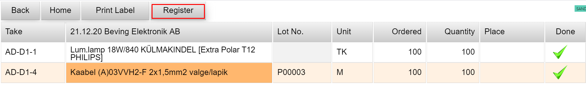

Then it is possible to print **Posted Sales shipment** Document directly from the device.  

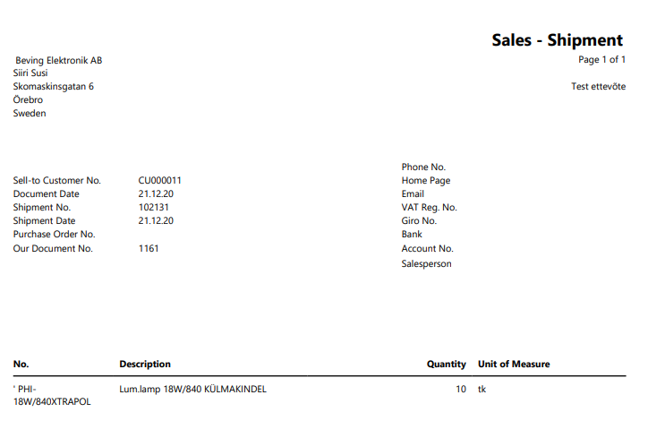

Moving back to the Business Central sales order, you can see the quantity shipped is filled and you can see that lot no is added to the item. 

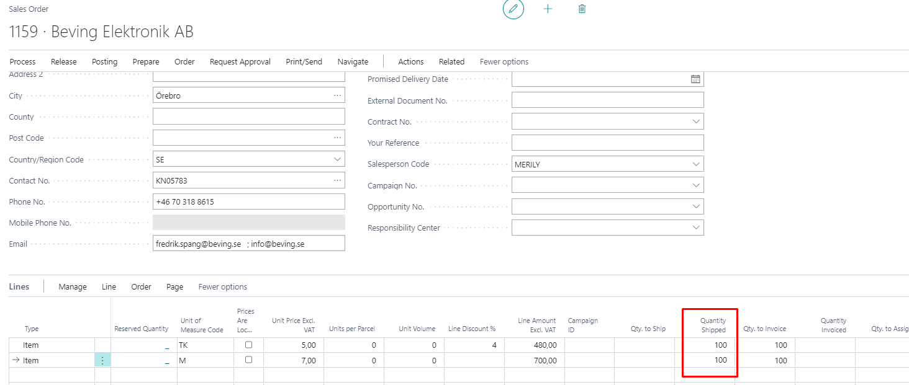

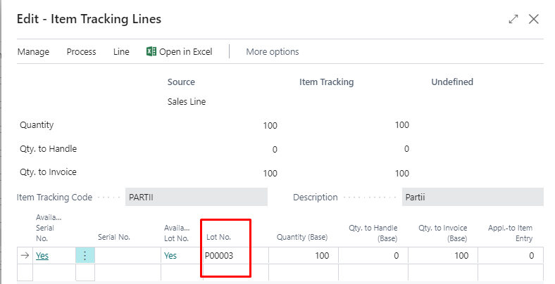

### Transfer orders with partial warehouse management 
Works on the bases of the same Document as purchase and sales.
Only difference is that in Smart Warehouse header you see Location where to send the items or where the items are going. 
Example pick to Tartu Location:

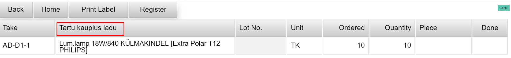

Example put away from Tallinn to Tartu Location: 

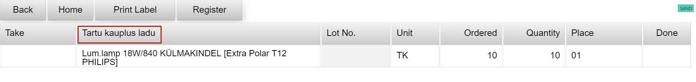

For more information and pricing please contact BCS Itera AS:
[https://www.itera.ee](https://www.itera.ee)

