# Smart Warehouse – User Guide

Smart Warehouse functionality enables the following:
- Paper free warehouse management
- Decrease the probability of errors
- Acceleration of warehouse processes
- Automatic exchange of information between Business Central and Smart Warehouse
- Functionality for determining traffic routes
- Accounting of pallets and boxes upon receipt of goods for packaging excise duty
- Possibility to assign an expiry date to the goods
- Possibility to set the order of assembly
- Possibility to print bin labels for the product
- Possibility to set the life of the goods
- From the Smart Warehouse program, the warehouse employee can see the stock of goods with expiration dates

## Table of Contents
  - [Smart Warehouse Installation](#smart Warehouse Installation)
  - [Settings](#settings)
  - [Use](#use)
  - [Purchase order process in Business Central](#purchase order process in Business Central)
  - [Purchase order process in Smart Warehouse program](#purchase order process in Smart Warehouse program)
  - [Purchase order check in Business Central and order posting](#purchase order check in Business Central and order posting)
  - [Sales Order process in Business Central](#sales Order process in Business Central)
  - [Sales Order process in Smart Warehouse](#sales Order process in Smart Warehouse)
  - [Sales order check in Business Central and order posting](#sales order check in Business Central and order posting)
  - [Bin content check](#bin content check)

 

## Smart Warehouse Installation
Open **Extension Management** and check if extension named ‘Smart Warehouse’ is installed. If not, please find and install it from AppSource or contact BCS Itera AS.

## Settings

Open **Install Wizard**.
Click on *Enable Web Service** and go **Next**.

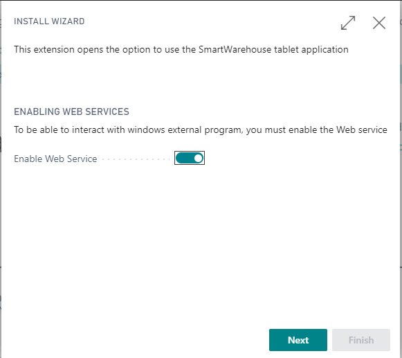

User is instructed to find Smart Warehouse Web Service. Here go **Yes**.

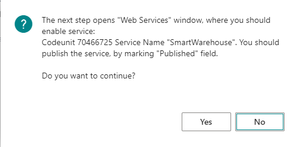

You find the Web Service on the top of the list of services.

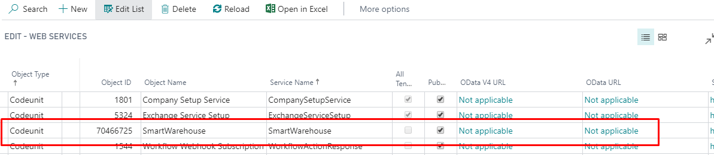

Close Web Services.
Copy Whiteboard Application URL for later use and go **Next**.

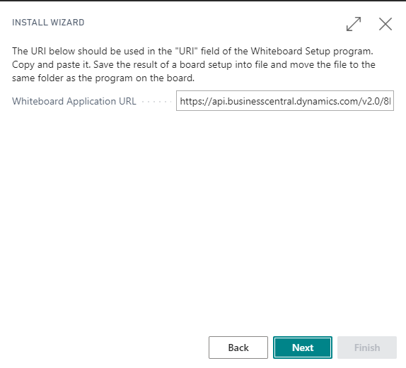

You can choose all functionalities for your needs and go **Next** again.
|Field|Usage|
|-|-|
|Use Work Ordeds|Allows user to view Work Orders.|
|Use Warehouse Shipments|Allows user to create and view Warehouse Shipments.|
|Use Warehouse Receipts|Allows user to create Warehouse Receipts.|
|Use Warehouse Activities|Allows user to view and create Warehouse Activities.|

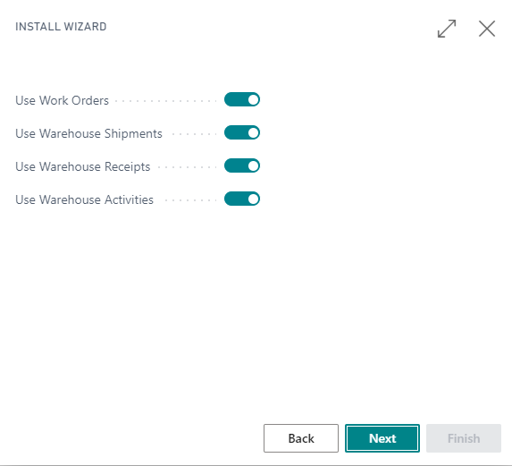

Allows automatically **Setting Up Item Categories** which automatically sends the work order to the **Smart Warehouse** program. If needed activate and go **Next**.

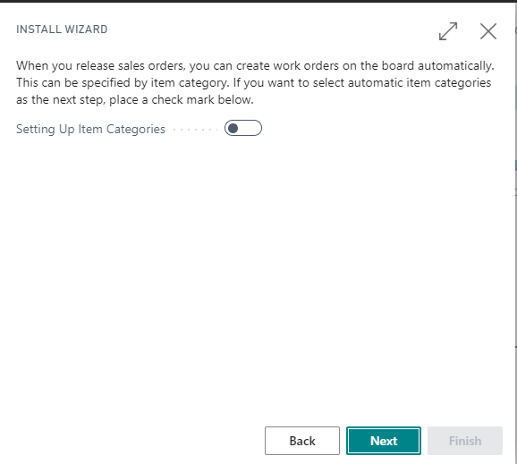

If you activated previous page, then now opens **Item Categories** page.

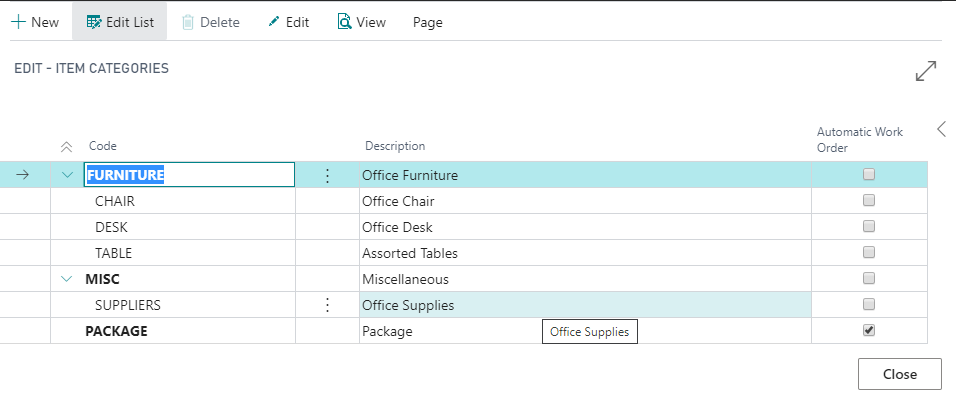

Select the category you want from there and put checkmark in the **Automatic workflow Order**. **Close** the page.

For next choose **Package Gen. Prod. Posting Group**:

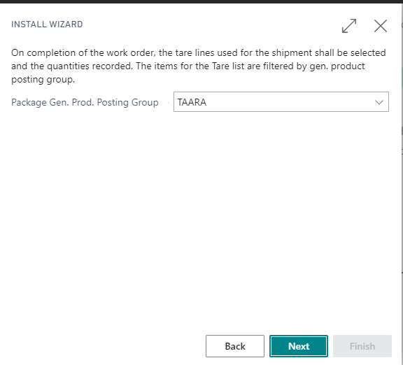

This setting allows the inclusion of tare lines at the end of the Work Order. If necessary, adjust suitable.
Go **Next**.

|Field|Usage|
|-|-|
|Probability % of checking employee|You can determine the probability of user possible errors when assembling orders. By typing the number into the box, the user is assigned the inspector, who randomly inspects his / her completed items according to the set percentage.|
|Select customers to be checked|Activation allows you to change the following option (Select customers to be checked manually or using filters)|
|Select customers to be checked manually or using filters|The previous setting must be activated, then the user can decide which option to select for the customers to be checked. |

Here user can assign the inspector for the employee.

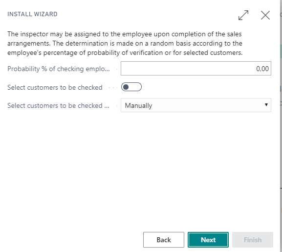

Go **Next**.
In the following user can activate automated job’s what is needed for user. 

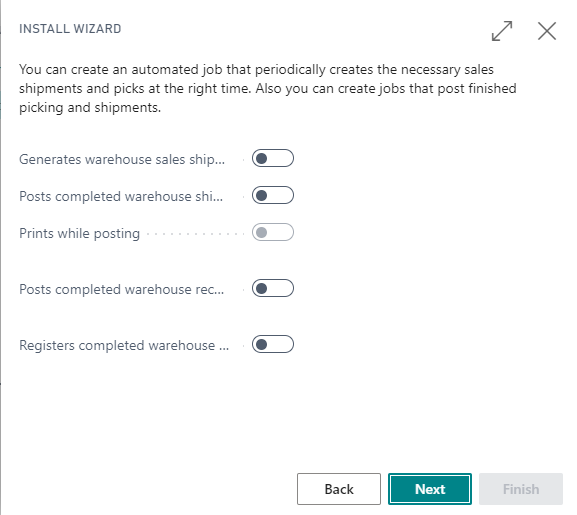

Go **Next**.

User can see specific information about all the selected automatic works. For example:

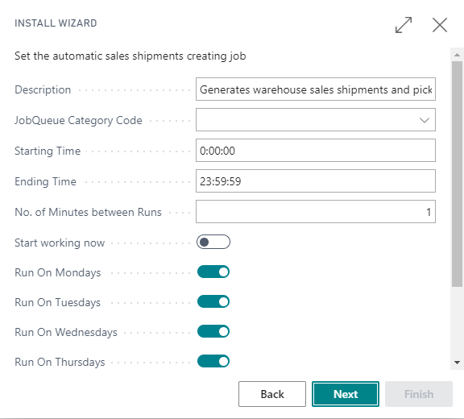

Go **Next**.
In the last settings window, you can activate user rights updating, open the settings window and queue entries. When needed lines are activated Finish the installation. 

User can download the Smart Warehouse application from the following page:

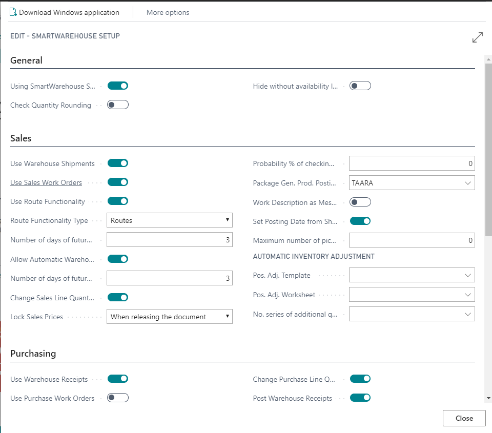

Extract the document and open file **SmartWarehouse Setup.exe**:

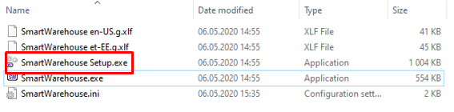

|Field|Usage|
|-|-|
|URL|Here copy the previously copied link. |
|Authentication|Windows/Nav User Password|
|User name|Depending on the pre-selection, either Window or Business Central User|
|Password|Depending on the pre-selection, either Window or Business Central User|

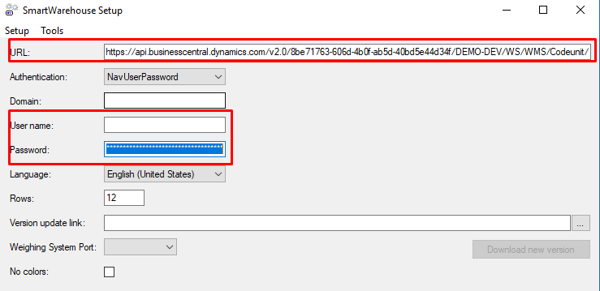

Then test the connection:

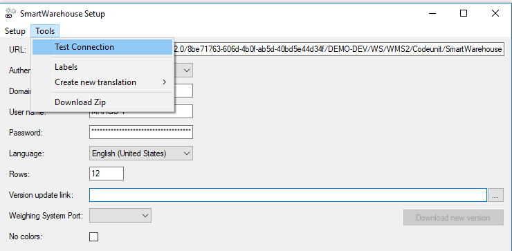

If user succeeded, the answer is:

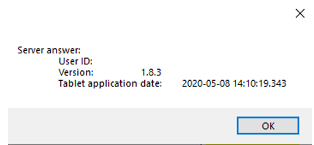

Go back to **Business Central**.
Open **Unit of Measure** settings and set up needed unit of measures. These what user needs to use in **Smart Warehouse** program put the checkmark into **Unit of Weight** box.

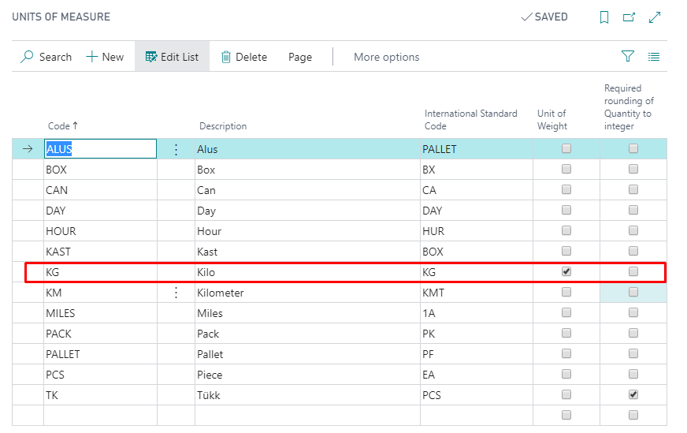

Go to **Warehouse Employees** page.
Add there all employees who start using Smart Warehouse program. Select **Location Code**. Put the checkmark for these locations in box **Default** what are going to be the users default locations. 

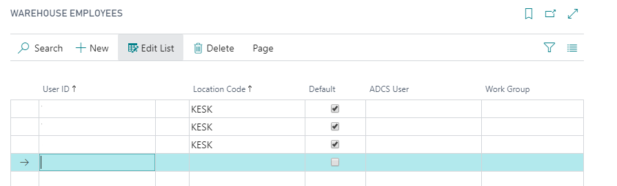

## Use

### Purchase order process in Business Central

Open **Purchase Orders** and make **New** order.
Mandatory fields are: **Vendor Name**, **Vendor Invoice No**, **Vehicle No**. On the lines add items with **Location code** and **Quantity**.

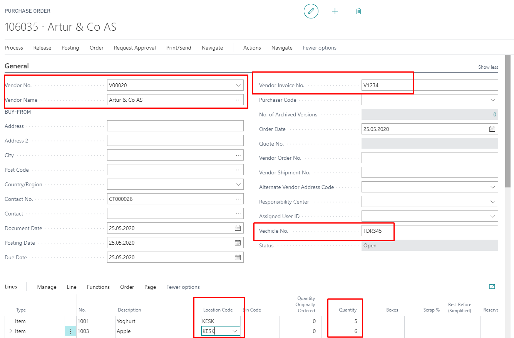

Previous information is needed, because then the warehouse worker can see this in the Smart Warehouse program. 
Then Press **Actions** -> **Release** -> **Fill Quantity Originally Ordered**.
Field **Quantity Originally Ordered** must now be filled with same value in the field **Quantity**.

Press button **Release**.
Press **Actions** -> **Warehouse** -> **Create Whse. Receipt**

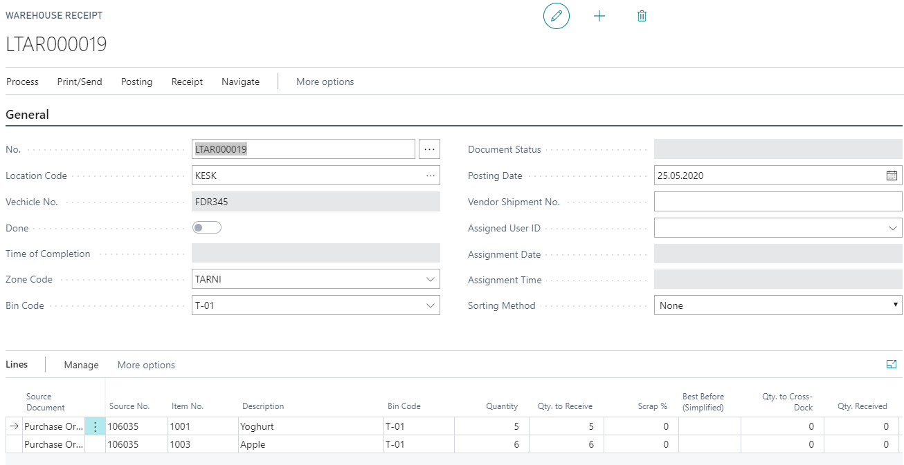

### Purchase order process in Smart Warehouse program 

Open **SmartWarehouse.exe.**

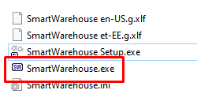

If needed log in with the same **User name** and **Access key** you used in the settings:

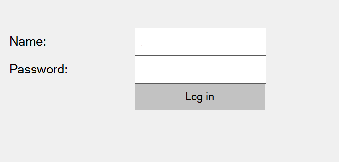

After successful login user can see activity list: 

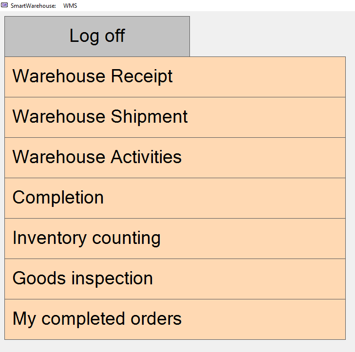

Open **Warehouse Receipt**.
In the following user can choose how to find right Warehouse Receipt: **by Date**, **by Vendor**, **by Vehicle**, **by Item**. 

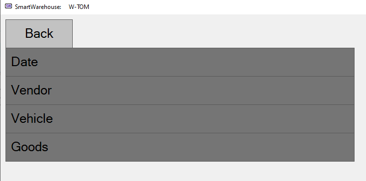

If for example user chooses Vehicle, all the purchase orders that have vehicle are shown:

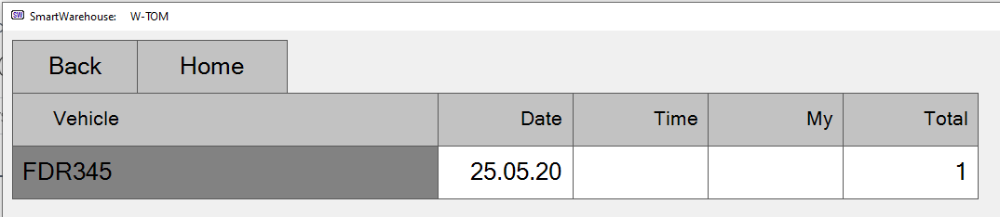

Click on **the Vehicle** and then user can see purchase lines. 

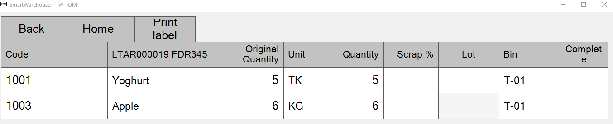

|Field|Usage|
|-|-|
|Code|From Business Central item code, not editable.|
|LTAR000019 FDR345|Items from Warehouse Receipt, not editable.|
|Original Quantity|In the Business Central purchase order quantity, not editable.|
|Unit|Unit from Business Central, not editable.|
|Quantity|Click on the field and fill in the actual quantity.|
|Scrap %|Click on the field and fill scrap % if needed.|
|Lot|If item has lot, edit it.|
|Bin|From Business Central, not editable field.|
|Complete|If the row checked user can mark it Complete.|

Click on item row **Quantity** and enter actual quantity.
For some products user also needs to fill in rows:

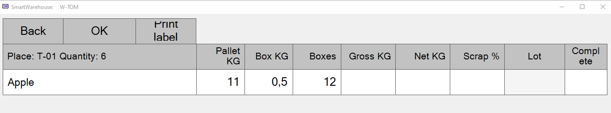

|Field|Usage|
|-|-|
|Pallet KG|If setup in Business Central comes automatically. Editable field if needed.|
|Box KG|If setup in Business Central comes automatically. Editable field if needed.|
|Boxes|If setup in Business Central comes automatically. Editable field if needed.|
|Gross KG|If setup in Business Central comes automatically. Editable field if needed.|
|Net KG|If setup in Business Central comes automatically. Editable field if needed.|
|Scrap %|If click on the field can setup scrap %.|
|Lot|Here user can’t set it. User can set it on the previous page.|
|Complete|If all is set, click **Complete**.|

From button Print label, user can print pallet label. 

If item is checked put a checkmark into box **Complete**.

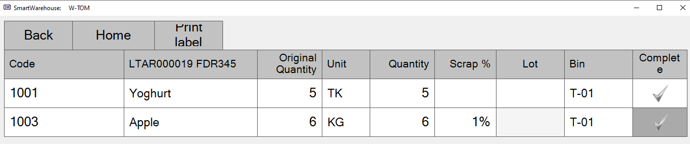

If all items are checked in warehouse go **Back**.

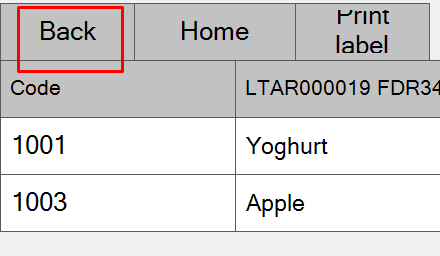

Then user can choose if to approve lines or not. If approves, click **Yes and Open**.

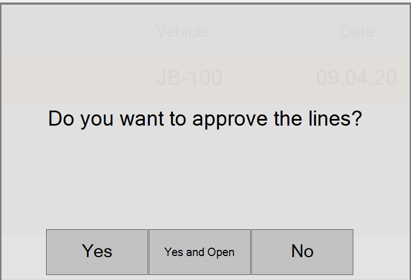

Then for user opens warehouse put-away, where user can choose the place for items.

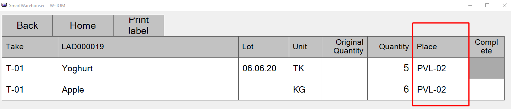

If place is set and items are in the right place put the checkmark into the box **Complete**.
All the purchase processes are done and user can go back home.  

### Purchase order check in Business Central and order posting

Open the purchase order that has put-away registered in Smart Warehouse.
On the **Lines** -> **Line** -> **Item Tracking Lines** user can see expiration date entered on **Warehouse Receipt** in Smart Warehouse program.

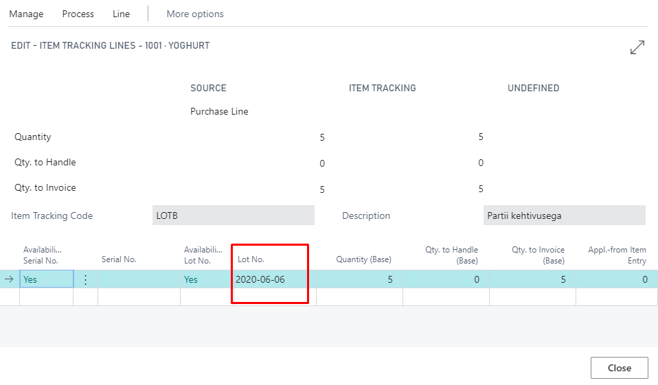

In addition, user can set Serial No., Lot No. and SN code for item.

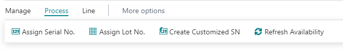

On the ***Lines** -> **Line** -> **Weighing lines** you see archive of weighing.

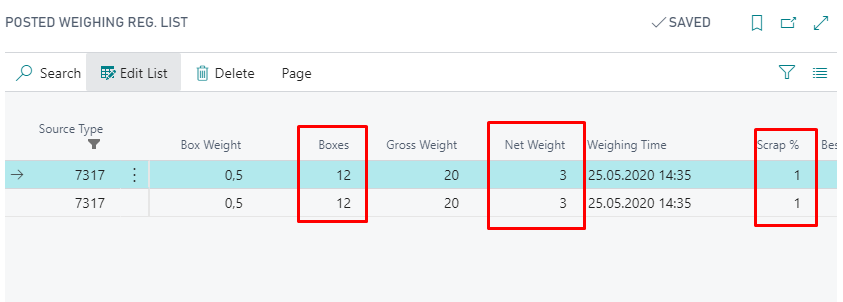

Now if all is correct **Post** the Document.

### Sales Order process in Business Central

Create **new** Sales Order.
In the General part in field **Work Description** user can enter information to the warehouse worker:

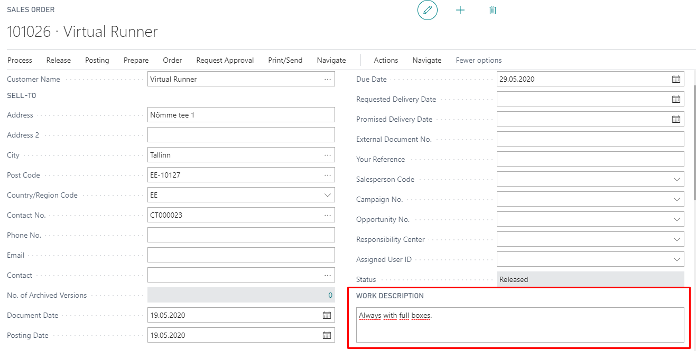

In the part **Smart Warehouse** user can enter following information:

|Field|Usage|
|-|-|
|Picking Status|Picking/Completed|
|Route|Preset routes|
|Route Delivery Start|Route delivery starting time|
|Route Delivery End|Route delivery ending time|
|Position on Route|What is the position in chosen route|
|Shipment Date|Shipment Date|
|Work Group|It is possible to connect warehouse workers with customers|

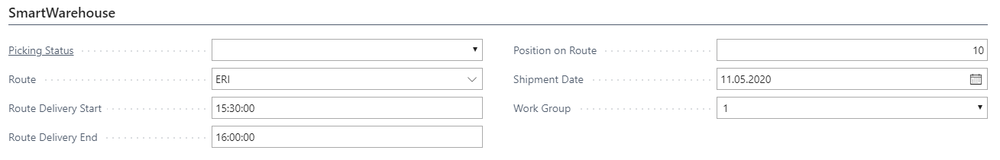

On the row’s user can enter information for assembler:

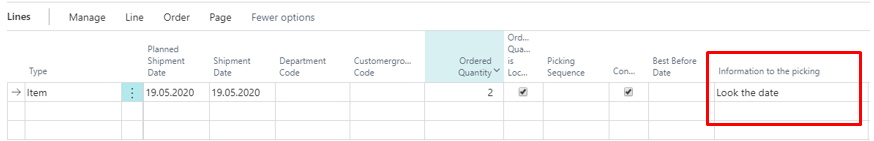

If all needed rows are filled **Release** the document.
Open **Job Queue Entries**.
Restart Job Queue Entry: 
- Object ID to Run - 70466728
- Parameter String: CREATESALESSHIPMENTS

This automation job creates a **Warehouse Shipment** and **Inventory Picking**. The lines will now available in the Smart Warehouse program.

### Sales Order process in Smart Warehouse

Open Smart Warehouse program.
Open page **Warehouse Activities**.

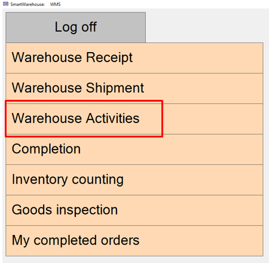

Then page **Pick**.

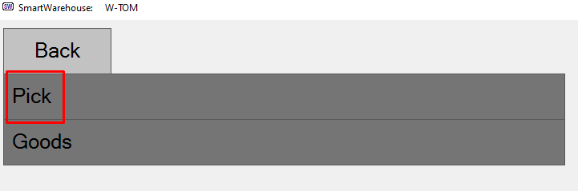

Then the **Warehouse Pick** user made in Business Central will be visible.

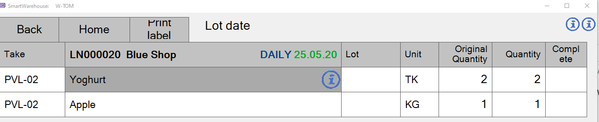

Warehouse worker can see **Work Description**, **Route and Warehouse Shipment** information with item information. 
Also here is possible to print Label for Bin. 
If items are picked put the checkmark into box **Complete**.

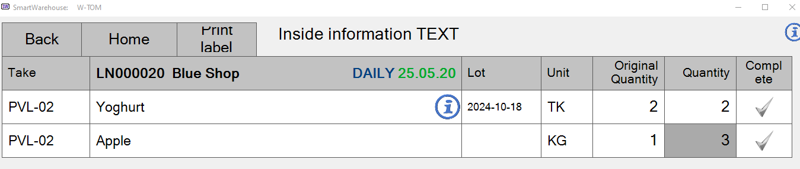

Pick is registered and user can go back **Home**.
Now go to **Warehouse Shipment**.

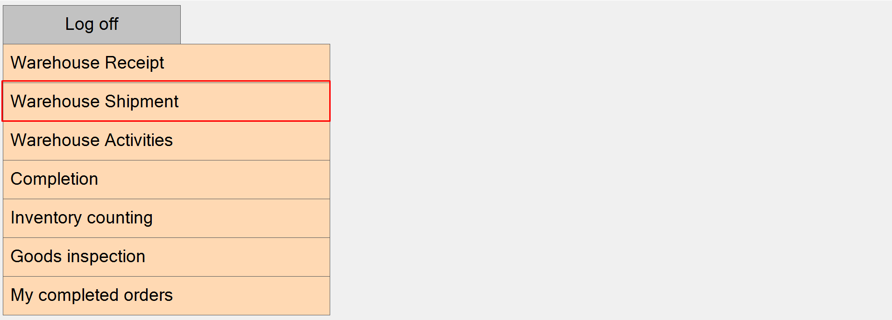

Opens picked warehouse shipment list.

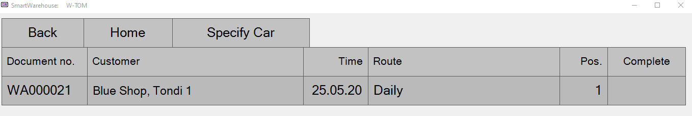

User can specify car information by clicking on the button **Specify Car**. 

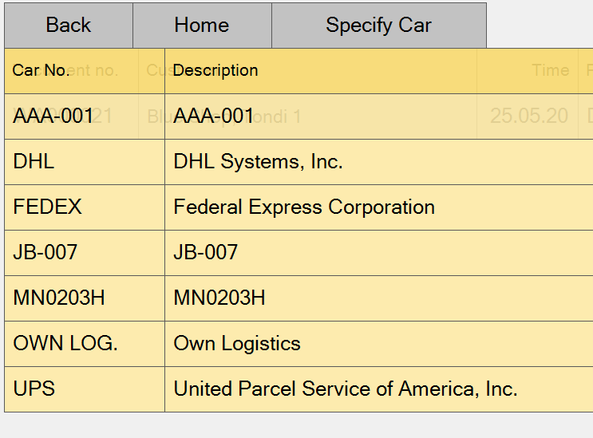

Then click on the row user wants to send out and confirm the **quantities** and put the checkmarks into **Complete**. 

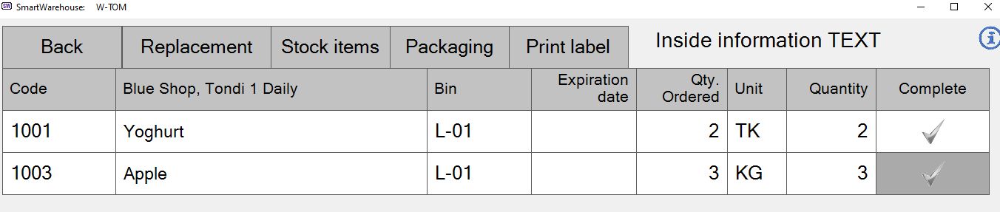

Go Back and Complete.

From Smart Warehouse part process is done and user can go back **Home**.

### Sales order check in Business Central and order posting

Open **Business Central** and check the **Sales order** what was previously made.
**Quantities** should be updated from **Smart Warehouse** program.

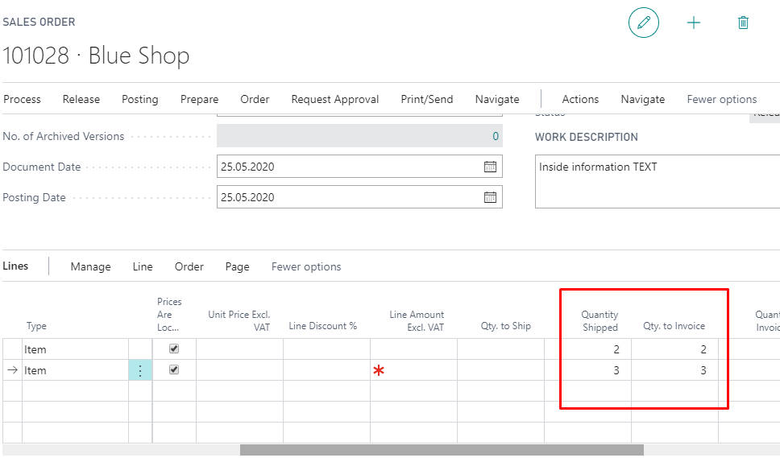

**Post** the invoice.

### Bin content check

Open in Smart Warehouse program page **Goods Inspection**.
Click on the field Code and enter item number user wants to check ant then click **Enter**. User can see Bin content for the item.

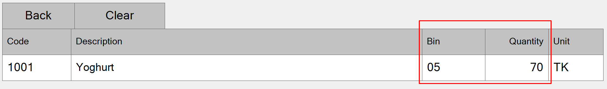

If item has for example lot, user can check it by clicking on the item line. 

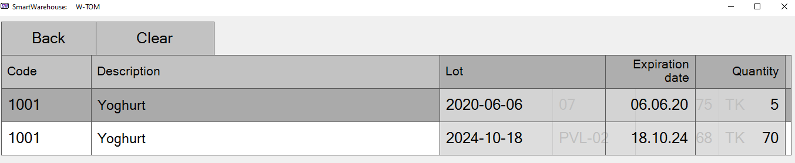

If needed information is checked click button **Clear** and go **Back**. 

For more information and pricing please contact BCS Itera AS:
[https://www.itera.ee](https://www.itera.ee)

