# Smart Warehouse – Kasutusjuhend

Smart Warehouse lahendus võimaldab alljärgnevat:
- Paberivabad laotegevused
- Vigade tekkimise tõenäosuse vähenemine
- Lao protsesside kiirenemine
- Business Centrali ja Smart Warehouse omavaheline automaatne infovahetus
- Veoringide määramise funktsionaalsus
- Aluste ja kastide arvestus kauba vastuvõtul
- Aegumiskuupäeva määramine kaubale
- Komplekteerimise järjekorra seadistamise võimalus
- Aluste kleepsude ja aluste kleepsude saadetistele printimise võimalus
- Kauba eluea seadistamise võimalus
- Smart Warehouse programmist on laotöötajal võimalik näha kauba laoseisu koos aegumiskuupäevadega
- Paberivaba inventuur

## Sisukord
  - [Seadistused](#seadistused)
  - [Äpi seadistamine](#äpi-seadistamine)
  - [Kasutamine](#kasutamine)
  - [Ostutellimuse toimingud Business Centralis](#ostutellimuse-toimingud-business-centralis)
  - [Ostutellimuse toimingud Smart Warehouse programmis](#ostutellimuse-toimingud-smart-warehouse-programmis)
  - [Ostutellimuse kontrollimine Business Centralis ja arveks konteerimine](#ostutellimuse-kontrollimine-business-centralis-ja-arveks-konteerimine)
  - [Müügitellimuse toimingud Business Centralis](#müügitellimuse-toimingud-business-centralis)
  - [Müügitellimuse toimingud Smart Warehouse programmis](#müügitellimuse-toimingud-smart-warehouse-programmis)
  - [Müügitellimuse kontrollimine Business Centralis ja arveks konteerimine](#müügitellimuse-kontrollimine-business-centralis-ja-arveks-konteerimine)
  - [Aluse sisu kontrollimine](#aluse-sisu-kontrollimine)
  - [Uuendatud funktsionaalsused](#uuendatud-funktsionaalsused)

 

## Seadistused

Esmalt kontrolli, kas oled alla laadinud “ **Smart Warehouse** ” äpi. Kui see puudub võta ühendust BCS Iteraga. 

### Äpi seadistamine

Ava **Installeerimine**.
**Aktiveeri veebiteenus** ning seejärel vajuta **Edasi**.

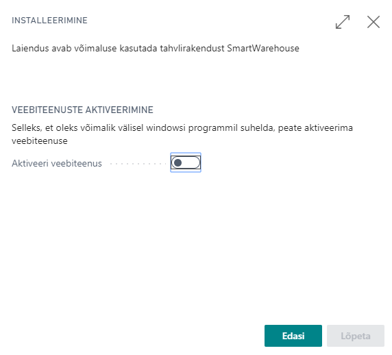

Järgmiseks juhendatakse kasutajat leidma Smart Warehouse veebiteenus. Siin vajuta **Jah**.

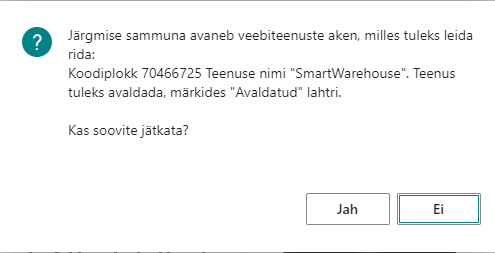

Järgmiseks juhendatakse kasutajat leidma Smart Warehouse veebiteenus. Siin vajuta **Jah**.
Veebiteenuse leiad teenuste loendist ülevalt poolt.

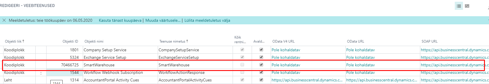

Sulge antud leht!
Kopeeri endale tuleviku tarvis **Tahvli rakenduse URL** ja liigu **Edasi**.

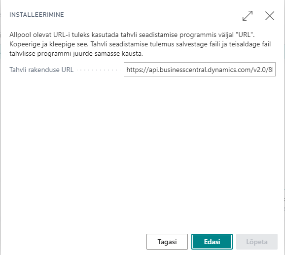

|Väli|Kasutamine|
|-|-|
|Töökorralduste funktsionaalsuse kasutamine|Võimaldab vaadata töökorraldusi.|
|Laolähetuse funktsionaalsuse kasutamine|Võimaldab vaata ja luua laolähetusi.|
|Laotarne funktsionaalsuse kasutamine|Võimaldab kasutajal luua laotarnet.|
|Laotegevuste funktsionaalsuse kasutamine|Võimaldab vaadata ja luua laotegevusi.|

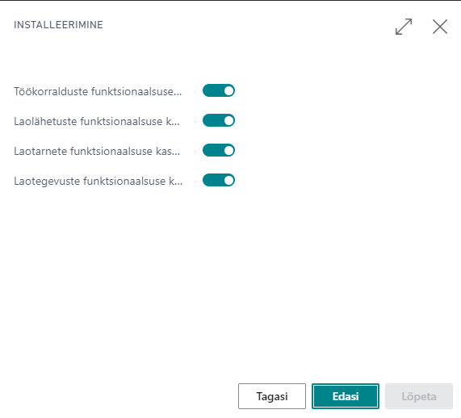

Kui kasutajal on vaja kõiki neid funktsionaalsusi kasutada aktiveeri need ning liigu Edasi.

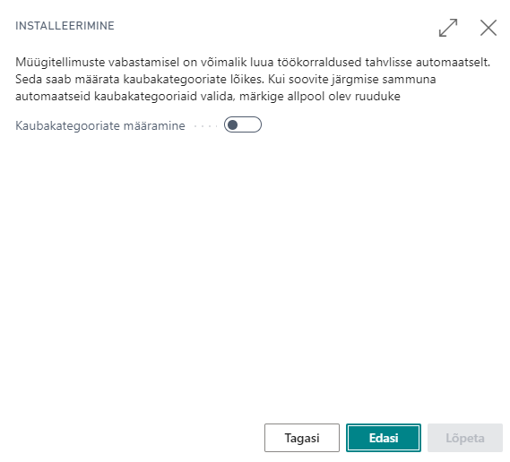

Võimaldab automaatse Kaubakategooria valimist aktiveerimisel, mis saadab töökorralduse automaatselt tahvlisse. Soovi korral aktiveerige ning vajutage **Edasi**.
Kui aktiveerisite eelneva avaneb Business Centralisse seadistatud **Kaubakategooriate leht**:

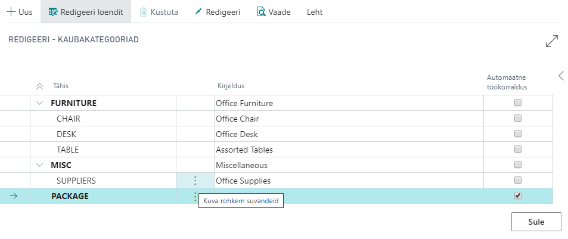

Valige sealt endale soovitud kategooria ning pange linnuke kasti **Automaatne töökorraldus**. Sulgege leht. 
Järgmiseks valige Taara üld, toote konteeringu rühm:

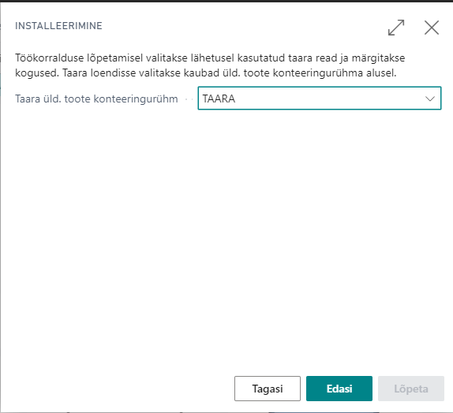

Antud seadistus võimaldab taara ridade kaasamist Töökorralduse lõpetamisel. Vajadusel seadistage endale sobiv.
Minge **Edasi**.

|Väli|Kasutamine|
|-|-|
|Töötaja kontrollimise tõenäosuse %|Saab määrata kasutaja eksimuste tõenäosust tellimuste kokkupanemisel. Kasti numbrit kirjutades määratakse kasutajale nn supervisor, kes vastavalt seatud protsendile pisteliselt tema komplekteeritud kauba üle kontrollib|
|Kontrollitavate klientide valimine|Aktiveerimine võimaldab järgmist valikut muuta(Kontrollitavate klientide valimine käsitsi või filtreid kasutades).|
|Kontrollitavate klientide  valimine käsitsi või filtreid kasutades|Eelnev seadistus peab olema aktiveeritud, seejärel saab kasutaja otsustada, millise valiku järgi kontrollitavaid kliente valitakse.|

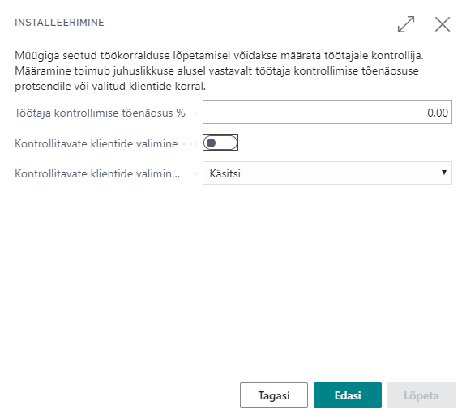

Minge **Edasi**.
Järgnevalt saab kasutaja aktiveerida endale soovitud automaattööd.

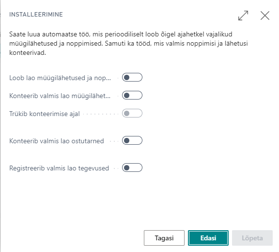

Vajutades **Edasi**, kuvatakse kõigi automaattööde kohta eraldi aknad algus/lõpu aegade ning sageduse seadistamiseks näiteks:

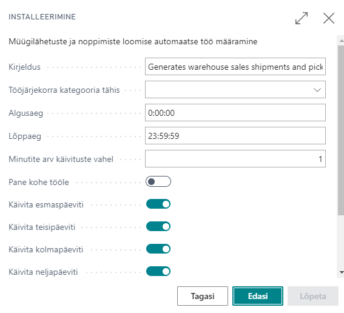

Liikuge **Edasi**.
Seadistuste viimases aknas on võimalik aktiveerida õiguste uuendamist, avada seadete akent ning tööjärjekorra kandeid. Kui soovitud read on aktiveeritud **Lõpetage** installeerimine.

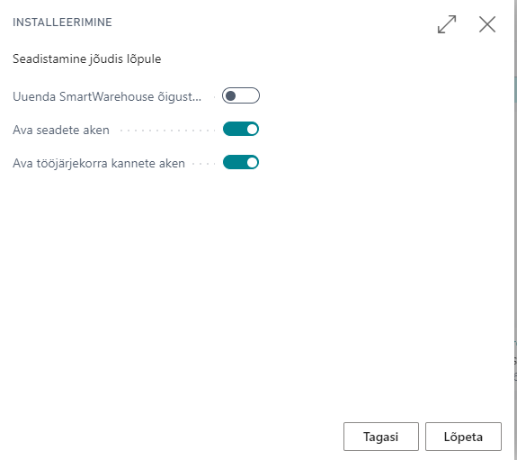

Järgnevalt lehelt on võimalik endale Smart Warehouse rakendus alla laadida:

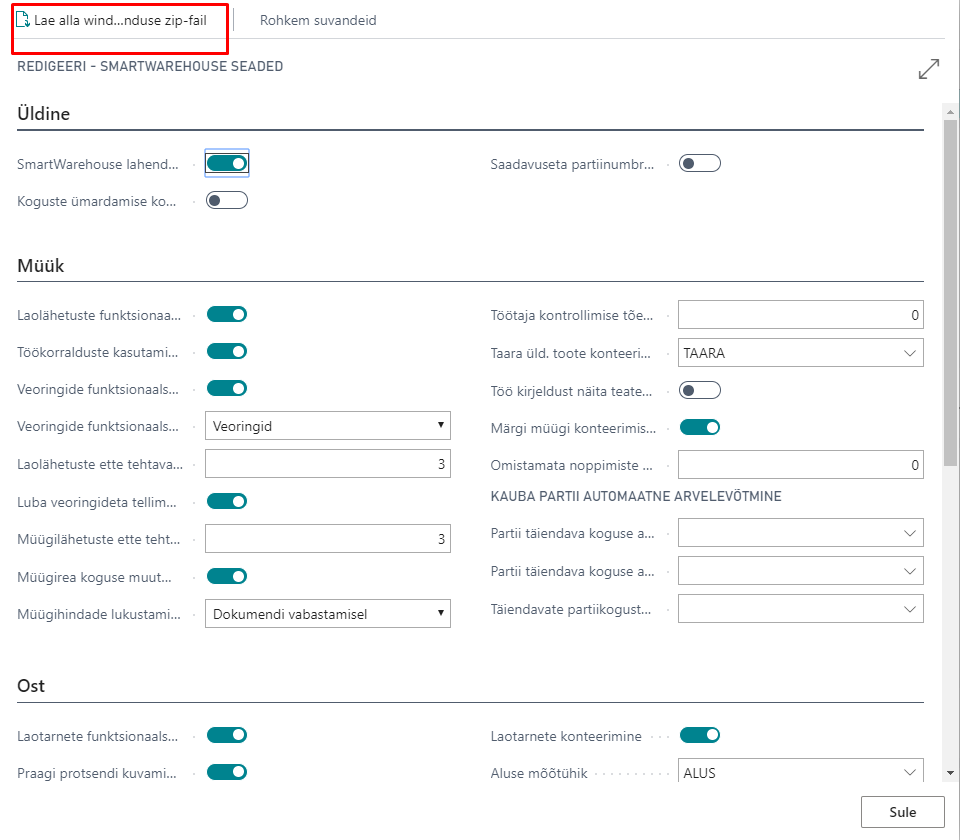

Pakkige fail lahti ning avage fail **SmartWarehouse Setup.exe**:

|Väli|Kasutamine|
|-|-|
|URL|Sinna kopeeri eelnevalt kopeeritud link.|
|Autentimine|Windows/Nav Kasutaja|
|Kasutaja nimi|Vastavalt eelnevalt tehtud valikule, kas Window või Business Central Kasutaja|
|Parool|Vastavalt eelnevalt tehtud valikule kas Window või Business Central parool|

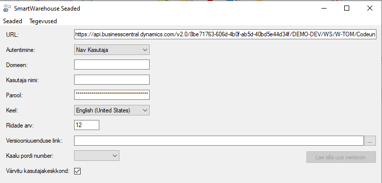

Seejärel testi ühendust:

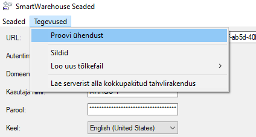

Kui kõik õnnestus annab server vastuse:

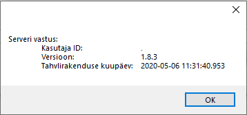

Mine tagasi **Business Centralisse**.
Seadista **Mõõtühikud**. Nendele mõõtühikutele, mida on vaja kasutada Smart Warehouse programmis lisa linnuke kasti **Kaaluühik**.

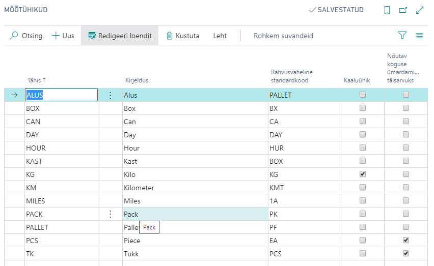

Järgmiseks mine lehele **Laotöötajad**.
Lisa sinna kõik töötajad, kes hakkavad programmi kasutama ning juurde vali ladu ehk **Asukoha tähis**. Kasti **Vaikimisi** lisa linnukesed nende töötajate asukohtadele, mis mida soovid määrata töötajale vaikimisi. 

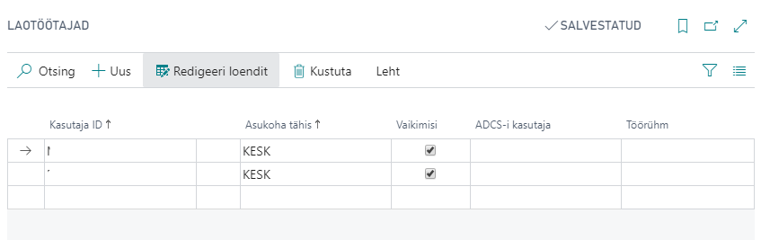

## Kasutamine

### Ostutellimuse toimingud Business Centralis

Avage ostutellimused ning looge uus ostutellimus.
Kohustuslikud väljad **Hankija nimi**, **Hankija arve nr**, **Auto nr.**

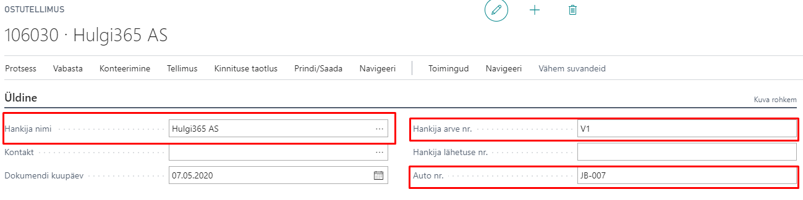

Ridadele lisa kaup, koos **Asukoha tähise** ja **Kogusega**.

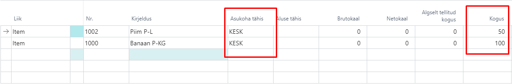

Eelnev info on vaja lisada, sest seda kuvatakse laotöötajale Smart Warehouse programmis.
Järgnevalt vajuta **Toimingud** -> **Vabasta** -> **Täida algselt tellitud kogus**.
Toimingu järgselt täitus ridadel **Algselt tellitud kogus**.

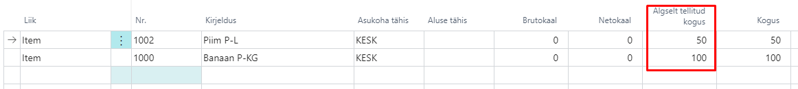

Vabasta tellimus!
Viimaks vajuta **Toimingud** -> **Ladu** -> **Loo Laotarne**.

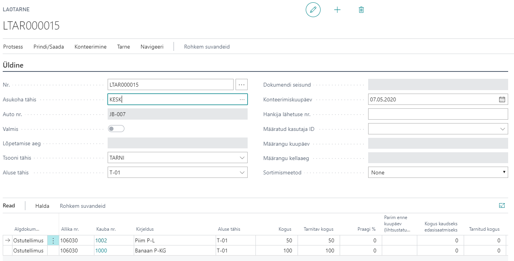

### Ostutellimuse toimingud Smart Warehouse programmis

Ava **SmartWarehouse.exe.**

Logi sisse eelnevalt seadistatud Kasutajanime ja Parooliga:

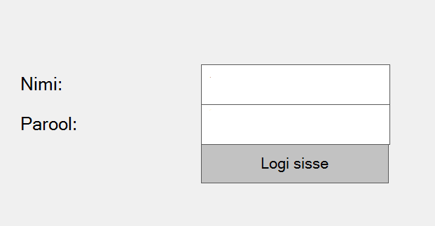

Seejärel avaneb tegevuste loend:

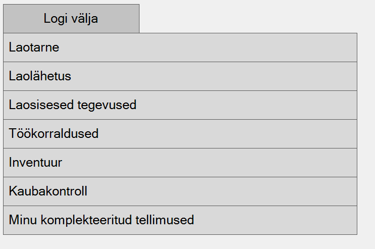

Ostutellimuse puhul lõime Business Centralis **Laotarne**, seega avame **Laotarne** lehe.
Alljärgnev valik annab võimaluse laotarne leidmiseks **Kuupäeva**, **Hankija**, **Auto**, **Kauba järgi**.

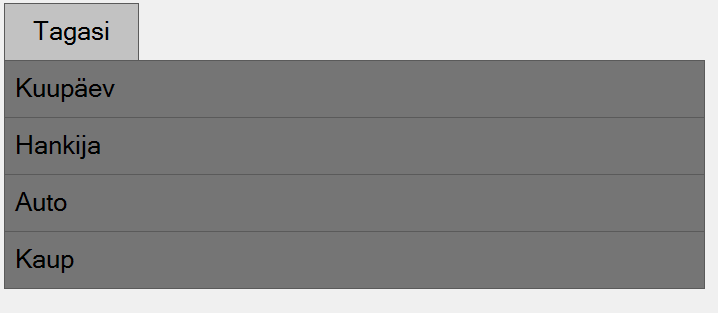

Valides Auto, kuvatakse laotöötajale kõik ostutellimused, millel oli auto väli täidetud:

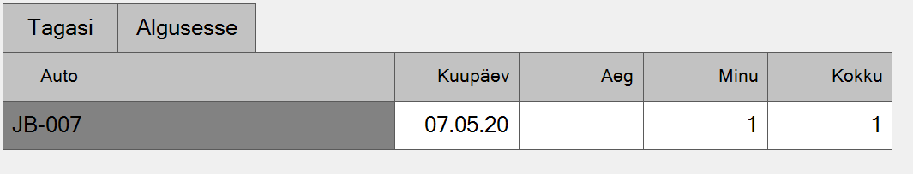

Vajuta **auto nr** väljal ning töötajale avaneb ostutellimuse read. 

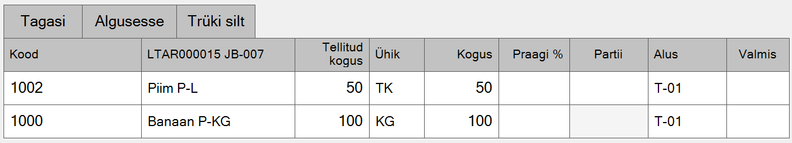

|Väli|Kasutamine|
|-|-|
|Kood|Business Centralist tulev kauba kood. Pole muudetav.|
|LTAR000015 JB-007|Laotarne peal olevad tooted. Pole muudetav|
|Tellitud kogus|Ostutellimusel märgitud tellitud kogus. Pole muudetav|
|Ühik|Kaubale määratud ühik. Pole muudetav.|
|Kogus|Vajutades väljale, on võimalik sisestada tegelik kogus.|
|Praagi %|Vajutades väljale, saab määrata praagi %.|
|Partii|Kui tootele on määratud partii, saab selle sisestada.|
|Alus|Vaikimisi Business Centralist. Pole muudetav.|
|Valmis|Kui rida on kontrollitud vajuta Valmis ja toote kontrollimine on automaatselt kinnitatud. |

Osade toodete puhul on vaja täita väljad :

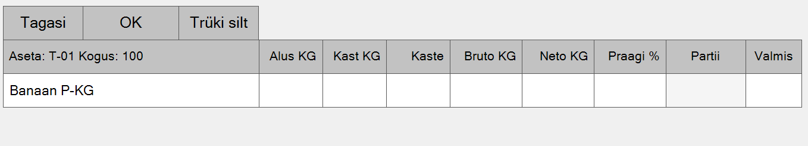

|Väli|Kasutamine|
|-|-|
|Aluse KG|Kui Business Centralis seadistatud tuleb automaatselt, aga saab muuta.|
|Kast KG|Kui Business Centralis seadistatud tuleb automaatselt, aga saab muuta.|
|Kaste|Kui Business Centralis seadistatud tuleb automaatselt, aga saab muuta.|
|Bruto KG|Kui Business Centralis seadistatud tuleb automaatselt, aga saab muuta.|
|Neto KG|Kui Business Centralis seadistatud tuleb automaatselt, aga saab muuta.|
|Praagi %|Vajutades väljale, saab määrata praagi %.|
|Partii|Siin lehel ei saa määrata, määratakse eelmisel lehel.|
|Valmis|Kui kõik vajalik info on seadistatud vajuta Valmis kasti linnuke.|

Vajutades nupule **Trüki silt**, on võimalik välja printida valitud tootele aluse silti.

Kui tooted on laos kontrollitud vajuta nupule **Tagasi**.

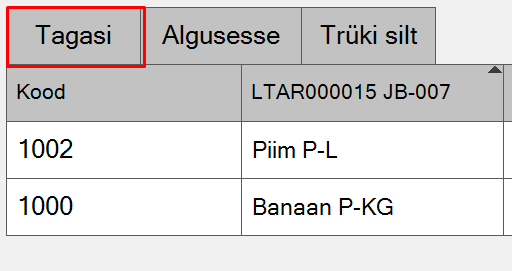

Seejärel saab valida, kas kinnitada rida, kinnitaja ja ava ladustamise või mitte kinnitada.

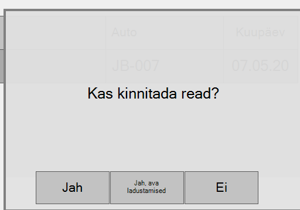

Vajutades **Jah, ava ladustamised** avaneb leht ladustusleht, kus saab sisestada kauba soovitud asukoha:

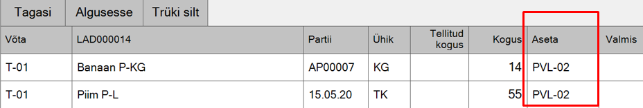

Kui soovitud asukoht on sisestatud ja kaup paigutatud tee linnukesed kasti **Valmis**. 
Ladustamine on registreeritud ning võid minna tagasi algusesse.

### Ostutellimuse kontrollimine Business Centralis ja arveks konteerimine

Ava eelnevate tegevuste jaoks loodud ostutellimus.
Tellimuse ridadel vajutades **Rida** -> **Kaubajälgimise read**, kuvatakse detailne info kauba kohta näiteks Smart Warehouses sisestatud **Kehtivuse lõpp**:

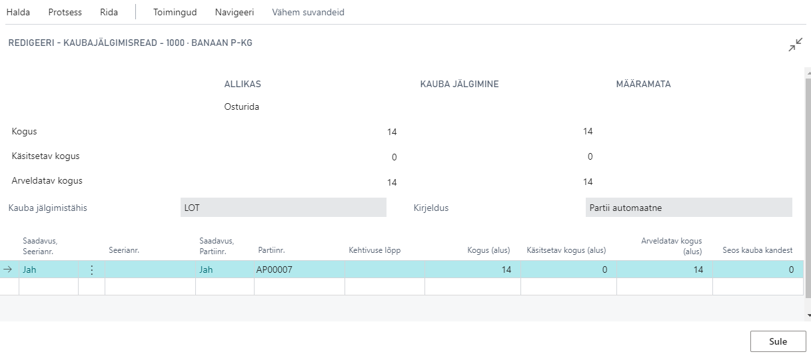

Lisaks saab kaubale juurde määrata:

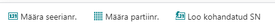

Tellimuse ridadel vajutades **Rida** -> **Kaalumise read** kuvatakse kasutajale **Konteeritud lao kaalumise ridu**:

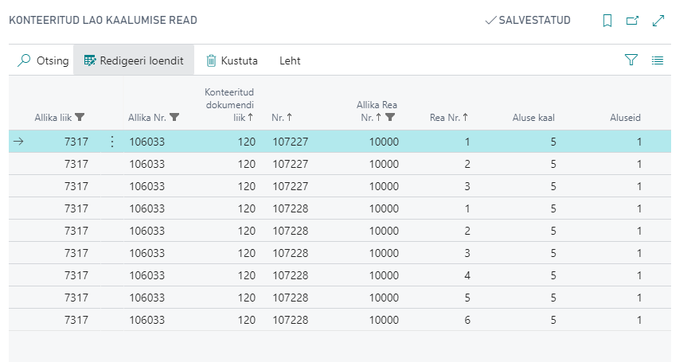

Kui kõik soovitud info on tellimusel olemas **Konteeri** dokument.

### Müügitellimuse toimingud Business Centralis

Loo uus müügitellimus.
Müügitellimuse osas **Üldine** saad sisestada laole info väljale **Töö kirjeldus**:

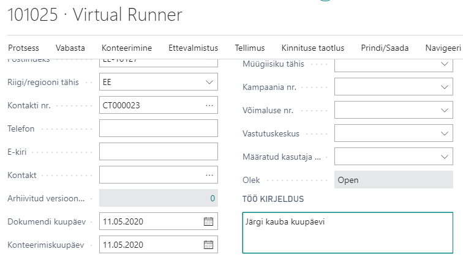

Osas SmartWarehouse saad sisestada järgneva info:

|Väli|Kasutamine|
|-|-|
|Noppimise seisund|Noppimine/Valmis|
|Veoring|Eelseadistatud veoringi valik.|
|Veoringi tarne algus|Veoringi tarne algusaeg.|
|Veoringi tarne lõpp|Veoringi tarne lõppaeg.|
|Järjekord veoringis|Mitmes on tellimus valitud veoringil.|
|Lähetuskuupäev|Lähetuskuupäeva määrang|
|Töörühm|Laotöötajaid on võimalik klientidega siduda|

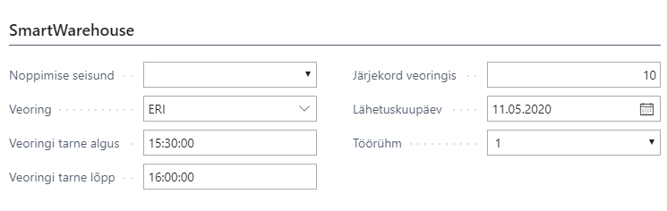

Ridadel saad sisestada lisainformatsiooni komplekteerijale:

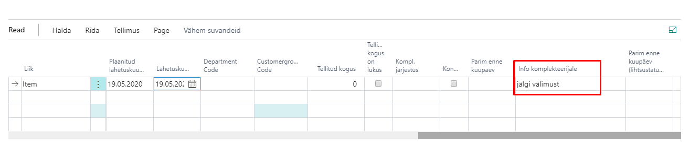

Kui müügitellimusel on kõik vajalikud read lisatud **Vabasta** dokument.

Seejärel ava **Tööjärjekorra kanded**.
Käivita automaatöö : 
- Käivitatava objekti ID - 70466728
- Parameetrijada: CREATESALESSHIPMENTS

Antud automaatöö loob lao lähetuse ning varude noppimise, mille read ilmuvad seejärel kättesaadavaks Smart Warehouse programmis.

### Müügitellimuse toimingud Smart Warehouse programmis

Ava **Smart Warehouse** programm.

Programmis ava leht **Laosisesed tegevused**.

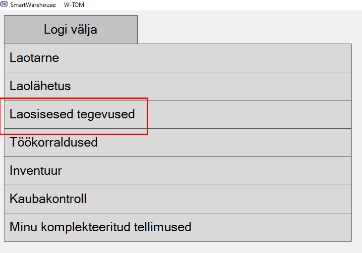

Seejärel ava leht **Noppimine**.

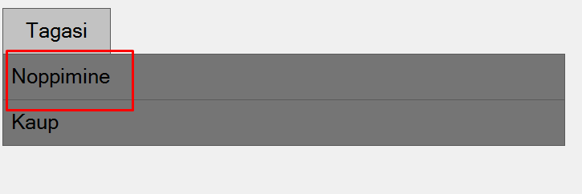

Avaneb noppeleht:

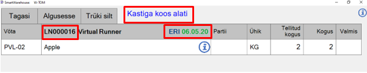

Kus kuvatakse infot müügitellimuse väljalt **Töö Kirjeldus**, **Veoringi**, **Laolähetuse numbrit** ning laotöötajale olulist info kauba kohta, näiteks **Asukoht**, **Kogus**.

Lisaks on võimalik alusele välja printida silti. Seal kuvatakse tellimuse saaja aadresse, tellimuse numbrit, kauba saatjat, veoringi, lähetuse ja- tarnekuupäeva.

Kui nope on valmis pane linnuke kasti **Valmis**.
Seejärel avaneb leht, mis juhendab töötajat kuhu tuleb suunata nopitud kaup. Lisaks saab vajadusel sisestada **Aluse KG**, **Kasti KG**, **Kastide arvu** ning selle järgi arvutatakse välja **Bruto KG** ja **Neto KG**.

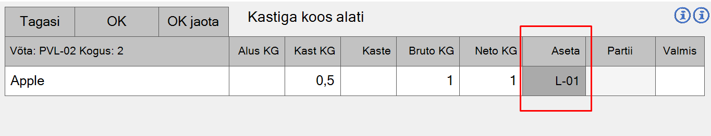

Pane linnuke kasti **Valmis**.
Nope on seejärel registreeritud ja liigu tagasi **Algusesse**.
Vajuta nupule **Laolähetus**.

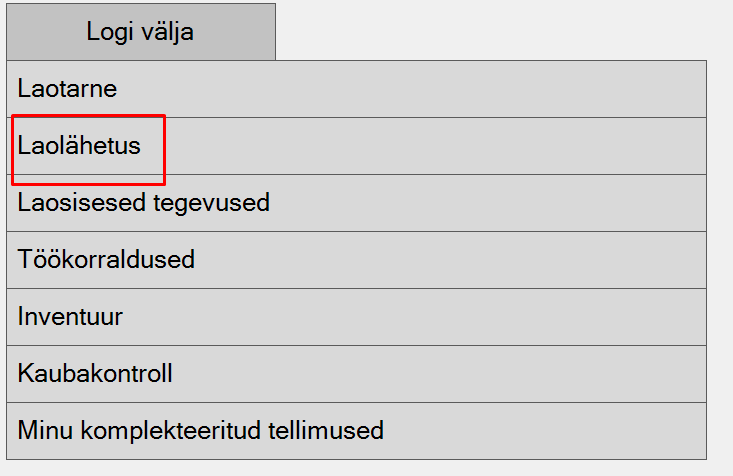

Avaneb nopitud laolähetuste loend.

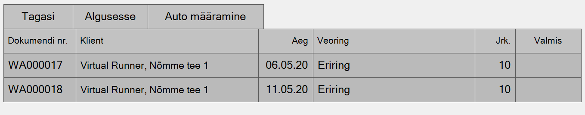

Vajutades Autode määramine, saad täpsustada kaupa vedava auto numbri. 
Vajuta laolähetuse reale ning kinnita veelkord kogused ning seejärel saad dokumendi märkida **Valmis**.

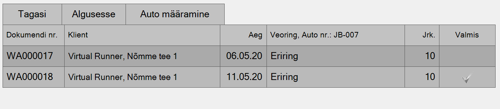

Smart Warehouse programmi tegevused on laotöötaja poolt lõpetatud ning võib minna tagasi **Algusesse**.

### Müügitellimuse kontrollimine Business Centralis ja arveks konteerimine

Ava Business Central ja kontrolli muutuseid müügitellimusel. Ridadel on kogused uuendatud.

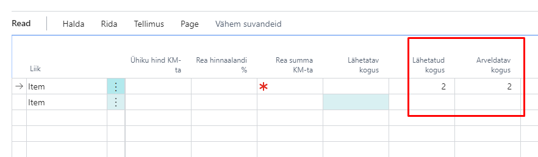

Seejärel saab arve ära konteerida.

### Aluse sisu kontrollimine

Ava Smart warehouse programmist leht **Kaubakontroll**.
Kliki real kood ning sisesta kauba number, mille aluse sisu soovid kontrollida ning seejärel vajuta klaviatuuril **Enter**. Avaneb kauba aluse sisu info:

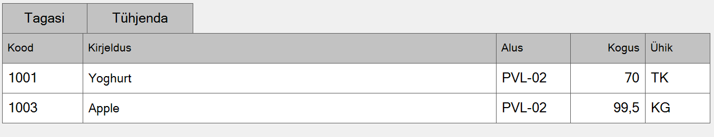

Kui kaubale on määratud partii ja säilivus, siis vajutades kauba reale kuvatakse seda infot.

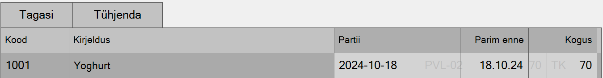

Kui soovitud info on üle kontrollitud vajuta nuppu **Tühjenda**.

## Uuendatud funktsionaalsused

Nutilaole on valminud täiustatud versioon, mis võimaldab rakendust kasutada ka osalise laohalduse puhul. 
Osalise laohalduse puhul moodustatakse dokumendid ladustamine ja noppimine ning lisaks saab määrata kohustuslikuks aluse ehk riiuli asukoha. 
Lahendust on täiendatud kasutamiseks ka Android seadmetega. Android seadmetes töötab rakendus Opera veebibrowseris või saab kasutada Business Central api kaudu-selleks on loodud spetsiaalne õiguste komplekt **BCS.BPF SMARTWAREHOU**. Kui kasutajale on lisatud see õiguste komplekt, siis suunatakse ta automaatselt apist Business Centralit avades Nutilao lahendusse. 

## Seadistus

Seadistusse on loodud viis uut menüüd.
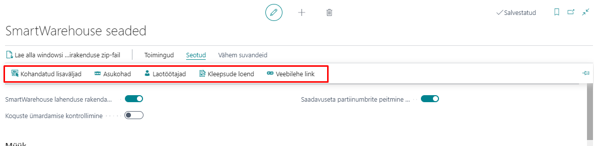

### Kohandatud lisaväljad
Kohandatud lisaväljad võimaldavad kasutajal tuua Nutilao lahendusse dokumentide juurde vajalikke lisavälju.
Seadistatav vastavalt kasutaja enda vajadustele ja Nutilao lahendusse saab tuua kõiki kauba kaardil olevaid välju.

|Field|Value|
|-|-|
|**Väljade kasutus**|kuhu väljale soovitakse lisa kirje tuua.|
|**Tabeli pealkiri**|kuhu dokumendi peale soovitud väli tuuakse|
|**Välja pealkiri**|millist lisa välja peab Nutilaos kuvama|
|**Eraldaja**|kui soovitakse välja kasutuse välja ja välja pealkirja eraldamist mõne enda soovitud märgiga. Võib ka jääda tühjaks|
|**Järeleandija**|kui soovitakse välja kasutuse välja ja välja pealkirja eraldamist mõne enda soovitud märgiga. Võib ka jääda tühjaks|

Näide Nutilaost funktsionaalsuse kasutuse kohta:

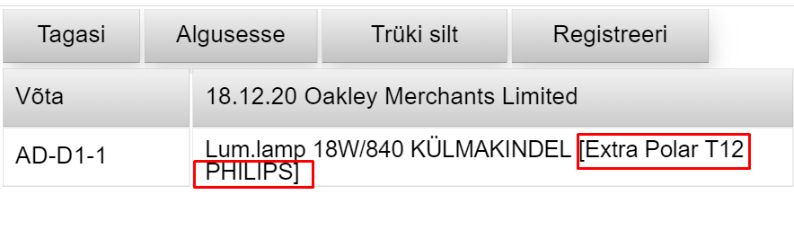

Näiteks antud juhul on lisatud noppe dokumendile eraldajatega Kirjeldus 2 väli kauba kaardilt. 

### Asukohad
Võimaldab mugavalt ilma Nutilao seadistustest välja minemata seadistada vajalikke parameetreid soovitud laole. Lisaks, kui enamus ladudes ei ole kasutusel Nutiladu ning osades soovitakse ikkagi kasutuse võtta, on võimalik seadistada Nutilao võimalused ka asukoha põhiselt. Nutilao üldised seadistused on prioriteetsemad.

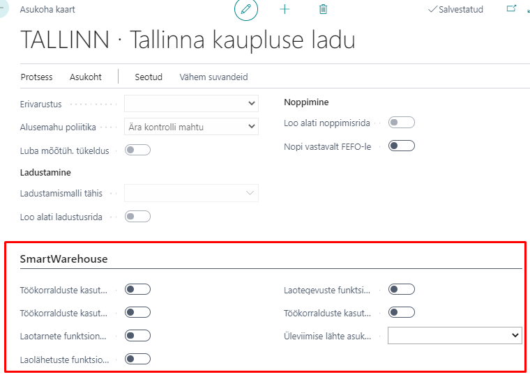

### Lao töötajad
Võimaldab mugavalt Nutilao seadistuste juures liikuda otse Lao töötajate juurde, kui on vaja kasutajaid lao töötajateks juurde lisada ilma, et peaks eraldi lehte otsima hakkama.

### Kleepsude loend
Võimaldab seadistada erinevatele lao tegevustele aluse/riiuli/kasti kleepse. 
Näide erinevatest kleepsude valikutest:

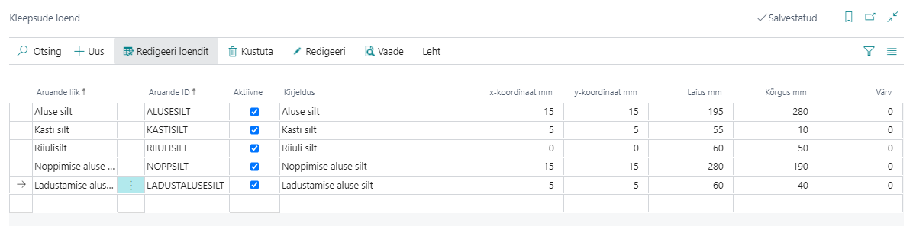
Loendis on võimalik ära defineerida erinevad kleepsud ning nende suurus.
Soovitud kleepsu kaarti avades on võimalik ära seadistada, milliseid ridu kleepsu peal kuvatakse. 
Näiteks:
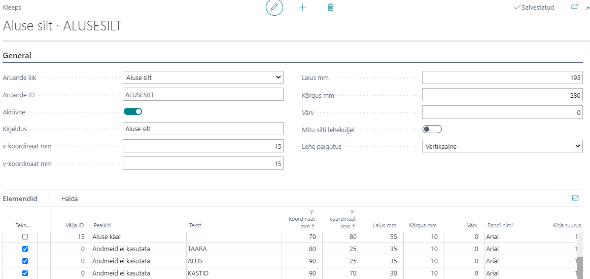
Näide noppimise sildist Nutilao lahendusest prindituna:
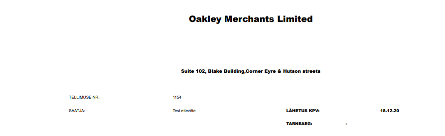

### Veebilehe link
Lingi kaudu on võimalik Nutilao lahendust avada näiteks Opera veebibrowseris, et kasutada lahendust Android seadmes. 

### Seadistuse väljad
Seadistuse väljad SmartWarehouse seadistustes, mis tuleks sisse lülitada osalise laohalduse puhul(noppimine/ladustamine/alus kohustuslik):

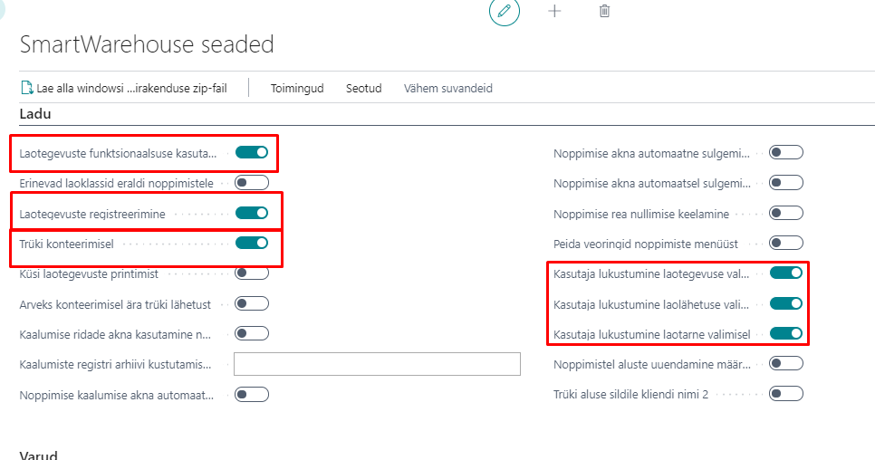
**Laotegevuste funktsionaalsuse** aktiveerimine defineerib ära selle, et kasutatakse osalist laohaldust. 
**Laotegevuste registreerimine** saadab nopitud/ladustatud ridade info Business Centralisse.
**Trüki konteerimisel** võimaldab seadmest välja printida peale dokumendi registreerimist konteeritud müügilähetust/konteeritud ostutarnet. Selle funktsionaalsuse jaoks on juurde loodud automaattöö:

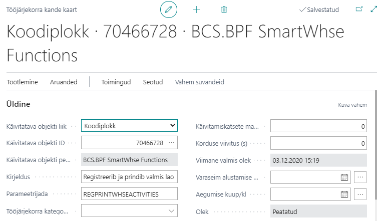

**Kasutaja lukustamine laotegevuse** valimisel võimaldab dokumendile kasutaja ID külge panemist st, et kui kasutaja on korra juba dokumendi endale avanud, on tema ID dokumendi küljes ning teistele kasutajatele dokument enam nähtav pole. Sama funktsionaalsus on **kasutaja lukustamine laolähetuse ja kasutaja lukustamine laotarne puhul**. 
Nutilaos tuleb linnuke nii noppimiste, kui ladustamise juures väljale **Minu**.

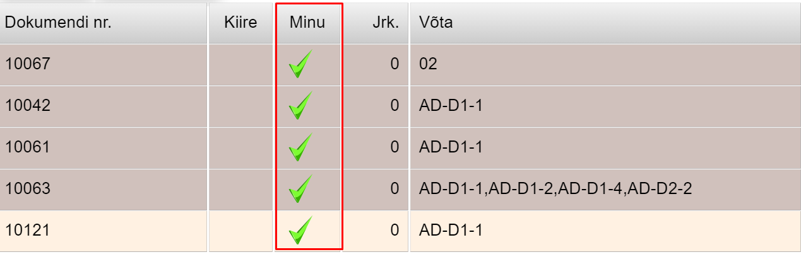

## Nutilao menüü osalise laohalduse puhul
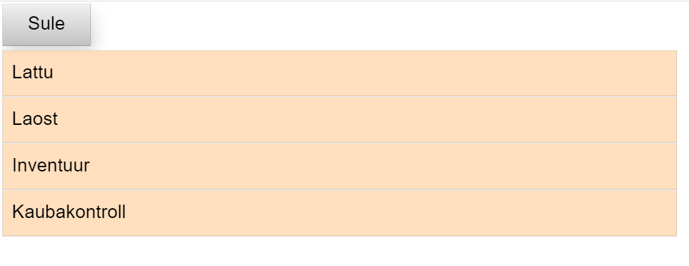

### Ladustamise menüü
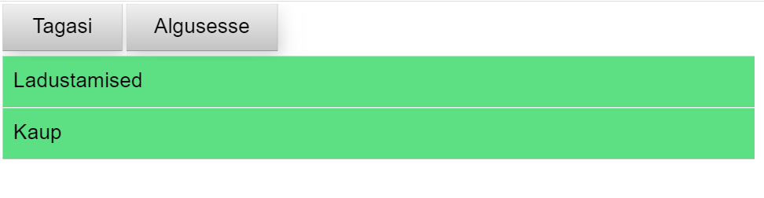
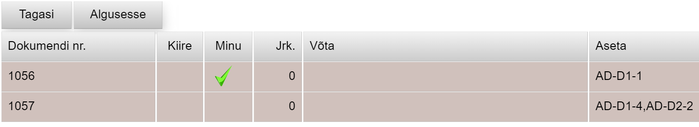
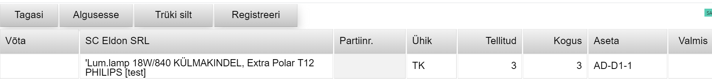

### Noppimise menüü

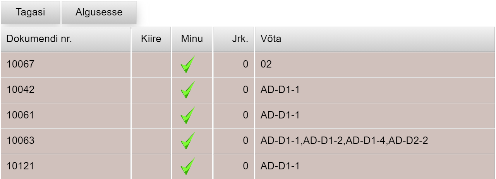
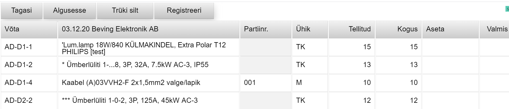

## Ostutellimuse tegevused osalise laohaldusega
Looge **Business Centralis** uus ostutellimus ning lisage kaubad tellimusele ning vabastage tellimus.
Ladustamise Nutilao lahendusse saatmiseks vajutade menüü päises **Protsess**-> **Loo varude ladustamine/noppimine**.

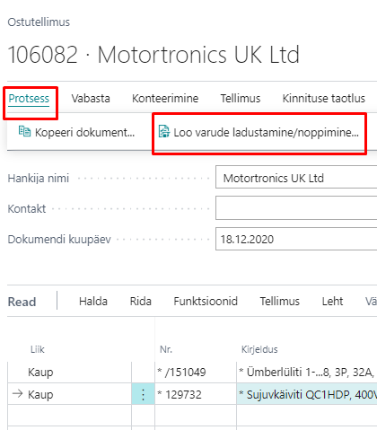

Seejärel aktiveerige marker väljal **Loo varude ladustamine**.

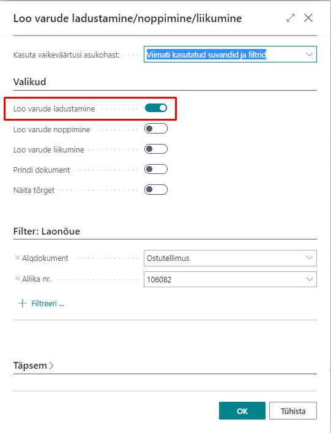

Klikkige **OK**.
Nüüd liikuge Nutilao lahendusse.
Klikkige menüül **Lattu**.

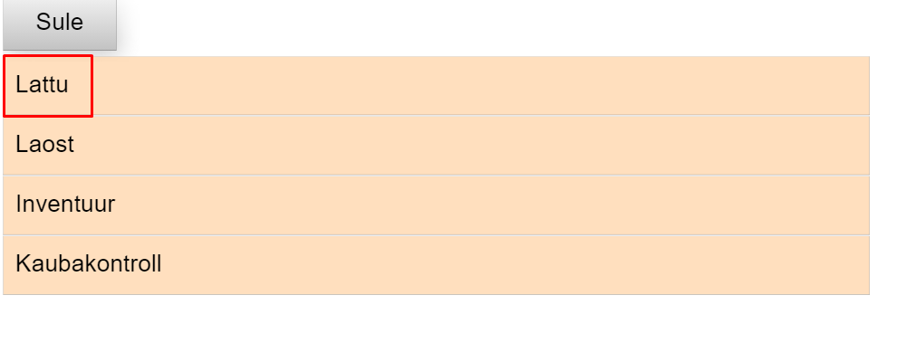

Seejärel valige menüüst **Ladustamised**.

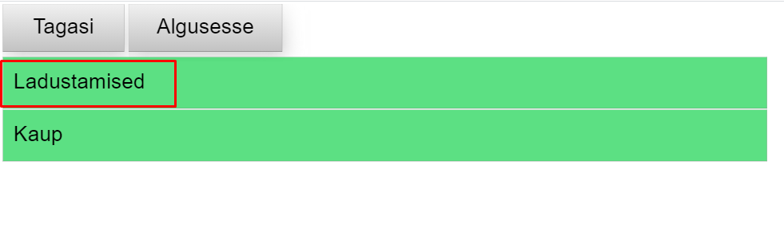

Avaneb ladustamise loend erinevate ladustamise dokumentidega.

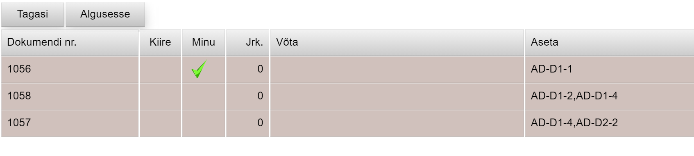

Valige dokument, mida soovite ladustada. NB! Peale seda, kui olete endale dokumendi avanud, salvestub teie kasutaja ID sellele dokumendile ning väljale **Minu** tuleb linnuke. 
Kui vaadata Business Centralis Varude Ladustamise all sama dokumenti, näiteks antud näite juures 1056 on näha, et **Määratud kasutaja ID** alla on tekkinud kasutaja ID, kes selle dokumendi endale Nutilao lahenduses avas.

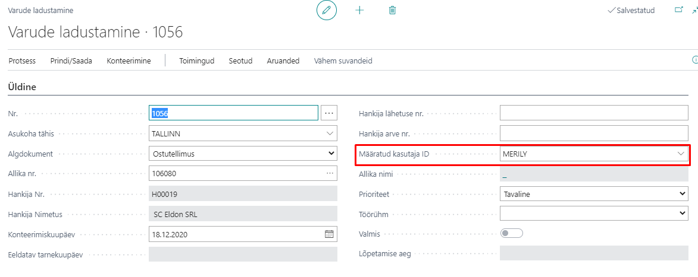

Liigume tagasi ladustamise protsessi juurde Nutilaos.
Partii kaubale on võimalik kas Business Centralist saata partii number või sisestada käsitsi programmis. Oleneb, kuidas on partii määramine seadistatud.

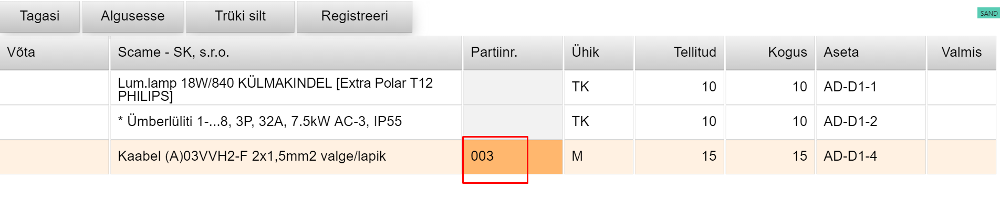

Antud näite puhul on partii käsitsi ladustamisel sisestatud. Väärtust saab sisestada ka käsi skänneriga.
Kui kogused peaks erinema reaalsest kogusest, tuleb muudatus fikseerida **Kogus** väljal.

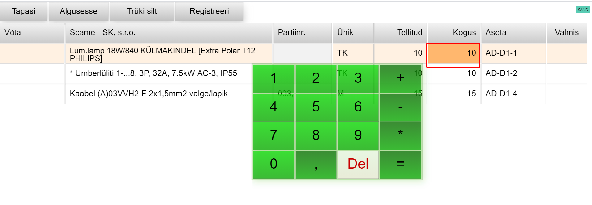

Kui kogused on kontrollitud tuleb rida märkida **Valmis**.

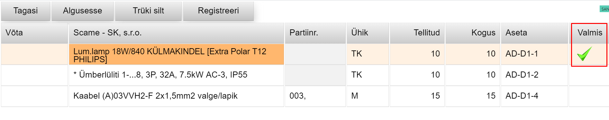

Pärast seda, kui kõik read on saanud **Valmis** linnukese, tuleb ladustamine ära registreerida ning info ladustamise kohta jõuab Business Centralisse.

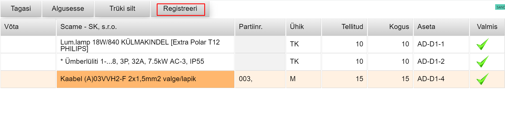

Lisaks prinditakse automattööga välja **Konteeritud ostutarne**.

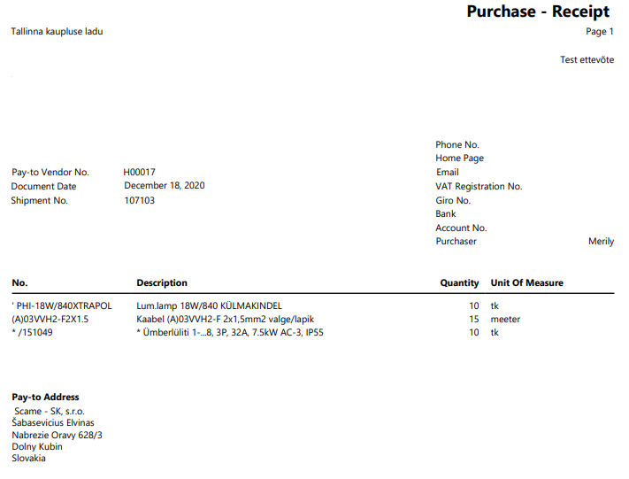

Liikudes tagasi **Business Centrali** vaatesse ostutellimusel, on näha kogust, mis lattu tariniti. 

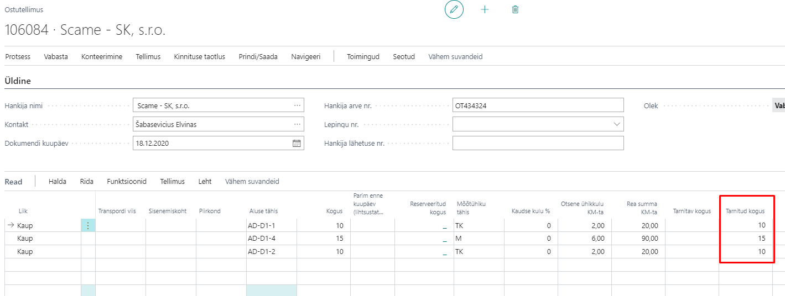

Lisaks partii kauba puhul, saab kaup partii külge, kui seda juba eelnevalt ostutellimusel ära defineeritud polnud.

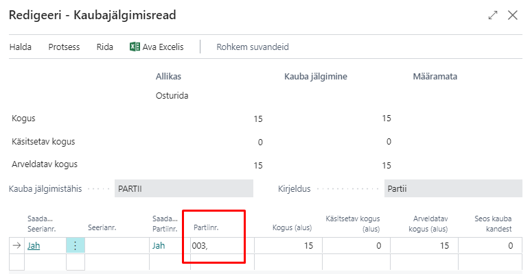

## Müügitellimuse tegevused osalise laohaldusega
Looge **Business Centralis** uus müügitellimus ning lisage kaubad tellimusele ning vabastage tellimus.
Noppimise Nutilao lahendusse saatmiseks vajutade menüü päises **Protsess**-> **Loo varude ladustamine/noppimine**.

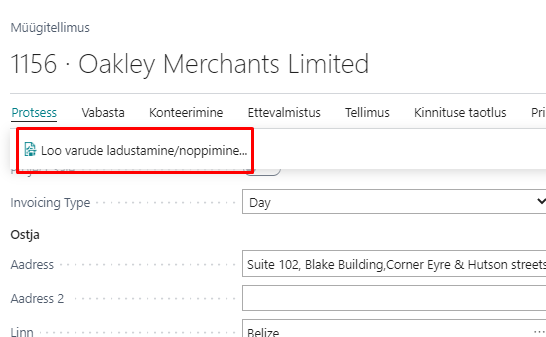

Aktiveerige avaneval lehel marker Loo varude noppimine ning klikkige **OK**. 

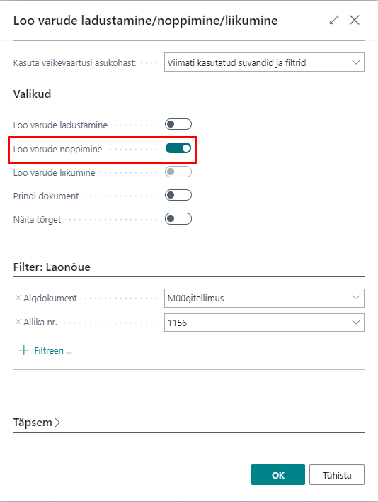

Igale noppelehele on võimalik Business Centrali poole pealt lisada noppimise prioriteetsust.
Selleks liikuge **Seotud**-> **Ladu**-> **Varude ladustamis-/noppimisread**.

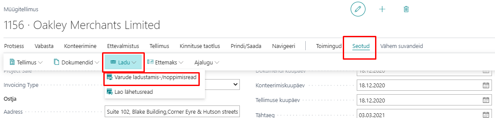

Avaneb antud konkreetse müügitellimuse **Varude noppimise loend**.
Noppimise avamiseks vajutage **Seotud**-> **Rida**-> **Kaart**.

Noppimiselt leiate sellise välja nagu **Prioriteet**. Valides prioriteediks **Kõrge**, kuvatakse kasutajale Nutilao lahenduses seda nopet kõige esimesena ning dokument saab juurde märke **Kiire**.

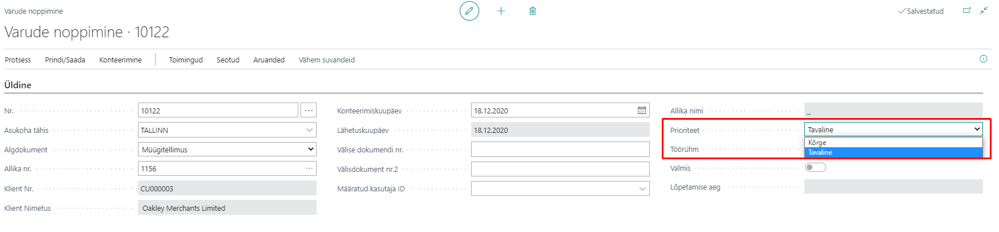

Nüüd liikuge **Nutilao** lahendusse ja valige menüüst **Laost**. 

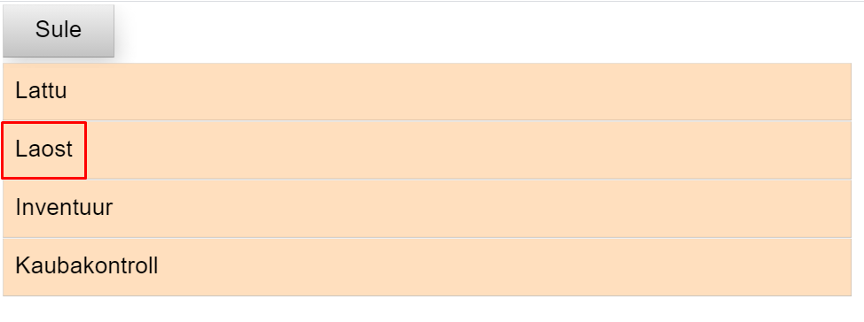

Avaneb kõigi vabade noppimiste loend või kuvatakse ainult selle kasutaja ID-ga noppimisi, kes menüü avas. Nt antud juhul kuvatakse kõiki selle konkreetse kasutaja ID-ga noppimisi ning ilma ID-ta noppimisi ei ole. Kiire linnuke on sellel noppimisel, mille prioriteediks valiti Business Centralis noppelehel **Kõrge**.

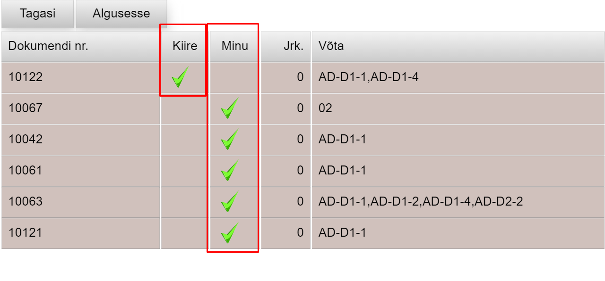

Avage noppimine, mille kaupu soovite komplekteerida.
Partii kaubal vajutades väljal partii avaneb kõigi võimalike partiide loend ning vastavad kogused, kui Business Centralis polnud partiid eelnevalt külge pandud, siis lao töötaja saab siit loendist valida selle partii, mis kokku komplekteeritakse. 

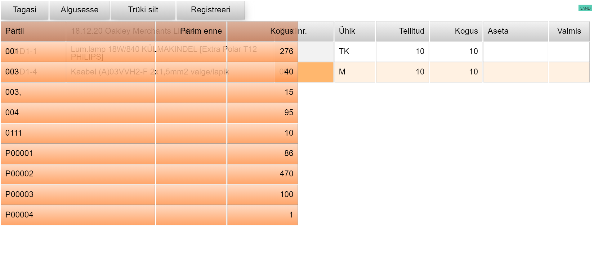

Sarnaselt ostu poolega on võimalik kogus väljal koguseid muuta.
Kui kaubad on kokku pandud pane linnuke väljale **Valmis** ning **Registreeri** nope, et info kokku pandud kauba kohta jõuaks Business Centralisse. 

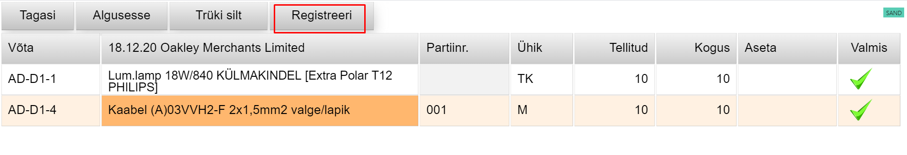

Seejärel on võimalik otse seadmest välja printida Saateleht ehk **Konteeritud müügilähetuse** dokument. 

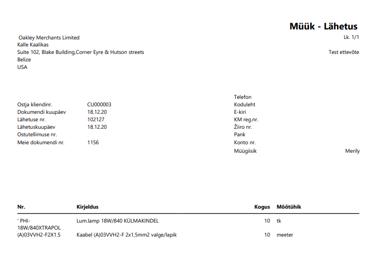

Liikudes tagasi Business Centrali müügitellimuse juurde on näha tarnitud kogust ning ka seda, et partii kaubal sai partii külge. 

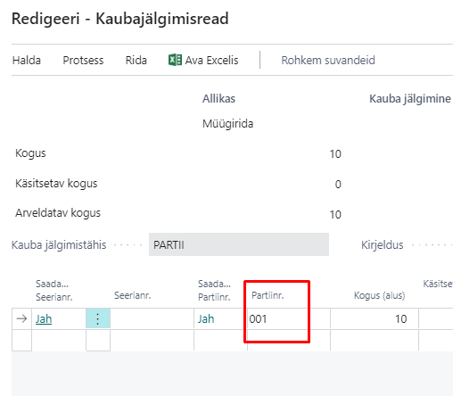

## Üleviimiskorraldused osalise laohalduse puhul
Töötab samade dokumentide alusel nagu osalise laohalduse puhul ost ja müük.
Erinevuseks on see, et dokumendi päises Nutilao lahenduses kuvab ladu kuhu kaup saadetakse või kust kaup vastu võetakse.
Näide noppimisest Tartu lattu:
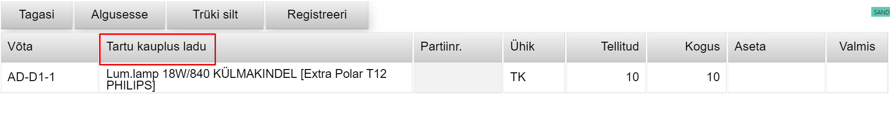
Näide ladustamisest Tallinna laost Tartu lattu:
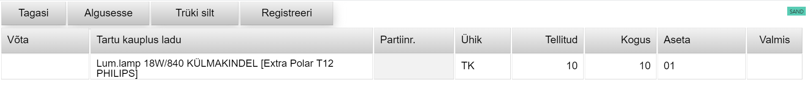

Lisainformatsiooni saamiseks palun võta ühendust BCS Itera AS:
[https://www.itera.ee](https://www.itera.ee)

